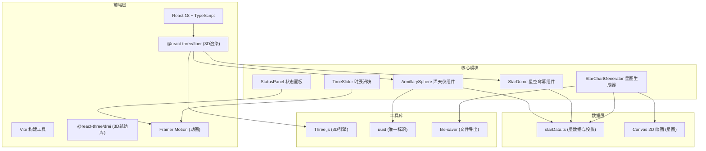

## 1. 架构设计



## 2. 技术描述

- **前端框架**：React@18 + TypeScript@5
- **构建工具**：Vite@5 + @vitejs/plugin-react@4
- **3D引擎**：three@0.160 + @react-three/fiber@8 + @react-three/drei@9
- **动画库**：framer-motion@10
- **工具库**：uuid@9、file-saver@2
- **无后端**：纯前端应用，所有数据本地硬编码
- **部署方式**：静态资源部署

## 3. 目录结构

```
auto304/
├── package.json
├── index.html
├── tsconfig.json
├── vite.config.js
└── src/
    ├── main.tsx
    ├── App.tsx
    ├── components/
    │   ├── ArmillarySphere.tsx
    │   ├── StarDome.tsx
    │   ├── StatusPanel.tsx
    │   ├── TimeSlider.tsx
    │   └── StarChart.tsx
    └── utils/
        ├── starData.ts
        └── starChartGenerator.ts
```

## 4. 路由定义

| 路由 | 用途 |
|------|------|
| / | 主观测台页面，包含所有3D场景和UI组件 |

## 5. 核心数据模型

### 5.1 恒星数据模型

```typescript
interface Star {
  id: string;
  name: string;          // 中文名，如"天狼星"
  westernName: string;   // 西方名称，如"Sirius"
  magnitude: number;     // 星等
  ra: number;            // 赤经（弧度）
  dec: number;           // 赤纬（弧度）
  constellation: string; // 中国星官，如"角宿"
  mansion: string;       // 二十八宿，如"角"
}

interface ObservedStar extends Star {
  observedAt: number;    // 观测时间戳
}
```

### 5.2 时辰映射

```typescript
const SHICHEN = [
  { name: '子时', start: 23, end: 1, rotation: 0 },
  { name: '丑时', start: 1, end: 3, rotation: Math.PI / 6 },
  // ...共12个时辰
];
```

## 6. 核心算法

### 6.1 星图投影算法

将3D天球坐标投影到2D极坐标平面：
```typescript
function projectToPolar(ra: number, dec: number, centerRa: number, radius: number): { x: number; y: number } {
  // 以天赤道为基准的极坐标投影
  const r = (Math.PI / 2 - Math.abs(dec)) / (Math.PI / 2) * radius;
  const theta = ra - centerRa;
  return {
    x: r * Math.cos(theta),
    y: r * Math.sin(theta)
  };
}
```

### 6.2 窥管对准检测

计算窥管方向与恒星方向的夹角：
```typescript
function calculateAngle(sightingDir: Vector3, starDir: Vector3): number {
  return Math.acos(sightingDir.normalize().dot(starDir.normalize())) * 180 / Math.PI;
}
```

### 6.3 时辰-角度转换

将12时辰转换为天球旋转角度：
```typescript
function shichenToRotation(shichenIndex: number, ke: number = 0): number {
  // 每个时辰30度，每刻3.75度（1时辰=8刻）
  return (shichenIndex * 30 + ke * 3.75) * Math.PI / 180;
}
```

## 7. 性能优化策略

1. **GPU加速星点闪烁**：使用ShaderMaterial实现星点闪烁动画
2. **实例化渲染**：使用InstancedMesh渲染500颗小星
3. **按需渲染**：仅在交互时触发渲染，静止时降低帧率
4. **Canvas星图缓存**：生成的星图缓存为DataURL，避免重复绘制
5. **事件节流**：滑块和鼠标拖拽事件使用requestAnimationFrame节流
