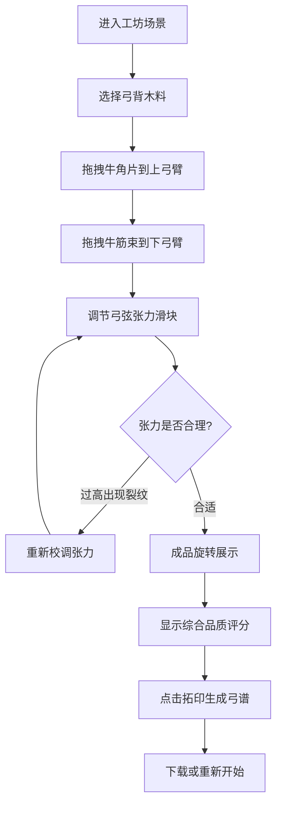

## 1. 产品概述

汉代弓匠制弓交互模拟游戏，通过数字化方式重现传统角弓制作的完整工艺流程。解决传统制弓技艺中选材、筋角配比、胶合、上弦和调校等复杂工序难以直观学习与反复试错的问题，让用户在沉浸式体验中掌握传统技艺精髓。

- **核心价值**：将非物质文化遗产的传统制弓技艺转化为可交互、可试错的数字体验
- **目标用户**：传统文化爱好者、手工艺学习者、弓箭爱好者、教育机构
- **产品定位**：寓教于乐的工艺模拟器，兼具文化传播与技艺教学功能

## 2. 核心功能

### 2.1 用户角色
| 角色 | 注册方式 | 核心权限 |
|------|----------|----------|
| 弓匠学徒 | 无需注册，直接使用 | 完整体验制弓全流程，生成弓谱，重新开始 |

### 2.2 功能模块
1. **工坊场景**：汉代边塞风格弓坊，包含材料架、炭火炉、操作台、弓胎展示
2. **选材系统**：柘木、桑木、竹片三种弓背木料，各有硬度和韧性属性
3. **筋角胶合**：拖拽牛角片和牛筋束到弓臂指定区域，黏合动画反馈
4. **上弦调校**：张力滑块调节弓弦张力，弓臂实时弯曲形变，裂纹预警
5. **成品展示**：360度旋转展示，综合品质评分，可下载弓谱图
6. **流程控制**：步骤切换动画，重新开始功能

### 2.3 页面详情
| 页面名称 | 模块名称 | 功能描述 |
|----------|----------|----------|
| 制弓工坊主页面 | 背景场景 | 土黄色汉代边塞工坊背景，干草色地面，左侧材料架，右侧炭火炉 |
| 制弓工坊主页面 | 操作台 | 中央大型操作台，放置半透明弓胎展示内部分层 |
| 制弓工坊主页面 | 材料选择 | 柘木、桑木、竹片三种木料，条形图显示属性数值 |
| 制弓工坊主页面 | 筋角胶合 | 拖拽牛角片(50x15px)和牛筋束(40x10px)到高亮目标框(100x30px) |
| 制弓工坊主页面 | 上弦调校 | 辘轳滑块控制张力20-80磅，渐变色进度条，弓臂弯曲动画 |
| 制弓工坊主页面 | 成品展示 | Y轴旋转展示(0.02rad/s)，水墨印章评分，拓印下载弓谱 |

## 3. 核心流程

用户进入工坊 → 选择弓背木料（柘木/桑木/竹片）→ 拖拽牛角片和牛筋束到弓臂指定区域 → 调节弓弦张力滑块 → 查看成品评分 → 点击拓印生成弓谱 → 重新开始或分享

## 4. 用户界面设计

### 4.1 设计风格
- **主色调**：土黄色 #c8a555，干草色 #d4b76a，赭石色系
- **辅助色**：水墨黑 #2c2c2c，半透明胶水黄 #e6d58a
- **字体**：思源宋体（Source Han Serif），水墨风格
- **按钮风格**：汉式印章风格，圆角4px，触摸面积不小于48x48px
- **布局风格**：卷轴展开式页面切换，由下而上transform动画
- **图标风格**：水墨线条60x60px图标，悬停放大1.15倍

### 4.2 页面设计概述
| 页面名称 | 模块名称 | UI元素 |
|----------|----------|----------|
| 制弓工坊 | 背景场景 | 土黄背景、干草地面、材料架、炭火炉、操作台 |
| 制弓工坊 | 材料架 | 三种木料水墨图标、条形图属性、悬停放大效果 |
| 制弓工坊 | 弓胎展示 | 半透明分层结构、材质替换动画 |
| 制弓工坊 | 胶合区域 | 高亮目标框、黏合动画、错误闪烁提示 |
| 制弓工坊 | 调校滑块 | 绿红渐变进度条、张力数值显示、弓臂实时弯曲 |
| 制弓工坊 | 成品展示 | Y轴旋转动画、水墨印章评分、拓印按钮 |
| 制弓工坊 | 弓谱弹窗 | 麻纸纹理背景、思源宋体字体、纸张翻动动画 |

### 4.3 响应式
- **桌面端**：横向布局，材料架左右分布，中央操作台
- **移动端**：单列纵向布局，材料架上下分布，font-size最小14px
- **触摸优化**：所有按钮可触摸面积不小于48x48px，拖拽操作支持触摸事件
- **动画性能**：所有交互动画帧率不低于55FPS，使用GPU加速属性

### 4.4 动画与交互
- **步骤切换**：由下而上卷轴展开，transition: transform 0.4s ease-out
- **材料悬停**：放大1.15倍，显示属性标签
- **黏合动画**：胶水从缝隙渗出凝固为半透明黄色，持续0.8s
- **错误提示**：胶水溅开，红色闪烁提示
- **弓臂弯曲**：60FPS流畅形变，曲率与张力成正比，最大40度
- **裂纹特效**：中央向两端扩散，持续1.5s，伴随"咔嚓"音效
- **成品旋转**：绕Y轴360度，速度0.02rad/s
- **弓谱悬停**：轻微纸张翻动动画

## 5. 性能指标
- 所有交互动画帧率 ≥ 55FPS
- 弓臂弯曲动画帧率 = 60FPS
- 步骤切换动画流畅无卡顿
- 移动端触摸响应延迟 < 100ms
