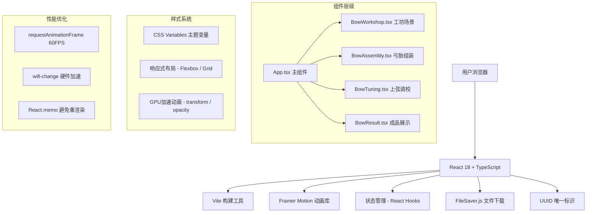

## 1. 架构设计



## 2. 技术描述

- **前端框架**: React@18 + TypeScript@5
- **构建工具**: Vite@5 + @vitejs/plugin-react@4
- **动画库**: framer-motion@11
- **状态管理**: React Hooks (useState, useReducer, useCallback, useMemo)
- **工具库**: uuid@9, file-saver@2.0.5
- **样式方案**: 原生CSS + CSS Variables，不使用Tailwind
- **字体**: 思源宋体 (Source Han Serif)
- **初始化方式**: 使用 Vite react-ts 模板初始化项目

## 3. 项目结构

```
├── index.html                 # 入口HTML
├── package.json               # 项目依赖
├── tsconfig.json              # TypeScript配置
├── vite.config.js             # Vite构建配置
└── src/
    ├── App.tsx                # 主组件，步骤状态管理
    ├── BowWorkshop.tsx        # 工坊场景组件
    ├── BowAssembly.tsx        # 弓胎组装组件
    ├── BowTuning.tsx          # 上弦调校组件
    ├── BowResult.tsx          # 成品展示组件
    ├── types/
    │   └── index.ts           # 类型定义
    ├── utils/
    │   ├── animation.ts       # 动画工具函数
    │   └── scoring.ts         # 评分计算逻辑
    ├── hooks/
    │   ├── useDrag.ts         # 拖拽自定义Hook
    │   └── useBowAnimation.ts # 弓臂动画Hook
    └── styles/
        └── globals.css        # 全局样式
```

## 4. 类型定义

```typescript
// 木料类型
interface WoodMaterial {
  id: string;
  name: '柘木' | '桑木' | '竹片';
  hardness: number;  // 0-100
  toughness: number; // 0-100
  color: string;
}

// 筋角材料类型
interface SinewHornMaterial {
  id: string;
  type: 'horn' | 'sinew';
  name: string;
  width: number;
  height: number;
}

// 弓胎状态
interface BowState {
  selectedWood: WoodMaterial | null;
  hornPlaced: { top: boolean; bottom: boolean };
  sinewPlaced: { top: boolean; bottom: boolean };
  tension: number; // 20-80磅
  hasCrack: boolean;
  isComplete: boolean;
}

// 评分结果
interface BowScore {
  materialScore: number;     // 选材评分
  assemblyScore: number;     // 胶合准确度
  tensionScore: number;      // 张力匹配度
  totalScore: number;        // 综合评分
  grade: '上品' | '中品' | '下品';
}

// 步骤枚举
type Step = 'material' | 'assembly' | 'tuning' | 'result';
```

## 5. 评分算法

```typescript
// 综合评分 = 选材(30%) + 胶合(35%) + 张力(35%)
function calculateTotalScore(state: BowState): BowScore {
  // 选材评分：根据木料属性计算
  const materialScore = calculateMaterialScore(state.selectedWood);
  
  // 胶合评分：根据放置准确度和数量计算
  const assemblyScore = calculateAssemblyScore(state.hornPlaced, state.sinewPlaced);
  
  // 张力评分：最佳张力区间50-60磅
  const tensionScore = calculateTensionScore(state.tension, state.hasCrack);
  
  const totalScore = Math.round(
    materialScore * 0.3 + assemblyScore * 0.35 + tensionScore * 0.35
  );
  
  return {
    materialScore,
    assemblyScore,
    tensionScore,
    totalScore,
    grade: totalScore >= 85 ? '上品' : totalScore >= 60 ? '中品' : '下品'
  };
}
```

## 6. 动画实现方案

### 6.1 弓臂弯曲动画
- 使用 `requestAnimationFrame` 实现60FPS流畅动画
- 弯曲角度 = (张力 - 20) / 60 * 40度
- CSS `transform: rotate()` 和 `transform-origin` 控制弯曲点
- `will-change: transform` 开启GPU加速

### 6.2 拖拽交互
- 自定义 `useDrag` Hook 处理鼠标/触摸事件
- `pointerdown` → `pointermove` → `pointerup` 事件流
- 使用 `clientX/clientY` 计算拖拽位置
- Framer Motion `AnimatePresence` 处理放置动画

### 6.3 裂纹特效
- SVG path 绘制裂纹路径
- `stroke-dashoffset` 动画实现裂纹扩散
- Web Audio API 生成"咔嚓"音效

### 6.4 成品旋转展示
- CSS `transform-style: preserve-3d` 开启3D空间
- `transform: rotateY()` 配合 `requestAnimationFrame` 实现持续旋转
- 速度 0.02rad/s ≈ 6.87度/帧（60FPS下）

## 7. 性能优化策略

1. **React.memo** 包装子组件，避免不必要重渲染
2. **useCallback** 缓存事件处理函数
3. **useMemo** 缓存计算结果（如评分、动画参数）
4. **transform 和 opacity** 做动画，触发GPU合成层
5. **will-change** 提前告知浏览器即将变化的属性
6. **requestAnimationFrame** 统一动画帧调度
7. **防抖/节流** 处理高频事件（如滑块拖动）
8. **CSS Contain** 隔离组件渲染区域

## 8. 响应式设计

```css
/* 桌面端（默认） */
.workshop-container {
  display: grid;
  grid-template-columns: 200px 1fr 200px;
  gap: 20px;
}

/* 平板端 */
@media (max-width: 1024px) {
  .workshop-container {
    grid-template-columns: 150px 1fr 150px;
  }
}

/* 移动端 */
@media (max-width: 768px) {
  .workshop-container {
    grid-template-columns: 1fr;
    grid-template-rows: auto auto auto;
  }
  
  .material-shelf {
    flex-direction: row;
    overflow-x: auto;
  }
  
  button {
    min-height: 48px;
    min-width: 48px;
  }
  
  html {
    font-size: 14px;
  }
}
```
