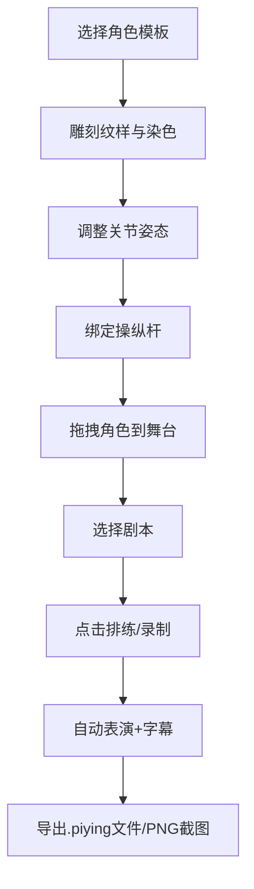

## 1. 产品概述

本产品是一款基于浏览器的古代皮影戏角色设计与操纵互动应用，让用户化身皮影匠人，在戏班后台设计雕刻皮影角色、连接操纵杆，并在纱幕舞台上表演录制皮影戏。

- 主要用途：让用户体验皮影戏创作全过程，包括角色设计、操纵绑定、剧本表演和录制分享
- 目标用户：对传统文化艺术感兴趣的普通用户、皮影戏爱好者、教育领域使用者
- 产品价值：通过数字化手段传承和推广皮影戏这一非物质文化遗产，降低皮影戏创作门槛

## 2. 核心 Features

### 2.1 Feature Module

1. **工作台**：角色模板选择、雕刻纹样面板、染色盘、操纵杆绑定区
2. **舞台表演区**：纱幕舞台、角色渲染与操控、剧本播放、字幕显示
3. **录制分享**：表演录制、JSON格式导出、PNG截图保存

### 2.3 Page Details

| 页面名称 | 模块名称 | Feature Description |
|-----------|-------------|---------------------|
| 主页面 | 工作台角色模板区 | 生/旦/净/丑四种角色模板选择，选中状态高亮 |
| 主页面 | 工作台雕刻区 | 300x400px画布，支持鼠标刻刀绘制纹样（2px线宽） |
| 主页面 | 工作台染色盘 | 12色矿物染料圆形布局，点击抖动高亮，支持闭合区域填充 |
| 主页面 | 工作台关节调整 | 5个关节（头、躯干、左右臂、左右腿）±30度拖拽微调 |
| 主页面 | 工作台操纵杆面板 | 可拖动灰色操纵杆（#8b7355），绑定到手臂或腿部关节 |
| 主页面 | 舞台表演区 | 半透明绢布纱幕，支持角色拖拽移动和缩放 |
| 主页面 | 剧本播放系统 | 3个内置剧本，5-8个时间轴动作，自动播放并显示书法字幕 |
| 主页面 | 录制分享模块 | 录制表演过程导出为.piying（JSON）文件，支持PNG截图 |

## 3. 核心 Process

用户在工作台选择角色模板 → 在雕刻区绘制纹样并染色 → 调整关节姿态 → 绑定操纵杆 → 将角色拖拽到舞台 → 选择剧本开始排练 → 点击录制按钮 → 表演结束后导出文件或保存截图。

## 4. User Interface Design

### 4.1 Design Style

- **主色调**：唐代宫廷暗红#1a0e0e与金色#ffd700搭配
- **工作台**：深木色#3e2723，雕刻画布米白色#f5e6c8
- **舞台纱幕**：半透明绢布色rgba(255,245,225,0.85)
- **模板卡片**：长方形120x180px，铜色边框#b8860b，选中时赤金色#ffd700外发光8px
- **色盘**：圆形直径240px，12色扇形排列，点击放大1.3倍弹起10px
- **操纵杆**：灰色细矩形#8b7355，宽10px高200px，底部木制握柄
- **按钮**：圆形古铜硬币造型，直径40px，阴影向内凹陷，点击有金属音效
- **字体**：书法字体用于字幕，古朴衬线字体用于界面文本

### 4.2 Page Design Overview

| 页面名称 | 模块名称 | UI Elements |
|-----------|-------------|-------------|
| 主页面 | 工作台 | 深木色背景、模板卡片、雕刻画布、圆形色盘、操纵杆列表 |
| 主页面 | 舞台区 | 仿古飞檐装饰、纱幕背景、流苏坠角、角色渲染、字幕层 |
| 主页面 | 控制栏 | 古铜硬币按钮、剧本选择下拉、录制状态指示 |

### 4.3 Responsiveness

- **桌面端(>=1024px)**：左右分栏，工作台55%，舞台45%
- **平板端(768px-1024px)**：上下布局，工作台在上舞台在下，可滚动
- **手机端(<768px)**：上下布局，UI缩小，模板卡片80x120px，色盘160px，操纵杆6x120px

### 4.4 Interaction Feedback

- 拖拽时鼠标变为交叉十字
- 操纵杆吸附关节时绿色闪烁0.3秒
- 颜色填充0.5s过渡动画
- 按钮点击"叮"金属音效（AudioContext生成）
- 设计变更时舞台同名角色实时同步更新
