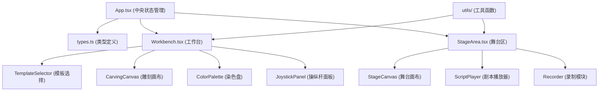
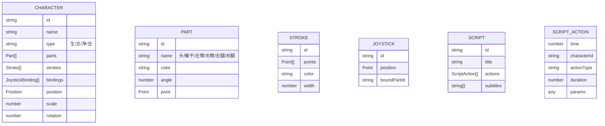

## 1. Architecture Design



**数据流：**
- 用户操作 → Workbench/StageArea 组件 → 通过回调发送 Action → App.tsx 接收 Action → 更新全局状态 → 重新渲染子组件
- 状态修改只能通过 App.tsx 的 reducer 完成，子组件为纯展示组件

## 2. Technology Description

- **前端**：React@18 + TypeScript@5 + Vite@5
- **状态管理**：React useReducer (中央状态管理)
- **动画库**：framer-motion@11
- **工具库**：uuid@9 (生成唯一ID)、file-saver@2 (文件下载)
- **构建工具**：Vite + @vitejs/plugin-react@4
- **CSS方案**：CSS Modules + 内联样式 + framer-motion动画
- **绘图**：Canvas 2D API + requestAnimationFrame

## 3. 项目结构

```
src/
├── types.ts              # 类型定义（角色、部件、操纵杆、剧本、Action）
├── App.tsx               # 主应用组件，状态管理中央调度
├── components/
│   ├── Workbench.tsx     # 工作台组件
│   ├── StageArea.tsx     # 舞台表演区组件
│   ├── TemplateSelector.tsx  # 角色模板选择区
│   ├── CarvingCanvas.tsx     # 雕刻画布
│   ├── ColorPalette.tsx      # 染色盘
│   ├── JoystickPanel.tsx     # 操纵杆面板
│   ├── StageCanvas.tsx       # 舞台画布
│   ├── ScriptPlayer.tsx      # 剧本播放器
│   └── ControlBar.tsx        # 控制按钮栏
├── utils/
│   ├── audio.ts          # 音效生成
│   ├── canvas.ts         # Canvas绘图工具
│   ├── geometry.ts       # 几何计算
│   └── recorder.ts       # 录制工具
├── data/
│   ├── templates.ts      # 角色模板数据
│   ├── scripts.ts        # 剧本数据
│   └── colors.ts         # 色盘颜色数据
└── hooks/
    ├── useCanvasDrawing.ts   # Canvas绘制hook
    ├── useDrag.ts            # 拖拽hook
    └── useAnimationFrame.ts  # requestAnimationFrame hook
```

## 4. 核心数据模型



## 5. Action 类型定义

| Action类型 | 载荷 | 描述 |
|-----------|------|------|
| SELECT_TEMPLATE | { templateType } | 选择角色模板 |
| ADD_STROKE | { characterId, stroke } | 添加雕刻笔触 |
| FILL_AREA | { characterId, point, color } | 填充颜色 |
| ADJUST_JOINT | { characterId, partId, angle } | 调整关节角度 |
| BIND_JOYSTICK | { joystickId, characterId, partId } | 绑定操纵杆 |
| ADD_TO_STAGE | { characterId } | 添加角色到舞台 |
| UPDATE_STAGE_POSITION | { characterId, position, scale } | 更新舞台角色位置 |
| SELECT_SCRIPT | { scriptId } | 选择剧本 |
| START_REHEARSAL | {} | 开始排练 |
| STOP_REHEARSAL | {} | 停止排练 |
| START_RECORDING | {} | 开始录制 |
| STOP_RECORDING | {} | 停止录制 |
| EXPORT_RECORDING | { format } | 导出录制文件 |

## 6. 性能优化策略

1. **雕刻绘制**：使用离屏Canvas双缓冲，笔触响应延迟<50ms
2. **舞台动画**：requestAnimationFrame驱动，目标30fps+
3. **状态更新**：角色状态局部更新，避免全量重渲染
4. **录制采样**：根据剧本长度动态调整采样率，文件<512KB
5. **React优化**：使用React.memo包裹子组件，useMemo/useCallback缓存计算和回调
