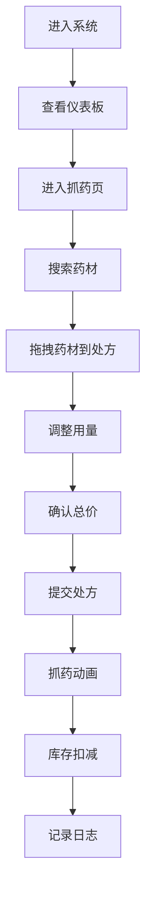

## 1. 产品概述

虚拟古代药铺药材管理与抓药流程Web应用，用户化身坐堂郎中，在古色古香的药铺中管理药材库存、按方抓药并记录患者诊疗历史。

- 主要用途：为传统中医药铺提供数字化的药材库存管理、处方抓药流程以及诊疗历史记录功能
- 目标用户：中医药师、药铺管理者
- 产品价值：将传统药铺管理与现代数字化技术结合，提升抓药效率和库存管理精准度

## 2. 核心功能

### 2.1 用户角色
| 角色 | 注册方式 | 核心权限 |
|------|----------|---------|
| 坐堂郎中 | 系统预置 | 药材库存管理、处方抓药、操作日志查看 |

### 2.2 功能模块
1. **仪表板**：药材总览、待抓方剂统计、7天抓药趋势图、操作日志时间线
2. **抓药页**：药材搜索列表、处方拖拽编辑、自动计算总价、库存扣减动画效果

### 2.3 页面详情
| 页面名称 | 模块名称 | 功能描述 |
|-----------|----------|------------|
| 仪表板 | 药材总览卡片 | 以中药柜抽屉卡片形式展示所有药材，悬停显示库存和单价 |
| 仪表板 | 抓药趋势图 | 折线图展示最近7天的抓药趋势 |
| 仪表板 | 操作日志时间线 | 以时间线形式展示抓药历史记录 |
| 抓药页 | 药材列表 | 可搜索的药材列表，支持拖拽 |
| 抓药页 | 处方面板 | 仿古宣纸风格，支持添加/删除药材，自动计算总价 |
| 抓药页 | 抓药动画 | 药柜抽屉弹出动画、对勾标记、卷轴横幅提示 |

## 3. 核心流程

用户进入系统 → 查看仪表板了解库存情况 → 进入抓药页搜索药材 → 拖拽药材到处方 → 调整药材用量 → 确认总价 → 提交处方 → 观看抓药动画 → 库存自动扣减 → 操作日志自动记录

## 4. 用户界面设计

### 4.1 设计风格
- 主色调：竹木色 #c9a96e
- 辅色：深木色 #8d6e63
- 背景色：宣纸色 #f5efe0
- 强调色：金色 #d4a373
- 成功色：绿色 #4caf50
- 字体：思源宋体（繁体显示药材名）
- 按钮风格：圆角8px，点击时scale(0.95)按下反馈，阴影0 4px 8px rgba(0,0,0,0.1)
- 布局风格：卡片式布局，药柜抽屉式导航
- 动画风格：卷轴展开、抽屉弹出、数字弹跳

### 4.2 页面设计概述
| 页面名称 | 模块名称 | UI元素 |
|-----------|----------|--------|
| 仪表板 | 药材卡片 | 100x120px抽屉卡片，竹木色背景，悬停右移15px，繁体宋体药材名 |
| 仪表板 | 趋势图 | 折线图展示7天数据 |
| 仪表板 | 时间线 | 圆形时间戳图标，上下午不同背景色 |
| 抓药页 | 药材列表 | 每行展示药材名、库存、单价，支持搜索 |
| 抓药页 | 处方面板 | 400x600px宣纸纹理，拖拽添加，数量调整，删除按钮 |
| 抓药页 | 总价显示 | 数字变化时0.8→1.0缩放动画 |
| 抓药页 | 抓药动画 | 抽屉依次弹出，对勾标记，卷轴横幅 |

### 4.3 响应式
- 桌面端（≥768px：4列卡片，左右布局
- 移动端（<768px）：2列卡片，上下布局，处方面板100%宽度
- 触摸优化：拖拽区域增大，按钮尺寸适配触摸操作

## 5. 性能要求
- 仪表板数据更新延迟 < 200ms
- 拖拽操作帧率 ≥ 50fps
- 动画流畅无卡顿
