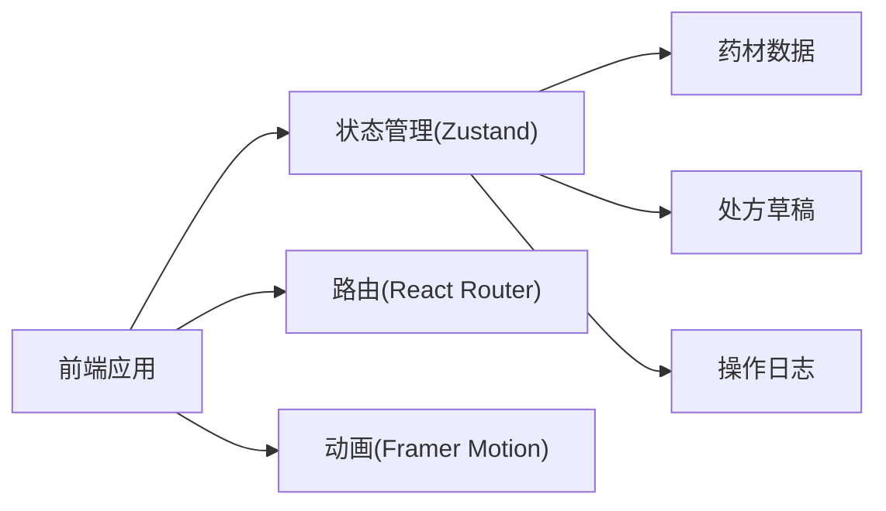
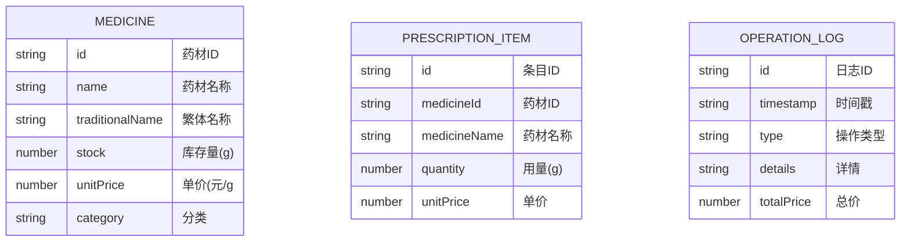

## 1. 架构设计



## 2. 技术描述
- 前端框架：React 18 + TypeScript
- 构建工具：Vite 5
- 路由管理：react-router-dom 6
- 状态管理：zustand 4
- 动画库：framer-motion 11
- 工具库：uuid、file-saver、axios
- 初始化工具：vite-init
- 后端：无（纯前端应用，使用Mock数据）
- 数据持久化：localStorage

## 3. 目录结构

```
src/
├── main.tsx          # React入口
├── App.tsx          # 路由与全局布局
├── pages/           # 页面组件
│   ├── Dashboard.tsx
│   └── Prescription.tsx
├── store/           # 状态管理
│   └── medicineStore.ts
├── components/      # 公共组件
│   ├── MedicineCard.tsx
│   ├── MedicineDrawer.tsx
│   ├── PrescriptionPanel.tsx
│   ├── Timeline.tsx
│   └── TrendChart.tsx
│   └── Navigation.tsx
├── types/           # 类型定义
│   └── index.ts
├── utils/           # 工具函数
│   └── mockData.ts
└── styles/         # 全局样式
    └── index.css
```

## 4. 路由定义
| 路由 | 用途 |
|------|------|
| / | 仪表板页面 |
| /prescription | 抓药页面 |

## 5. 数据模型

### 5.1 数据模型定义



### 5.2 TypeScript 类型定义

```typescript
interface Medicine {
  id: string;
  name: string;
  traditionalName: string;
  stock: number;
  unitPrice: number;
  category: string;
}

interface PrescriptionItem {
  id: string;
  medicineId: string;
  medicineName: string;
  quantity: number;
  unitPrice: number;
}

interface OperationLog {
  id: string;
  timestamp: number;
  type: 'prescription' | 'restock';
  medicines: { name: string; quantity: number }[];
  totalPrice: number;
}
```

### 5.3 初始Mock数据

```typescript
const initialMedicines: Medicine[] = [
  { id: '1', name: '黄芪', traditionalName: '黃芪', stock: 500, unitPrice: 0.5, category: '补气' },
  { id: '2', name: '当归', traditionalName: '當歸', stock: 300, unitPrice: 0.8, category: '补血' },
  { id: '3', name: '人参', traditionalName: '人蔘', stock: 100, unitPrice: 5.0, category: '补气' },
  { id: '4', name: '白术', traditionalName: '白朮', stock: 250, unitPrice: 0.6, category: '健脾' },
  { id: '5', name: '茯苓', traditionalName: '茯苓', stock: 400, unitPrice: 0.4, category: '利水' },
  { id: '6', name: '川芎', traditionalName: '川芎', stock: 200, unitPrice: 0.7, category: '活血' },
  { id: '7', name: '甘草', traditionalName: '甘草', stock: 350, unitPrice: 0.3, category: '调和' },
  { id: '8', name: '熟地', traditionalName: '熟地', stock: 180, unitPrice: 0.9, category: '补血' },
];
```

## 6. 状态管理设计

```typescript
interface MedicineStore {
  medicines: Medicine[];
  prescriptionItems: PrescriptionItem[];
  operationLogs: OperationLog[];
  
  // 处方操作
  addPrescriptionItem: (medicine: Medicine, quantity: number) => void;
  removePrescriptionItem: (id: string) => void;
  updatePrescriptionQuantity: (id: string, quantity: number) => void;
  clearPrescription: () => void;
  submitPrescription: () => void;
  
  // 库存操作
  updateStock: (medicineId: string, amount: number) => void;
  
  // 日志操作
  addLog: (log: Omit<OperationLog>) => void;
  
  // 计算属性
  getTotalPrice: () => number;
  getPendingPrescriptions: () => number;
  get7DayTrend: () => { date: string; count: number }[];
}
```

## 7. 性能优化策略

1. **状态管理优化**
   - 使用 zustand 选择性订阅，避免不必要的重渲染
   - 计算属性使用 useMemo 缓存
   - 列表项使用唯一key

2. **动画性能**
   - 使用 transform 而非 top/left 实现拖拽
   - 使用 will-change 提升动画性能
   - 避免在动画中避免重排重绘

3. **响应式优化**
   - 使用 CSS 媒体查询
   - 移动端资源按需加载
