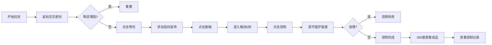

## 1. 产品概述

宋代陶匠拉坯成型3D交互可视化项目，让用户体验古代陶瓷制作的完整工艺流程。
- 主要目的：通过沉浸式3D交互，模拟从拉坯、修坯、施釉到烧制的陶瓷制作全过程
- 目标用户：陶瓷爱好者、文化学习者、游戏玩家
- 产品价值：传承传统工艺文化，提供寓教于乐的互动体验

## 2. 核心功能

### 2.1 用户角色
| 角色 | 注册方式 | 核心权限 |
|------|----------|----------|
| 普通用户 | 无需注册 | 完整体验陶瓷制作流程，查看烧制记录 |

### 2.2 功能模块
1. **拉坯场景**：辘轳车旋转控制、陶泥形态变形、塌陷检测与重置
2. **修坯场景**：网格辅助视图、弦纹装饰添加
3. **施釉场景**：釉池浸泡动画、釉色效果
4. **烧制场景**：窑炉温度控制、火焰粒子效果、釉面熔融效果
5. **成品展示**：360度旋转查看、烧制记录卷轴

### 2.3 页面详情
| 页面名称 | 模块名称 | 功能描述 |
|----------|----------|----------|
| 主场景 | 拉坯交互 | 鼠标拖动控制陶泥拉伸与收缩，转速滑块控制辘轳速度 |
| 主场景 | 修坯交互 | 网格辅助线显示，点击添加弦纹装饰 |
| 主场景 | 施釉交互 | 浸入釉池动画，釉面效果变化 |
| 主场景 | 烧制交互 | 温度滑块控制，窑炉火焰效果 |
| 主场景 | 成品展示 | 自由旋转查看，烧制记录弹窗 |

## 3. 核心流程

用户进入页面后，首先看到旋转的辘轳车和陶泥。通过鼠标左键上下拖动拉伸泥壁，右键左右拖动收缩泥壁，调整转速观察离心力效果。完成拉坯后点击修坯按钮进入修坯模式，添加弦纹装饰。点击施釉按钮将陶器浸入釉池。最后送入窑炉，调节温度烧制。完成后可360度查看成品，点击烧制记录查看参数摘要。

## 4. 用户界面设计

### 4.1 设计风格
- 主色调：土褐色#8b4513、陶土黄#d2691e、青瓷色#7fffd4、木色#deb887
- 辅助色：釉蓝#5dade2、窑火红#ff4500、背景米白#f5f5dc
- 按钮风格：圆角矩形，半透明毛玻璃效果，古风水印边框
- 字体：Noto Serif SC（宋体），体现古风雅致
- 布局：全屏3D场景为主体，控制面板悬浮于底部和右侧
- 图标：使用陶瓷相关的古风图标，如陶轮、窑炉、釉罐等

### 4.2 页面设计概述
| 页面名称 | 模块名称 | UI元素 |
|----------|----------|--------|
| 主场景 | 3D画布 | 全屏WebGL渲染，辘轳车、陶泥、环境光照 |
| 主场景 | 控制面板 | 半透明毛玻璃卡片，包含转速滑块、温度滑块、功能按钮 |
| 主场景 | 状态提示 | 右上角显示当前阶段、转速、温度等信息 |
| 主场景 | 烧制记录 | 卷轴式弹窗，古风纸张纹理 |

### 4.3 响应性
- 桌面端优先设计，全屏3D场景
- 控制面板采用固定定位，适配不同屏幕尺寸
- 滑块和按钮尺寸适合鼠标操作
- 塌陷动画和飞溅效果使用CSS关键帧实现

### 4.4 3D场景指导
- 环境：柔和的自然光，模拟古代作坊的室内光照
- 光照：主光源45度角照射，辅助光填充阴影，环境光提供整体亮度
- 相机：拉坯阶段固定机位，成品阶段允许轨道控制旋转查看
- 构图：辘轳车位于场景中心，陶泥为视觉焦点
- 交互：鼠标事件映射到陶泥顶点变形算法
- 后期处理：轻微的环境光遮蔽，柔和的抗锯齿
- 性能：单个陶泥网格约2000-3000顶点，火焰粒子约50个
