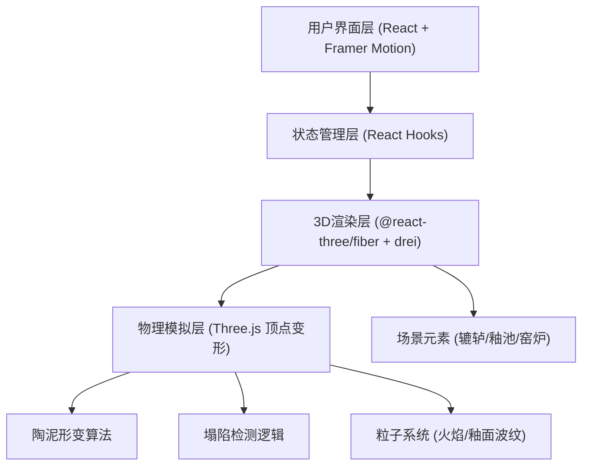

## 1. 架构设计



## 2. 技术描述
- 前端：React@18 + TypeScript + Vite
- 3D引擎：three@0.160 + @react-three/fiber@8 + @react-three/drei@9
- 动画库：framer-motion@10
- 后期处理：@react-three/postprocessing@2
- 状态管理：React useState/useRef 本地状态
- 音效：Web Audio API 合成音效

## 3. 核心数据结构

### 3.1 陶泥状态类型定义
```typescript
interface PotteryState {
  height: number;           // 当前高度
  wallThickness: number;    // 壁厚
  radius: number[];         // 每层半径数组
  rotationSpeed: number;    // 转速 (rpm)
  collapseThreshold: {
    maxHeight: number;      // 最大高度阈值
    minThickness: number;   // 最小壁厚阈值
  };
  isCollapsed: boolean;     // 是否塌陷
  decorations: number[];    // 弦纹位置数组
  glazed: boolean;          // 是否施釉
  fired: boolean;           // 是否烧制
  firingTemperature: number;// 烧制温度
  deformation: number;      // 变形程度 0-1
}

interface ControlState {
  currentPhase: 'throwing' | 'trimming' | 'glazing' | 'firing' | 'finished';
  rotationSpeed: number;
  temperature: number;
  showRecord: boolean;
}
```

## 4. 核心模块说明

### 4.1 陶泥形变算法
- 顶点圆柱坐标系：高度分层（20层），圆周分段（32段）
- 拉伸算法：根据鼠标Y轴偏移量，线性增加各层高度，顶部拉伸幅度大于底部
- 收缩算法：根据鼠标X轴偏移量，调整各层半径，角度限制在-15°~15°
- 离心力效果：转速越高，外层顶点向外向上偏移，形成自然的泥团形变

### 4.2 塌陷检测
- 每帧检测：高度 > 2单位 或 壁厚 < 0.05单位
- 塌陷效果：顶点随机散落，播放"噗"音效，CSS动画模拟泥浆飞溅

### 4.3 釉面效果
- 未烧制：颗粒感纹理，半透明
- 1000-1200度：玻璃质感，高光反射
- >1200度：变形效果，顶点位置随机偏移

### 4.4 粒子系统
- 火焰粒子：向上运动，颜色从橙红到黄色渐变，大小随机变化
- 釉面波纹：正弦波动画，周期2秒，透明度变化

## 5. 性能优化
- 顶点更新使用BufferGeometry，避免每帧重建网格
- 粒子系统使用InstancedMesh，批量渲染
- 塌陷检测使用requestAnimationFrame节流
- 材质复用，避免重复创建
