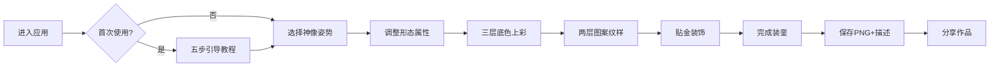

## 1. 产品概述

古代泥塑造像彩绘与装銮互动应用，让用户体验宋代泥塑匠人创作神像的完整工艺流程，从选泥塑形到贴金装銮，最终生成可360度旋转观赏的彩绘神像作品。

- **目标用户**：对中国传统艺术、泥塑文化感兴趣的普通用户，教育场景下的学生和艺术爱好者
- **核心价值**：通过沉浸式互动体验，传承中国传统泥塑技艺，让用户亲手完成一尊神像的创作过程

## 2. 核心功能

### 2.1 用户角色
| 角色 | 注册方式 | 核心权限 |
|------|----------|----------|
| 访客用户 | 无需注册 | 完整体验七道工序、保存作品、分享作品 |

### 2.2 功能模块
1. **泥胎塑形模块**：5种经典神像轮廓选择，3个属性滑块实时调整形态
2. **分层彩绘模块**：三层底色、两层图案纹样、一层贴金装饰
3. **3D预览模块**：实时渲染带材质贴图的神像，支持拖拽旋转缩放
4. **保存分享模块**：导出PNG截图+作品描述，模拟分享链接
5. **引导教程模块**：首次进入的五步操作引导

### 2.3 页面详情
| 页面名称 | 模块名称 | 功能描述 |
|----------|----------|----------|
| 主应用页 | 顶部导航栏 | 如意云头纹样，左右纱灯脉动动画，标题展示 |
| 主应用页 | 工序进度指示器 | 7个圆形节点，显示当前工序进度 |
| 主应用页 | 左操作面板 | 泥胎塑形控件、彩绘工具、贴金控制 |
| 主应用页 | 右预览面板 | 3D神像实时渲染，支持交互操作 |
| 主应用页 | 教程弹窗 | 五步引导，暗色遮罩，可跳过 |
| 主应用页 | 分享弹窗 | 作品名称、创作者昵称、复制链接 |

## 3. 核心流程

用户进入应用 → 首次使用弹出五步引导 → 选择神像姿势 → 调整头身比/肩宽/腰身 → 完成塑形 → 依次上三层底色 → 添加两层纹样 → 选择贴金位置与面积 → 完成装銮 → 保存作品（PNG+描述）→ 分享作品

## 4. 用户界面设计

### 4.1 设计风格
- **主色调**：檀木色#3e2723 + 米白色#f5f0e8
- **辅助色**：古纸色#efebe9、竹节色#5d4037、灰泥色#bdbdbd
- **按钮样式**：仿木刻凸起，border-bottom: 3px solid #5d4037，hover上移2px
- **字体**：思源宋体（Source Han Serif）
- **布局风格**：宋式美学，左操作面板+右3D预览，竹节分割线
- **图标风格**：水墨线性icon，hover放大1.1倍+背景填充

### 4.2 页面设计概述
| 页面名称 | 模块名称 | UI元素 |
|----------|----------|--------|
| 主应用页 | 顶部导航栏 | 如意云头渐变背景#4e342e→#3e2723，高度60px，左右纱灯脉动阴影动画 |
| 主应用页 | 操作面板 | 古纸色背景#efebe9，工具按钮水墨风格，滑块古典样式 |
| 主应用页 | 3D预览区 | 深色背景，神像居中，支持鼠标拖拽旋转 |
| 主应用页 | 进度指示器 | 底部7个圆形节点，檀木色填充已完成，当前脉动放大 |
| 主应用页 | 弹窗 | 半透明磨砂玻璃backdrop-filter blur(8px)，圆角柔和 |

### 4.3 响应式
- **≥1280px**：三栏正常布局（左面板+分割线+右预览）
- **768px-1280px**：双栏布局（左面板与预览上下排列）
- **<768px**：控件全屏，预览以弹窗形式展示

### 4.4 3D场景指导
- **环境氛围**：温暖的古代作坊光效，柔和的全局光+主方向光
- **光照设置**：环境光强度0.6，主光强度0.8，暖黄色调
- **相机设置**：透视相机，初始距离3.5，可拖拽旋转（限制极角）
- **交互方式**：OrbitControls，鼠标左键旋转，滚轮缩放
- **后处理效果**：轻微泛光，贴金完成后metallic 0.3, roughness 0.6
- **性能预算**：帧率≥45 FPS，单模型面数≤5000三角面

## 5. 动画与交互
- **和泥动效**：泥团scale循环1.0-1.05-1.0，周期2s
- **上色动效**：笔刷扫过渐变+opacity过渡0.5s
- **贴金动效**：粒子动画40x40px金箔飘落吸附，持续0.8s
- **滑块响应**：0.3秒平滑变形过渡
- **按钮反馈**：hover上移2px，active下压
