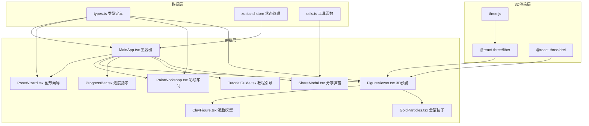

## 1. 架构设计



## 2. 技术描述

- **前端框架**：React@18 + TypeScript
- **构建工具**：Vite@5 + @vitejs/plugin-react
- **3D渲染**：three@0.160, @react-three/fiber@8.15, @react-three/drei@9.92
- **状态管理**：zustand@4.4
- **动画库**：framer-motion@10.16
- **UI工具**：file-saver@2.0, uuid@9.0
- **样式方案**：TailwindCSS@3.4 + CSS Modules
- **初始化方式**：vite-init react-ts 模板

## 3. 目录结构

```
src/
├── types.ts              # 共享类型定义（PoseState, ColorLayer, GoldLeaf等）
├── MainApp.tsx           # 主容器组件，状态管理
├── store/
│   └── useFigureStore.ts # Zustand状态管理
├── components/
│   ├── PoseWizard.tsx    # 泥胎塑形向导
│   ├── PaintWorkshop.tsx # 分层彩绘与贴金
│   ├── FigureViewer.tsx  # 3D预览组件
│   ├── ProgressBar.tsx   # 工序进度指示器
│   ├── TutorialGuide.tsx # 引导式教程
│   ├── ShareModal.tsx    # 分享弹窗
│   ├── TopNavbar.tsx     # 顶部导航栏
│   └── three/
│       ├── ClayFigure.tsx    # 泥胎3D模型
│       └── GoldParticles.tsx # 金箔粒子动画
├── utils/
│   ├── exportUtils.ts    # 导出保存工具
│   ├── colorUtils.ts     # 颜色处理工具
│   └── geometryUtils.ts  # 几何计算工具
├── constants/
│   ├── poseList.ts       # 姿势列表数据
│   └── colorPalette.ts   # 古典色盘数据
├── hooks/
│   └── useTutorial.ts    # 教程逻辑Hook
├── App.tsx
├── main.tsx
└── index.css
```

## 4. 数据模型

### 4.1 核心类型定义

```typescript
// 姿势状态
interface PoseState {
  id: string;
  name: string;
  description: string;
  baseHeight: number;
  headRatio: number; // 1:4 到 1:6
  shoulderRatio: number; // 0.8 到 1.2
  waistCurve: number; // 0 到 1
}

// 颜色图层
interface ColorLayer {
  id: string;
  name: string;
  type: 'base' | 'pattern';
  color: string;
  opacity: number;
  patternType?: 'scroll' | 'cloud' | 'flame';
  position?: { x: number; y: number };
  scale?: number;
}

// 金箔装饰
interface GoldLeaf {
  id: string;
  area: number; // 10% - 80%
  positions: ('halo' | 'edge' | 'ribbon')[];
}

// 完整神像数据
interface FigureData {
  pose: PoseState;
  baseColor: string;
  colorLayers: ColorLayer[];
  goldLeaf: GoldLeaf;
  currentStep: number; // 0-6 七道工序
  isGilded: boolean;
}
```

### 4.2 调用关系与数据流

1. **types.ts** → 被所有模块引用，作为数据契约
2. **MainApp.tsx** → 从store读取figureData，通过props分发给子组件
3. **PoseWizard.tsx** → 接收poseList和poseIndex，调用setPoseIndex更新
4. **PaintWorkshop.tsx** → 接收colors和goldLeaf，调用setter更新状态
5. **FigureViewer.tsx** → 接收完整figureData，渲染3D模型
6. **useFigureStore.ts** → 集中管理状态，所有状态变更通过store

## 5. 性能优化策略

- **3D模型优化**：使用简化的参数化几何（LatheGeometry + CylinderGeometry组合），总面数控制在5000以内
- **状态更新防抖**：滑块拖动使用useDeferredValue，确保80ms内响应
- **材质缓存**：使用useMemo缓存MeshStandardMaterial配置
- **帧率监控**：使用@react-three/drei的Stats组件监控FPS
- **动画优化**：framer-motion使用will-change，CSS动画优先transform/opacity

## 6. 依赖版本说明

```json
{
  "react": "^18.2.0",
  "react-dom": "^18.2.0",
  "typescript": "^5.3.0",
  "vite": "^5.0.0",
  "@vitejs/plugin-react": "^4.2.0",
  "framer-motion": "^10.16.0",
  "uuid": "^9.0.0",
  "file-saver": "^2.0.5",
  "three": "^0.160.0",
  "@react-three/fiber": "^8.15.0",
  "@react-three/drei": "^9.92.0",
  "zustand": "^4.4.0",
  "tailwindcss": "^3.4.0"
}
```
