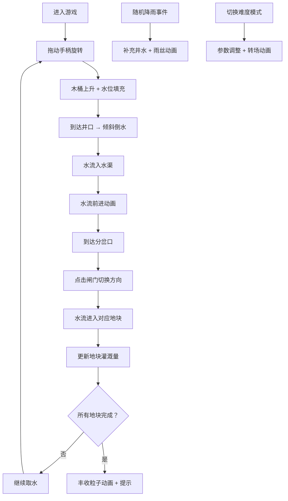

## 1. 产品概述

本产品是一款古代辘轳井打水与水利灌溉的交互游戏应用，通过模拟传统农事场景，让用户直观体验水井取水、水位变化和渠道分水的过程。用户通过拖动辘轳手柄获取井水，经木制水渠输送至6x6农田网格，在分岔处控制闸门方向，最终完成所有地块的灌溉任务。游戏融入天气系统和难度模式，兼具教育性与趣味性。

- 核心价值：将传统农事知识转化为可交互的游戏体验，解决水井取水、水位变化和渠道分水难以直观呈现与反复尝试的问题
- 目标用户：对传统农耕文化感兴趣的玩家、学生及教育工作者

## 2. 核心功能

### 2.1 用户角色
| 角色 | 注册方式 | 核心权限 |
|------|----------|----------|
| 游戏玩家 | 无需注册，直接进入 | 体验完整游戏流程，切换难度模式 |

### 2.2 功能模块
1. **主游戏场景**：宋式农家院落、水井亭、辘轳装置、6x6农田网格、木制水渠系统
2. **取水交互系统**：鼠标拖动手柄旋转、绳索升降、木桶水位填充、倾斜倒水动画
3. **灌溉管理系统**：水流动画、闸门控制、地块需水量计算、进度显示
4. **天气系统**：随机降雨事件、井水补充、雨丝动画效果
5. **难度模式系统**：轻松模式/挑战模式切换、参数调整、转场动画

### 2.3 页面详情
| 页面名称 | 模块名称 | 功能描述 |
|----------|----------|----------|
| 游戏主页面 | 水井亭模块 | 茅草顶水井亭、木质辘轳（直径100px）、可拖动手柄、绳索与木桶系统 |
| 游戏主页面 | 农田网格模块 | 6x6方格（每格80x80px），水田/旱田/菜畦三种类型，独立需水量 |
| 游戏主页面 | 水渠系统模块 | 木制水渠（宽30px）、渐变水流动画、分岔闸门（点击切换方向） |
| 游戏主页面 | 进度显示模块 | 圆形百分比进度环（右上角）、丰收粒子动画 |
| 游戏主页面 | 天气系统模块 | 井口波纹水位显示、降雨事件触发、雨丝动画 |
| 游戏主页面 | 难度切换模块 | 模式切换按钮、进度环颜色变化、缩放旋转转场 |
| 游戏主页面 | 导航与提示模块 | 顶部茅草檐导航栏（高60px）、底部操作提示栏 |

## 3. 核心流程

用户进入游戏后，首先看到宋式农家院落全景。用户需要按住并拖动辘轳手柄顺时针旋转（每圈约2秒），绳索逐渐缩短，木桶上升，桶内水位线从0%填充到100%。当木桶到达井口时，自动倾斜倒水，水花飞溅动画持续0.8秒。

水倒入水渠后，蓝色渐变水流以每格0.3秒的速度前进。到达分岔口时，用户点击红色闸门方块，闸门旋转45度切换水流方向（左/右）。水流最终流入对应农田地块。

每种地块有不同需水量：水田10桶、旱田5桶、菜畦3桶。右上角进度环显示整体灌溉进度，内圈绿色渐变为收获状态。当所有地块灌溉完成时，农田上方升起50个金色粒子，上升50px后消散，持续2秒，并在控制台输出"丰收"提示。

水井初始水位100桶，每取1桶减少1桶。井口波纹动画显示水位：半径随水位递减而缩小，低水位时波纹变为浑浊色。每60秒有40%概率触发降雨，补充20桶水，同时屏幕顶部出现10秒雨丝动画，下落速度200px/s。

用户可切换难度模式：轻松模式水位无限且需求减半；挑战模式水位40桶，需水量增加0.5倍，降雨间隔改为90秒。切换时进度环从绿色变为橙色，伴随0.3秒缩放旋转动画。

## 4. 用户界面设计

### 4.1 设计风格
- **整体风格**：仿宋农业图卷风格，还原古代农事情景
- **主色调**：土黄#d4b76a、赭石#8d6e63、墨绿#2e7d32
- **按钮样式**：所有交互元件（手柄、闸门）带悬停放大效果（scale 1.1，transition 0.3s ease），点击时有深度阴影偏移反馈
- **字体**：思源宋体，呼应宋代美学
- **布局**：顶部茅草檐导航栏（高60px，屋檐延伸20px阴影，底部雨水滴落动画），中央游戏主区域（宽900px，高600px，带轻微阴影），底部操作提示栏（浅色半透明底）

### 4.2 页面设计概述
| 页面名称 | 模块名称 | UI元素 |
|----------|----------|----------|
| 游戏主页面 | 水井亭 | 茅草顶造型、深褐色#4e342e辘轳、圆柱形手柄、绳索、40x50px木桶、蓝色半透明#4a90d9水位线 |
| 游戏主页面 | 农田 | 6x6网格、水田（深褐色湿润）、旱田#c8a555（干裂纹理）、菜畦#4caf50（作物） |
| 游戏主页面 | 水渠 | 木制水渠30px宽、蓝色渐变水流动画、红色闸门方块、45度旋转切换 |
| 游戏主页面 | 井口波纹 | radial-gradient循环动画（周期2s）、低水位#8d6e63浑浊色 |
| 游戏主页面 | 进度环 | 圆形百分比、绿色/橙色渐变、缩放旋转转场 |
| 游戏主页面 | 粒子效果 | 金色丰收粒子（50个）、雨丝（白色半透明线状） |
| 游戏主页面 | 动画效果 | CSS关键帧水花飞溅（0.8秒）、线性渐变水流、radial-gradient波纹 |

### 4.3 响应式设计
- **设计原则**：桌面优先，移动端自适应
- **最小宽度**：768px
- **移动端适配**：所有游戏元件缩放至0.8倍，保证触摸交互区域充足
- **触摸优化**：手柄和闸门的点击区域适当扩大，确保移动端操作流畅

### 4.4 性能要求
- **帧率**：整体动画稳定在60fps
- **内存占用**：最大不超过150MB
- **动画优化**：优先使用CSS transform和opacity属性实现动画，避免频繁重排重绘
