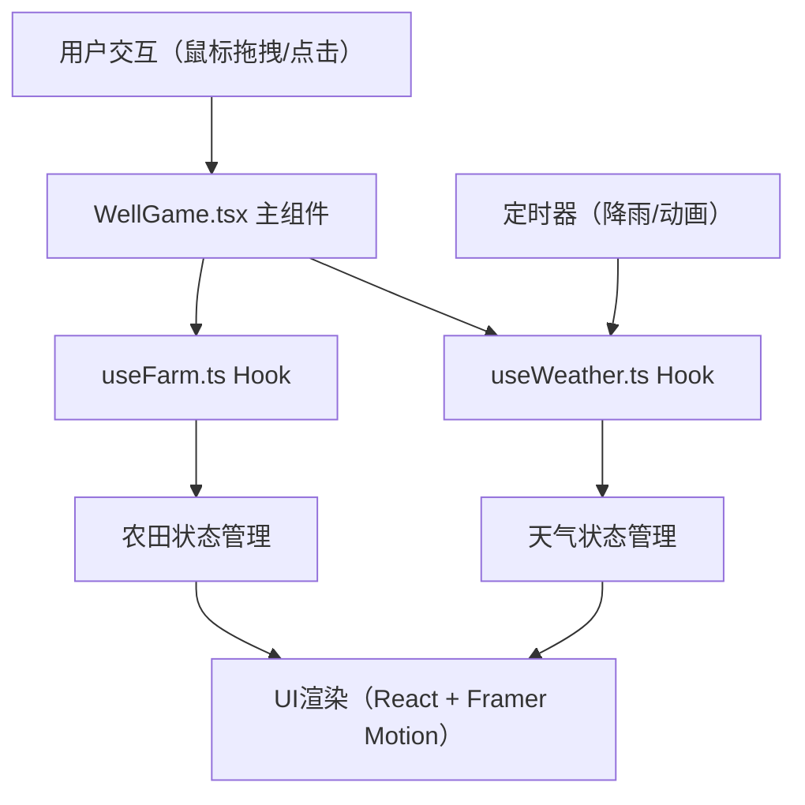

## 1. 架构设计

本项目为纯前端React应用，采用组件化架构，通过自定义Hook管理游戏状态和副作用。整体采用单向数据流设计，事件驱动状态更新，状态变化驱动UI渲染。



## 2. 技术描述

- **前端框架**：React@18 + TypeScript
- **构建工具**：Vite@5
- **动画库**：framer-motion@11
- **语言版本**：ES2020
- **状态管理**：React Hooks（useState、useEffect、useRef、useCallback）
- **样式方案**：CSS Modules + 内联样式（动画相关）

## 3. 项目文件结构

| 文件路径 | 说明 |
|----------|------|
| `package.json` | 项目依赖配置，包含react、react-dom、typescript、vite、@vitejs/plugin-react、framer-motion |
| `index.html` | 入口HTML页面，设置背景色、引用思源宋体字体 |
| `tsconfig.json` | TypeScript配置，严格模式、esnext模块、jsx: react-jsx |
| `vite.config.js` | Vite配置，基础路径./、esbuild目标es2020 |
| `src/WellGame.tsx` | 主游戏组件，管理辘轳拖动、水桶动画、渠道分流、灌溉逻辑 |
| `src/hooks/useFarm.ts` | 农田网格状态管理Hook，包含地块需水量、已灌溉量、灌溉方法、丰收检测 |
| `src/hooks/useWeather.ts` | 天气事件Hook，管理降雨定时器、雨丝粒子、井水补充 |

## 4. 核心数据模型

### 4.1 地块类型定义
```typescript
type PlotType = 'paddy' | 'dry' | 'vegetable';

interface Plot {
  id: string;
  type: PlotType;
  row: number;
  col: number;
  waterNeeded: number;      // 总需水量
  waterReceived: number;    // 已灌溉量
  growthLevel: number;      // 生长等级 0-100
}

interface FarmState {
  plots: Plot[][];          // 6x6网格
  totalProgress: number;    // 整体进度 0-100
  isHarvest: boolean;       // 是否丰收
}
```

### 4.2 游戏状态定义
```typescript
type DifficultyMode = 'easy' | 'normal' | 'hard';

interface GameState {
  mode: DifficultyMode;
  wellWater: number;        // 井水剩余桶数
  maxWellWater: number;     // 井水最大容量
  bucketPosition: number;   // 木桶位置 0（井底）- 1（井口）
  bucketFill: number;       // 桶内水位 0-100
  handleRotation: number;   // 手柄旋转角度
  isPouring: boolean;       // 是否正在倒水
  waterInChannel: number;   // 水渠中的水量
  gateDirection: 'left' | 'right';  // 闸门方向
  isRaining: boolean;       // 是否下雨
}
```

### 4.3 难度参数配置
```typescript
interface DifficultyConfig {
  maxWellWater: number;
  isWaterInfinite: boolean;
  waterDemandMultiplier: number;
  rainInterval: number;     // 毫秒
  rainProbability: number;
  rainWaterAmount: number;
  progressColor: string;
}
```

## 5. 核心算法

### 5.1 手柄旋转与水桶上升算法
- 鼠标拖动时计算拖动角度变化
- 每旋转360度（2秒），水桶位置增加固定值
- 桶内水位随位置线性填充：position * 100
- 位置到达1时触发倒水动画

### 5.2 水流传输算法
- 倒水完成后，水渠中水量+1
- 水流沿水渠以每格0.3秒的速度前进
- 到达分岔口时根据闸门方向流向对应地块
- 目标地块已灌溉量+1，生长等级更新

### 5.3 进度计算算法
```
总需水量 = Σ(各地块需水量)
已灌溉量 = Σ(各地块已灌溉量)
总进度 = (已灌溉量 / 总需水量) * 100
```

### 5.4 天气事件算法
- 定时器按难度配置的间隔触发
- 生成随机数，小于概率阈值则触发降雨
- 降雨持续10秒，期间雨丝动画播放
- 井水补充：min(当前水量 + 补充量, 最大容量)

## 6. 动画实现方案

| 动画效果 | 实现方式 | 参数 |
|----------|----------|------|
| 手柄旋转 | framer-motion animate | rotate属性 |
| 水桶升降 | framer-motion animate | y属性 |
| 水位填充 | CSS linear-gradient + transition | background-position |
| 倾斜倒水 | CSS @keyframes | transform: rotate |
| 水花飞溅 | framer-motion AnimatePresence | opacity + scale |
| 水流前进 | CSS linear-gradient 动画 | background-position-x |
| 闸门切换 | framer-motion | rotate 45deg |
| 井口波纹 | CSS radial-gradient 动画 | background-size |
| 丰收粒子 | framer-motion | y + opacity + scale |
| 雨丝动画 | CSS animation + 粒子数组 | translateY |
| 模式切换 | framer-motion | scale + rotate |

## 7. 性能优化策略

1. **动画性能**：所有动画使用transform和opacity属性，避免触发重排
2. **状态隔离**：通过自定义Hook分离状态管理，减少不必要的重渲染
3. **事件防抖**：鼠标拖动事件使用requestAnimationFrame节流
4. **粒子复用**：雨丝和丰收粒子使用对象池模式，避免频繁创建销毁
5. **CSS优化**：使用will-change提示浏览器优化动画性能
6. **内存控制**：定时器和事件监听器在组件卸载时清理，避免内存泄漏
