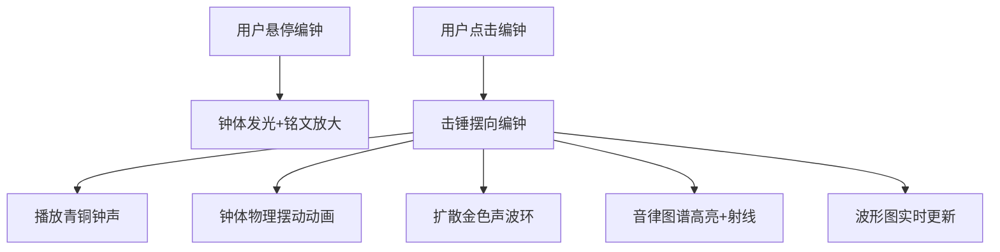
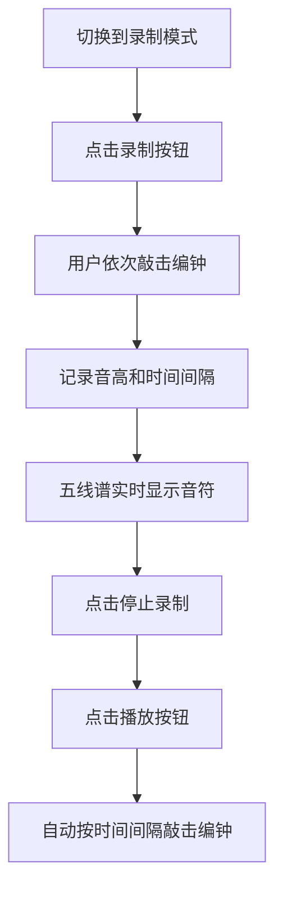

## 1. 产品概述

西周编钟演奏与音律可视化应用，让用户化身古代乐师，在虚拟3D场景中敲击青铜编钟，聆听古朴音律，观察声波振动与音律图谱的实时生成。

- 核心价值：沉浸式体验中华古代礼乐文化，将专业的音乐理论与3D交互技术结合
- 目标用户：音乐爱好者、历史文化爱好者、教育工作者

## 2. 核心功能

### 2.1 功能模块

1. **3D编钟场景**：两层钟架共12个青铜编钟，带古文字铭文和绿锈纹理
2. **音频引擎**：Tone.js合成具有衰减特性的青铜钟声，频率精确到0.1Hz
3. **两种演奏模式**：单音演奏模式和旋律录制/回放模式
4. **音律图谱**：极坐标形式显示12个编钟位置，敲击时高亮并射出射线
5. **声波波形显示**：Canvas 2D实时绘制声波波形，显示频率和音名

### 2.2 页面详情

| 页面名称 | 模块名称 | 功能描述 |
|-----------|-------------|---------------------|
| 主页面 | 3D编钟场景 | 12个编钟按音阶排列，悬停发光，点击触发敲击动画和音效 |
| 主页面 | 操作面板 | 模式切换、录制按钮、播放按钮，半透明毛玻璃效果 |
| 主页面 | 音律图谱 | 极坐标显示12个编钟，敲击时高亮扩散脉冲 |
| 主页面 | 波形显示 | Canvas实时绘制声波，显示音名和频率数值 |
| 主页面 | 五线谱显示 | 录制模式下实时显示音符，回放时同步高亮 |

## 3. 核心流程

### 3.1 单音演奏流程

### 3.2 旋律录制回放流程

## 4. 用户界面设计

### 4.1 设计风格
- **主色调**：深灰背景#1a1a1a，古铜色#b87333，青绿色#2e5e4e，金色#ffd700
- **辅助色**：声波线条#f0d080，钟架边框#3e2723，地面#4a4a4a
- **字体**：思源宋体（标题和铭文），现代无衬线字体（UI文本）
- **按钮风格**：圆角矩形（16px圆角），点击缩放0.95倍+微光闪烁
- **整体氛围**：庄重典雅，古雅肃穆，呼应西周礼乐文化

### 4.2 页面设计概述

| 页面名称 | 模块名称 | UI元素 |
|-----------|-------------|-------------|
| 主页面 | 3D场景 | 两层钟架、12个青铜编钟（扁圆钟形，高度30-80cm渐变）、古绿锈纹理、铭文、击锤、金色声波环 |
| 主页面 | 操作面板 | 右上角半透明毛玻璃面板（backdrop-filter: blur(8px)，背景rgba(0,0,0,0.6)）、模式切换按钮、录制按钮、播放按钮 |
| 主页面 | 音律图谱 | 左下方极坐标图，12个圆形节点（直径10px），脉冲光晕，金色到橙色渐变射线 |
| 主页面 | 波形显示 | 右下方Canvas波形图（线条#f0d080，2px粗细），半透明黑背景，音名+频率数值显示 |
| 主页面 | 五线谱 | 场景上方金色五线，实心椭圆音符，颜色随音高变化 |

### 4.3 响应式设计
- **桌面端**：3D场景占主要视口，音律图谱和波形图分置左右下角
- **移动端（<768px）**：3D场景缩小为视口70%，下方波形图和音律图谱改为双列布局
- **触摸优化**：增大点击热区，优化拖拽手感

### 4.4 3D场景指导
- **环境**：深灰背景，青石板地面，柔和环境光+聚光灯突出编钟金属质感
- **光照**：两盏方向光模拟室内环境，一盏聚光灯照亮钟架主体
- **相机**：初始位置正对钟架，支持鼠标拖拽旋转视角，滚轮缩放
- **后处理**：轻微泛光效果增强青铜质感，环境光遮蔽提升层次感
- **动画**：钟体摆动使用弹簧阻尼模型（k=0.8, d=0.2），声波环ease-out扩散

## 5. 性能要求
- 3D场景帧率：≥30fps
- 波形绘制刷新率：≥30fps
- 点击到发音延迟：≤50ms
