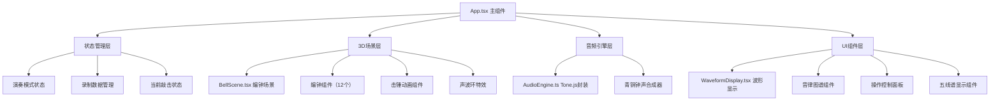

## 1. 架构设计



## 2. 技术描述

- **前端框架**：React 18 + TypeScript
- **构建工具**：Vite 5
- **3D渲染**：Three.js + @react-three/fiber + @react-three/drei
- **动画库**：framer-motion
- **音频引擎**：tone.js
- **状态管理**：React Hooks (useState, useRef, useCallback)
- **样式方案**：原生CSS + CSS变量，framer-motion处理动画

## 3. 项目文件结构

| 文件路径 | 用途说明 |
|----------|----------|
| `package.json` | 项目依赖配置，包含react、three、tone.js等 |
| `index.html` | 入口HTML，配置背景色和思源宋体字体 |
| `tsconfig.json` | TypeScript配置，严格模式，target ES2020 |
| `vite.config.js` | Vite构建配置 |
| `src/types.ts` | 类型定义：编钟数据结构、声波粒子参数 |
| `src/App.tsx` | 主组件，组合3D场景、UI、状态管理 |
| `src/BellScene.tsx` | 3D编钟场景，12个编钟模型、敲击动画 |
| `src/AudioEngine.ts` | Tone.js音频引擎，青铜钟声合成 |
| `src/WaveformDisplay.tsx` | Canvas 2D波形绘制组件 |
| `src/constants.ts` | 编钟数据、音阶映射、颜色常量 |

## 4. 数据模型

### 4.1 编钟数据结构

```typescript
interface BellData {
  id: number;           // 编号 1-12
  name: string;         // 音名（黄钟、大吕等）
  note: string;         // 音名（C4, D4等）
  frequency: number;    // 频率（精确到0.1Hz）
  size: number;         // 高度（cm）
  color: string;        // 颜色（古铜到青绿渐变）
  position: [number, number, number];  // 3D坐标
  layer: 'upper' | 'lower';  // 上下层
  inscription: string;  // 铭文
}

interface RecordingNote {
  bellId: number;
  timestamp: number;
  duration: number;
}

interface WaveParticle {
  id: number;
  bellId: number;
  radius: number;
  opacity: number;
  position: [number, number, number];
}
```

### 4.2 12个编钟音阶配置

| 编号 | 音名 | 西乐音名 | 频率(Hz) | 高度(cm) | 层级 |
|------|------|----------|----------|----------|------|
| 1 | 黄钟 | C4 | 261.6 | 80 | 下层 |
| 2 | 大吕 | C#4 | 277.2 | 76 | 下层 |
| 3 | 太簇 | D4 | 293.7 | 72 | 下层 |
| 4 | 夹钟 | D#4 | 311.1 | 68 | 下层 |
| 5 | 姑洗 | E4 | 329.6 | 64 | 下层 |
| 6 | 仲吕 | F4 | 349.2 | 60 | 下层 |
| 7 | 蕤宾 | F#4 | 370.0 | 50 | 上层 |
| 8 | 林钟 | G4 | 392.0 | 47 | 上层 |
| 9 | 夷则 | G#4 | 415.3 | 44 | 上层 |
| 10 | 南吕 | A4 | 440.0 | 41 | 上层 |
| 11 | 无射 | A#4 | 466.2 | 35 | 上层 |
| 12 | 应钟 | B4 | 493.9 | 30 | 上层 |

## 5. 核心API定义

### 5.1 AudioEngine 接口

```typescript
class AudioEngine {
  constructor();
  init(): Promise<void>;
  playBell(frequency: number, velocity?: number): void;
  getWaveformData(): Float32Array;
  getFrequency(): number;
  dispose(): void;
}
```

### 5.2 组件Props定义

```typescript
interface BellSceneProps {
  onBellStrike: (bellId: number) => void;
  activeBellId: number | null;
  autoPlayBellId: number | null;
  recordingMode: boolean;
}

interface WaveformDisplayProps {
  isActive: boolean;
  frequency: number;
  bellName: string;
  note: string;
}

interface ToneCircleProps {
  activeBellId: number | null;
  bells: BellData[];
}
```

## 6. 性能优化策略

1. **3D性能**：
   - 使用InstancedMesh渲染重复几何元素
   - 编钟模型使用低多边形，法线贴图模拟细节
   - 动画使用requestAnimationFrame批量更新
   - 离屏编钟使用视锥体剔除

2. **音频性能**：
   - Tone.js合成器预初始化
   - 复用合成器实例，避免频繁创建销毁
   - 使用Web Audio API原生节点减少开销

3. **渲染性能**：
   - Canvas波形使用requestAnimationFrame节流
   - React.memo包裹非频繁更新组件
   - 状态更新批量处理，避免重复渲染
