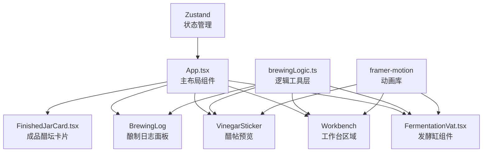

## 1. 架构设计



## 2. 技术描述
- 前端：React 18 + TypeScript + Vite
- 状态管理：Zustand
- 动画库：framer-motion
- 样式：Tailwind CSS 3
- 构建工具：Vite
- 第三方库：uuid（ID生成）、file-saver（文件下载）、canvas（图片生成）
- 后端：无（纯前端应用，数据存储在localStorage）
- 字体：Google Fonts - Liu Jian Mao Cao

## 3. 数据模型

### 3.1 类型定义

```typescript
interface FermentationVat {
  id: string;
  material: 'gaoliang' | 'xiaomi' | 'nuomi';
  progress: number; // 0-100
  lastStirTime: number; // timestamp
  startTime: number; // timestamp
  stirHistory: number[]; // timestamps
}

interface FinishedJar {
  id: string;
  jarNumber: string;
  material: 'gaoliang' | 'xiaomi' | 'nuomi';
  initialAcidity: number;
  agingDays: number;
  openDate: string;
  completedAt: number;
}

interface BrewingLog {
  id: string;
  material: 'gaoliang' | 'xiaomi' | 'nuomi';
  startTime: number;
  stirTimes: number[];
  finalAcidity: number;
  completedAt: number;
}
```

### 3.2 状态管理
- 发酵缸列表
- 成品醋坛列表
- 酿制日志列表
- 当前选中的发酵缸
- 醋帖预览数据

## 4. 核心逻辑模块

### 4.1 发酵进度计算
- 翻拌：每次增加3-5%随机进度
- 衰减：超过12小时未翻拌，每天自动倒退10%
- 完成：进度达到100%自动转为成品醋坛

### 4.2 记录存取
- localStorage持久化存储
- 初始化时从localStorage加载
- 数据变更时自动保存

### 4.3 醋帖生成
- Canvas API绘制400x600px图片
- 云纹边框 `#8b4513`
- 宣纸纹理背景
- 坛号、原料、成醋日期信息
- 支持PNG格式下载

## 5. 文件结构
```
├── package.json
├── index.html
├── tsconfig.json
├── vite.config.js
├── tailwind.config.js
├── postcss.config.js
└── src/
    ├── App.tsx
    ├── main.tsx
    ├── index.css
    ├── store/
    │   └── useBrewingStore.ts
    ├── components/
    │   ├── FermentationVat.tsx
    │   ├── FinishedJarCard.tsx
    │   ├── Workbench.tsx
    │   ├── BrewingLog.tsx
    │   └── VinegarSticker.tsx
    └── utils/
    │   └── brewingLogic.ts
    │   └── generateSticker.ts
    └── types/
        └── index.ts
```
