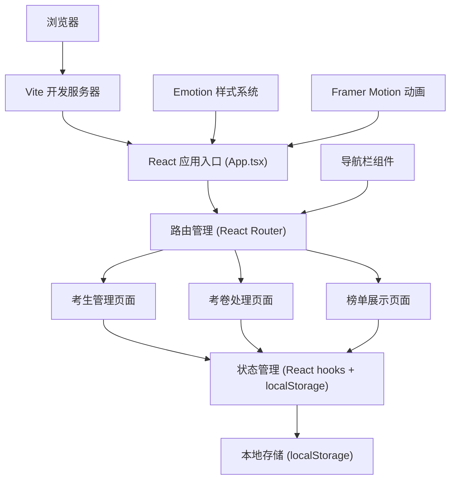
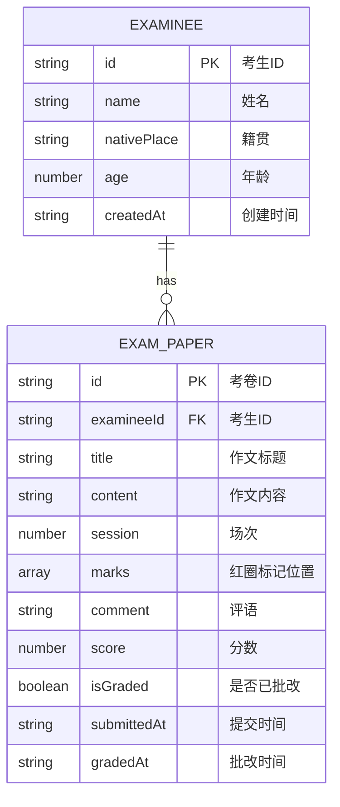

## 1. 架构设计

本项目为纯前端单页应用（SPA），采用React + TypeScript + Vite技术栈，使用localStorage进行数据持久化存储，无需后端服务。



## 2. 技术描述

### 2.1 核心技术栈

- **前端框架**：React 18 + TypeScript 5
- **构建工具**：Vite 5（配置代码分割，优化首屏加载）
- **路由管理**：React Router DOM 6
- **样式方案**：Emotion (@emotion/react + @emotion/styled) CSS-in-JS
- **动画库**：Framer Motion
- **工具库**：
  - uuid：生成唯一ID
  - file-saver：文件导出
  - html2canvas：截图导出PNG
  - axios：HTTP请求（预留扩展）

### 2.2 目录结构

```
├── index.html                 # 入口HTML
├── package.json               # 项目依赖
├── tsconfig.json              # TypeScript配置
├── vite.config.js             # Vite构建配置
└── src/
    ├── App.tsx                # 主应用组件
    ├── main.tsx               # 应用入口
    ├── pages/
    │   ├── ExamineeManage.tsx # 考生管理页面
    │   ├── ExamPaper.tsx      # 考卷处理页面
    │   └── RankList.tsx       # 榜单展示页面
    ├── components/
    │   └── NavBar.tsx         # 导航栏组件
    ├── types/
    │   └── index.ts           # TypeScript类型定义
    ├── utils/
    │   ├── storage.ts         # localStorage封装
    │   └── helpers.ts         # 工具函数
    └── styles/
        └── theme.ts           # 全局主题变量
```

### 2.3 性能优化配置

- **Vite代码分割**：按路由分割代码块，首屏加载≤1.5秒
- **组件懒加载**：路由级别代码分割
- **内存优化**：榜单数据使用useMemo缓存，更新重排≤0.3秒
- **CSS优化**：Emotion样式提取与缓存

## 3. 路由定义

| 路由路径 | 页面组件 | 页面说明 |
|----------|----------|----------|
| `/` | 重定向到 `/examinee` | 默认路由 |
| `/examinee` | ExamineeManage | 考生信息登记与搜索页面 |
| `/exam-paper` | ExamPaper | 考卷录入与批改页面 |
| `/rank-list` | RankList | 成绩榜单生成与展示页面 |
| `*` | 重定向到 `/examinee` | 404处理 |

## 4. 数据模型

### 4.1 实体关系图



### 4.2 类型定义

```typescript
// 考生信息
interface Examinee {
  id: string;
  name: string;
  nativePlace: string;
  age: number;
  createdAt: string;
}

// 红圈标记
interface Mark {
  id: string;
  x: number;
  y: number;
}

// 考卷信息
interface ExamPaper {
  id: string;
  examineeId: string;
  title: string;
  content: string;
  session: number;
  marks: Mark[];
  comment: string;
  score: number | null;
  isGraded: boolean;
  submittedAt: string;
  gradedAt: string | null;
}

// 榜单排名
interface RankItem {
  rank: number;
  examineeId: string;
  name: string;
  nativePlace: string;
  paperCount: number;
  averageScore: number;
}

// 籍贯选项
type NativePlace = '应天府' | '顺天府' | '苏州府' | '杭州府' | '松江府' | '常州府' | '镇江府' | '淮安府' | '扬州府' | '安庆府';
```

## 5. 状态管理方案

采用React Hooks + localStorage的轻量级状态管理方案：

- **useState**：组件内局部状态
- **useEffect**：副作用处理（数据持久化、联动计算）
- **useMemo**：榜单排名等计算型数据缓存
- **useCallback**：优化渲染性能
- **localStorage**：数据持久化存储

### 5.1 数据存储Key

- `examinees`：考生列表数据
- `examPapers`：考卷列表数据

### 5.2 核心状态

```typescript
// 考生管理状态
const [examinees, setExaminees] = useState<Examinee[]>([]);
const [selectedIds, setSelectedIds] = useState<string[]>([]);
const [currentPage, setCurrentPage] = useState(1);
const [filterNativePlace, setFilterNativePlace] = useState('');

// 考卷处理状态
const [papers, setPapers] = useState<ExamPaper[]>([]);
const [selectedPaper, setSelectedPaper] = useState<ExamPaper | null>(null);
const [marks, setMarks] = useState<Mark[]>([]);

// 榜单状态（使用useMemo缓存）
const rankList = useMemo<RankItem[]>(() => {
  // 计算每位考生的平均分并排序
  return calculateRankList(examinees, papers);
}, [examinees, papers]);
```

## 6. 核心功能实现方案

### 6.1 考生管理

- **表单验证**：使用React受控表单，姓名非空验证，年龄范围1-99
- **分页逻辑**：每页10条，使用slice分页
- **批量删除**：filter过滤选中ID
- **搜索筛选**：按籍贯filter过滤

### 6.2 考卷录入与批改

- **考生选择**：下拉框加载考生列表
- **多次提交**：记录session场次号
- **红圈标记**：点击考卷内容区记录相对坐标，渲染绝对定位的红色圆圈
- **分数验证**：1-100整数验证

### 6.3 榜单排名

- **平均分计算**：按考生ID分组，计算已批改考卷的平均分
- **排序逻辑**：按平均分降序，分数相同按考卷数量降序
- **前三名高亮**：根据rank值应用不同边框颜色
- **图片导出**：html2canvas截图 + file-saver保存为PNG

### 6.4 导航动画

- **下划线动画**：Framer Motion AnimatePresence + layoutId
- **悬停效果**：CSS transition颜色变化

## 7. 样式主题变量

```typescript
// theme.ts
export const theme = {
  colors: {
    background: '#f7f3e8',
    paper: '#faf3e0',
    card: '#ffffff',
    border: '#d4b76a',
    primary: '#c0392b',
    primaryHover: '#922b21',
    textHover: '#8e44ad',
    rowHover: '#fff3cd',
    gold: '#ffd700',
    silver: '#c0c0c0',
    bronze: '#cd7f32',
    mark: 'rgba(192, 57, 43, 0.5)',
    markSolid: 'rgba(192, 57, 43, 1)',
  },
  fonts: {
    family: '"Source Han Serif CN", "Noto Serif SC", serif',
  },
  breakpoints: {
    mobile: '768px',
  },
};
```
