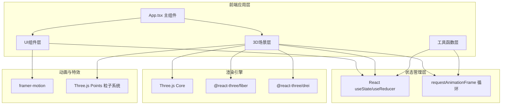

## 1. 架构设计



## 2. 技术描述

- **前端框架**：React@18 + TypeScript@5 + Vite@5
- **3D渲染**：Three.js@0.160 + @react-three/fiber@8 + @react-three/drei@9
- **动画库**：framer-motion@11
- **状态管理**：React Hooks (useState, useRef, useCallback, useMemo)
- **工具库**：uuid（生成冰块ID）、file-saver（导出日志）
- **构建工具**：Vite@5，使用@vitejs/plugin-react
- **样式方案**：CSS Modules + CSS Variables + framer-motion动画
- **初始化工具**：Vite react-ts模板

## 3. 目录结构

```
src/
├── App.tsx              # 主组件，全局状态管理
├── main.tsx             # 入口文件
├── index.css            # 全局样式，CSS变量定义
├── components/
│   ├── IceCellar.tsx    # 3D冰窖场景，冰块管理
│   ├── BlockInfo.tsx    # 冰块/冰鉴信息面板
│   ├── Toolbar.tsx      # 左侧垂直工具条
│   ├── SeasonSwitch.tsx # 季节切换器
│   ├── TempIndicator.tsx # 温度指示条
│   ├── GlobalStatus.tsx # 顶部全局状态UI
│   └── IceBook.tsx      # 冰册日志面板
├── hooks/
│   ├── useIcePhysics.ts # 融化物理计算hook
│   └── useParticleSystem.ts # 粒子系统hook
├── utils/
│   ├── icePhysics.ts    # 纯函数：融化速度、温度计算
│   └── constants.ts     # 常量定义：颜色、尺寸、配置
└── types/
    └── index.ts         # TypeScript类型定义
```

## 4. 核心数据模型

### 4.1 类型定义

```typescript
// 冰块状态
interface IceBlock {
  id: string;
  number: number;           // 编号：冬储第N号
  storedDate: string;       // 储存日期 YYYY-MM-DD
  position: [number, number, number]; // 3D位置
  meltProgress: number;     // 融化进度 0-100%
  size: [number, number, number]; // 尺寸
  isInCellar: boolean;      // 是否在冰窖中
  isInIceJian: boolean;     // 是否在冰鉴中
  temperature: number;      // 冰块温度
}

// 冰鉴
interface IceJian {
  id: string;
  blocks: string[];         // 包含的冰块ID
  position: [number, number, number];
  placedScene: 'banquet' | 'pavilion' | null;
  meltProgress: number;
  createdAt: string;
}

// 季节类型
type Season = '大雪' | '小寒' | '大寒' | '立夏' | '大暑';

// 场景状态
interface SceneState {
  currentSeason: Season;
  temperature: number;      // 当前温度 -10 到 35
  isCellarDoorOpen: boolean;
  hasStrawCurtain: boolean; // 草帘保温
  hasFeltCover: boolean;    // 毛毡覆盖
  activeTool: 'none' | 'chisel' | 'lift' | 'straw' | 'felt';
  selectedBlocks: string[];
  iceBlocks: IceBlock[];
  iceJians: IceJian[];
  operationLogs: OperationLog[];
}

// 操作日志
interface OperationLog {
  id: string;
  type: 'store' | 'retrieve' | 'createJian' | 'placeJian';
  blockNumbers?: number[];
  temperature: number;
  timestamp: string;
  description: string;
}

// 温度记录
interface TempRecord {
  time: number;
  temperature: number;
}
```

### 4.2 常量配置

```typescript
// 季节配置
const SEASON_CONFIG: Record<Season, {
  tempRange: [number, number];
  bgColor: string;
  ambientIntensity: number;
  fogDensity: number;
}> = {
  '大雪': { tempRange: [-5, 0], bgColor: '#a8d5ea', ambientIntensity: 0.6, fogDensity: 0.02 },
  '小寒': { tempRange: [-10, -3], bgColor: '#8ec5e0', ambientIntensity: 0.5, fogDensity: 0.03 },
  '大寒': { tempRange: [-8, -2], bgColor: '#9ad0ea', ambientIntensity: 0.55, fogDensity: 0.025 },
  '立夏': { tempRange: [20, 28], bgColor: '#f5deb3', ambientIntensity: 0.9, fogDensity: 0.01 },
  '大暑': { tempRange: [30, 35], bgColor: '#e6c88a', ambientIntensity: 1.1, fogDensity: 0.008 },
};

// 融化速度配置（%/秒）
const MELT_RATES = {
  WINTER_OPEN: 0.1,      // 冬季露天
  SUMMER_CELLAR_OPEN: 0.3, // 夏季冰窖门开
  SUMMER_CELLAR_CLOSED: 0.08, // 夏季冰窖门关
  ICE_JIAN: 0.05,        // 冰鉴中
  INSULATION_FACTOR: 0.5, // 保温材料系数
};
```

## 5. 核心模块设计

### 5.1 App.tsx - 主组件

**职责**：
- 全局状态管理（场景状态、冰块列表、温度历史）
- 季节切换逻辑与过渡动画
- 组件布局：3D场景 + UI层
- requestAnimationFrame主循环
- 温度历史记录与曲线绘制

**核心状态**：
```typescript
const [sceneState, setSceneState] = useState<SceneState>({...});
const [tempHistory, setTempHistory] = useState<TempRecord[]>([]);
const [transitionProgress, setTransitionProgress] = useState(0);
const [targetSeason, setTargetSeason] = useState<Season>('大雪');
```

### 5.2 IceCellar.tsx - 3D场景组件

**职责**：
- 冬季/夏季场景渲染
- 冰块生成、摆放、动画
- 粒子系统（木屑、冷凝水、雾气）
- 射线检测与交互（点击选择、拖拽）
- 冰凿划线切割逻辑
- 冰窖门、阶梯、冰鉴模型

**核心功能**：
- `generateIceBlock()`: 生成新冰块
- `handleChiselCut()`: 处理凿冰切割
- `liftIceAnimation()`: 起冰动画
- `selectBlock()`: 冰块选择
- `createIceJian()`: 创建冰鉴
- `placeIceJian()`: 放置冰鉴

### 5.3 icePhysics.ts - 物理计算

**纯函数，无副作用**：

```typescript
// 计算当前温度下的基础融化速度
export function calculateBaseMeltRate(
  temperature: number,
  isWinter: boolean,
  isCellarDoorOpen: boolean,
  isInCellar: boolean,
  isInIceJian: boolean
): number;

// 应用保温材料系数
export function applyInsulation(
  baseRate: number,
  hasStrawCurtain: boolean,
  hasFeltCover: boolean
): number;

// 计算冰块剩余质量
export function calculateRemainingMass(
  initialMass: number,
  meltProgress: number
): number;

// 估算完全融化时间（秒）
export function estimateMeltTime(
  currentProgress: number,
  meltRate: number
): number;

// 温度颜色映射
export function tempToColor(temp: number): string;

// 季节温度插值
export function interpolateSeasonTemp(
  fromSeason: Season,
  toSeason: Season,
  progress: number
): number;
```

### 5.4 BlockInfo.tsx - 信息面板

**Props**：
```typescript
interface BlockInfoProps {
  block: IceBlock | null;
  iceJian: IceJian | null;
  temperature: number;
  onClose: () => void;
  onSelectBlock: (id: string) => void;
  onCreateIceJian: (blockIds: string[]) => void;
  selectedBlocks: string[];
}
```

**Tab内容**：
- 详情：冰块编号、日期、温度、融化进度条
- 操作：取冰按钮、选择多块、制作冰鉴
- 日志：最近操作历史列表

## 6. 性能优化策略

### 6.1 3D渲染优化

- **InstancedMesh**：冰块使用实例化网格渲染，减少draw call
- **LOD**：远距离冰块简化几何体
- **视锥体剔除**：Three.js内置，确保只渲染可见物体
- **粒子池**：粒子对象复用，避免频繁GC
- **材质共享**：相同材质的物体共享Material实例

### 6.2 计算优化

- **融化计算**：requestAnimationFrame中批量更新，使用增量时间
- **温度曲线**：使用requestAnimationFrame节流，每帧只更新最后一个数据点
- **状态更新**：使用useCallback/useMemo避免不必要的重渲染
- **射线检测**：限制检测频率，mousemove时使用throttle

### 6.3 内存管理

- 冰块移除时调用`dispose()`释放几何体和材质
- 粒子系统使用BufferGeometry，更新时只修改position属性
- 场景切换时清理事件监听器和动画帧

## 7. 构建与部署

- **开发命令**：`npm run dev`
- **构建命令**：`npm run build`
- **代码检查**：`tsc --noEmit` 确保类型正确
- **资源优化**：Vite内置代码分割、tree shaking、压缩
- **静态资源**：SVG图标内联，音频资源按需加载
