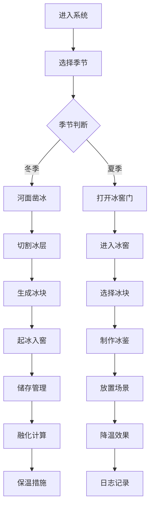

## 1. 产品概述

古代冰窖储冰取冰全流程3D交互可视化项目，让用户以周代"凌人"身份体验冬凿夏取的冰政管理。通过沉浸式3D场景还原古代藏冰文化，结合物理模拟与交互设计，实现教育性与趣味性的统一。

- 核心目标：还原古代冰窖运作流程，科普传统藏冰文化
- 目标用户：历史文化爱好者、教育工作者、博物馆参观者
- 产品价值：数字化传承非物质文化遗产，提供交互式历史学习体验

## 2. 核心特性

### 2.1 用户角色

| 角色 | 注册方式 | 核心权限 |
|------|----------|----------|
| 凌人（用户） | 无需注册，直接进入 | 完整操作流程：凿冰、储冰、取冰、制冰鉴、查看日志 |

### 2.2 功能模块

1. **场景控制模块**：季节切换（大雪/小寒/大寒/立夏/大暑）、温度显示、视角控制
2. **冬季凿冰模块**：冰层切割、冰凿工具、粒子爆炸效果、起冰动画
3. **冰窖管理模块**：冰块储存、融化物理、草帘/毛毡保温、冰窖门开关
4. **夏季取冰模块**：冰块抽取、信息浮窗、冰鉴制作、放置场景
5. **效果系统模块**：冷凝水粒子、雾气粒子、木屑粒子、温度计动画
6. **日志系统模块**：冰册记录、操作历史、导出TXT文件

### 2.3 页面详情

| 页面名称 | 模块名称 | 功能描述 |
|----------|----------|----------|
| 主场景页面 | 3D场景渲染 | 冬季河面/夏季冰窖双场景切换，Three.js实时渲染 |
| 主场景页面 | 季节切换器 | 左上角节气按钮，平滑过渡动画（1.2秒） |
| 主场景页面 | 温度指示条 | 顶部-10到35度渐变可视化条 |
| 主场景页面 | 左侧工具条 | 冰凿、起冰、草帘、毛毡等操作图标，悬停展开 |
| 主场景页面 | 右侧信息面板 | 冰块/冰鉴详情，tab切换（详情/操作/日志） |
| 主场景页面 | 全局状态UI | 剩余冰块数、总融化进度、24小时温度曲线图 |

## 3. 核心流程

### 冬季储冰流程
用户进入冬季场景 → 移动视角定位冰层 → 按住鼠标拖动冰凿划线切割 → 冰层裂开生成冰块 → 点击"起冰"按钮 → 冰块通过绞盘上升 → 运入冰窖储存 → 冰块编号并记录时间戳

### 夏季取冰流程
用户切换到夏季场景 → 打开冰窖门 → 下阶梯进入冰窖 → 点击选择冰块 → 冰块上升显示信息浮窗 → 选择2块以上冰块 → 点击"取冰"制作冰鉴 → 拖拽冰鉴到宴席/凉亭 → 触发降温效果 → 记录操作日志

### 状态管理流程
系统实时计算融化速度 → 更新冰块状态 → 全局UI同步显示 → 用户可添加保温材料 → 融化速度降低50% → 冰窖门状态影响融化速率

## 4. 用户界面设计

### 4.1 设计风格

- **主色调**：米白#f5f0e0、深褐#4a3728、淡青#b0c4b0
- **冬季场景色**：背景冷蓝#a8d5ea、积雪#f0f4f8、冰层#b3d9ff渐变
- **夏季场景色**：背景暖金#f5deb3、毛石#6b5b4a、橡木#3e2723
- **按钮样式**：木纹纹理（CSS径向渐变模拟木节），点击下凹动画
- **字体**：思源宋体（Noto Serif SC），字重400/600
- **整体风格**：宋代美学，雅致简约，宣纸纹理做旧效果

### 4.2 页面设计概述

| 页面名称 | 模块名称 | UI元素 |
|----------|----------|--------|
| 主场景 | 3D视口 | 透视相机、OrbitControls、环境光+方向光 |
| 主场景 | 季节切换器 | 圆角按钮组，激活态发光效果，1.2秒过渡动画 |
| 主场景 | 温度指示条 | 水平渐变条，指针随温度移动，颜色从蓝到红 |
| 左侧 | 工具条 | 半透明黑底#1a1a1a，宽度60px，悬停展开至180px，SVG图标 |
| 右侧 | 信息面板 | 宣纸纹理背景，宽度350px，tab切换淡入淡出0.3秒 |
| 顶部 | 状态UI | 三栏布局：冰块数量/融化进度/温度曲线 |
| 冰册 | 日志面板 | 竹简样式，浅黄#f0e68c背景，小楷字体，可滚动列表 |

### 4.3 响应式设计

- **桌面端优先**：1280px以上最佳体验，完整功能
- **平板适配**：900-1280px，工具条改为底部水平布局
- **触摸优化**：支持触摸拖拽旋转、双指缩放、长按选择
- **性能降级**：低性能设备自动减少粒子数量至200以内

### 4.4 3D场景指导

- **环境氛围**：冬季使用冷色调HDR，蓝紫色环境光；夏季暖金色环境光，模拟日光
- **光照设置**：冬季方向光色温6000K，强度0.8；夏季方向光色温3500K，强度1.2；添加半球光模拟环境反射
- **相机设置**：初始位置(0, 5, 10)，Fov 50度，近裁0.1，远裁100；OrbitControls限制俯仰角-20到60度，缩放范围1-8单位
- **构图布局**：冬季场景以河面为主体，冰窖入口在右上角；夏季场景冰窖穹顶居中，阶梯在左侧
- **交互动画**：冰块上升2秒缓动，冰窖门开启1秒旋转动画，冰鉴拖拽使用射线检测+lerp平滑跟随
- **后处理效果**：Bloom发光（冰凿微光、冰块边缘），色调映射ACES，轻微晕影增强沉浸感
- **性能预算**：Draw call < 100，三角形 < 50万，粒子总数 < 500，目标帧率60fps

## 5. 交互细节规范

### 5.1 鼠标交互

- **左键拖拽**：3D场景旋转（绕Y轴360度）
- **滚轮**：缩放（1-8单位）
- **左键按住+移动**：冰凿划线切割
- **点击**：选择冰块、按钮操作、开关冰窖门
- **拖拽**：冰鉴放置到指定位置

### 5.2 动画规范

- **季节切换**：背景色、光照、雾效线性过渡1.2秒
- **冰块裂开**：CSS粒子爆炸，碎片0.8秒后消失
- **起冰动画**：绳索抖动+冰块上升，2秒完成
- **面板切换**：tab内容淡入淡出0.3秒
- **图标点击**：下凹0.1秒keyframe动画

### 5.3 反馈机制

- **操作成功**：微妙音效+轻微屏幕震动
- **状态变化**：温度变化时颜色渐变提示
- **错误操作**：边界提示+禁止光标
- **音频反馈**：冰窖门开启石材摩擦声、凿冰敲击声（可选）
