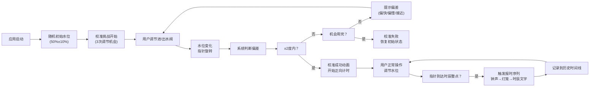

## 1. 产品概述

古代漏刻计时与报时互动应用，让用户扮演汉代司天监掌漏吏，通过调节铜壶滴漏的进水阀和出水阀控制水位变化，使浮箭刻度盘精确对准时辰刻度，确保城池时辰报时准确无误。

- 主要目的：通过互动体验还原古代计时技术，寓教于乐
- 目标用户：对中国古代科技文化感兴趣的各年龄段用户
- 产品价值：沉浸式体验汉代计时智慧，兼具教育性与趣味性

## 2. 核心特性

### 2.1 用户角色
| 角色 | 注册方式 | 核心权限 |
|------|----------|----------|
| 掌漏吏（用户） | 无需注册，直接进入 | 调节阀门、手动报时、校准挑战、查看历史记录 |

### 2.2 功能模块
1. **漏刻房主场景**：三只铜壶水位动态模拟、浮箭刻度盘实时显示、钟鼓楼报时动画
2. **水位控制面板**：进水阀/出水阀滑块调节、时辰进度条、手动报时按钮、四季切换
3. **校准挑战系统**：初始随机偏移、3次调节机会、偏差提示、计时与结果判定
4. **历史记录边栏**：最近10次报时事件时间线、详情弹窗与水量变化曲线

### 2.3 页面详情
| 页面名称 | 模块名称 | 功能描述 |
|----------|----------|----------|
| 主应用页 | 漏刻房场景 | SVG绘制三只铜壶（日/月/星壶），实时水位模拟，溢出动画，浮箭刻度盘指针旋转，钟鼓楼背景与报时动画 |
| 主应用页 | 控制面板 | 进水阀滑块(0-100)、出水阀滑块(0-100)、时辰进度条、报时按钮、四季切换滑块 |
| 主应用页 | 校准挑战 | 启动时随机初始水位，3次调节限制，偏差提示（偏快/偏慢/接近），成功/失败动画，计时统计 |
| 主应用页 | 历史记录边栏 | 左侧200px边栏，10条报时记录卡片，悬停上浮效果，详情弹窗显示水量变化曲线 |

## 3. 核心流程

**主用户流程说明**：
1. 应用启动后自动进入校准挑战模式，星壶初始水位为50%±10%随机偏移
2. 用户有3次调节机会，通过进水阀和出水阀控制水位，使指针对准当前时辰±2度范围内
3. 每次调节后系统给出偏差提示，校准成功后开始计时并进入正常操作模式
4. 用户持续调节水位，每当时辰整点时自动触发报时序列
5. 所有报时事件记录到左侧边栏，可查看详情和水量变化曲线
6. 四季切换影响蒸发速率和水流粘稠度，增加策略性

## 4. 用户界面设计

### 4.1 设计风格
- **配色方案**：参考汉代漆器配色
  - 主色：黑褐 `#2a2a2a`、朱红 `#8b2500`
  - 点缀色：金色 `#c6955a`、象牙白 `#f5f0e8`
  - 场景色：青铜色 `#6d4c41` ~ `#5d4037`、水蓝色 `rgba(74, 144, 226, 0.6)`
- **按钮/控件风格**：统一金色描边 `#c6955a`，圆角6px，悬停时背景亮度提升10%
- **字体**：思源宋体（标题/刻度）、楷体（报时文字）、篆书（时辰刻度）
- **布局风格**：竖屏优化flex列布局，70%场景区 + 30%控制区，左侧200px历史记录边栏
- **装饰元素**：汉代弦纹、云纹装饰，卷轴动画，宣纸质感

### 4.2 页面设计概述
| 页面名称 | 模块名称 | UI元素 |
|----------|----------|--------|
| 主应用页 | 漏刻房场景 | 深色木纹地板 `#4e342e`、土坯色墙壁 `#6d4c41`、摇摆油灯、铜壶弦纹凹槽、溢出水滴粒子、象牙白刻度盘、红色木质指针、灰砖城楼SVG、灯笼光效、时辰文字浮动 |
| 主应用页 | 控制面板 | 自定义滑块（轨道 `#2a2a2a` 高8px，圆形手柄 `#c6955a` 直径20px）、时辰进度条、报时按钮、四季切换滑块 |
| 主应用页 | 历史记录边栏 | 半透明背景 `#3e2723`、卡片式记录 `#4e342e` 圆角8px、悬停上浮5px、季节图标、详情弹窗竖排文字、SVG水量曲线 |
| 主应用页 | 校准挑战 | 宣纸卷轴展开动画、偏差提示文字、正向计时器、成功/失败弹窗 |

### 4.3 响应式设计
- **桌面优先**：标准竖屏布局，左侧边栏200px，主内容区flex列布局
- **平板适配**：屏幕宽度<1024px时，边栏可折叠
- **移动端**：屏幕宽度<768px时
  - 自动调整为单列布局
  - 场景高度缩小至60vw
  - 所有触摸控件最小尺寸48px，方便手指操作
  - 滑块放大，按钮增大
  - 边栏改为底部抽屉式

### 4.4 动效设计
- **数值变化**：水位、指针角度、季节切换使用framer-motion的spring动效，duration 0.5s，bounce 0.2
- **报时动画**：CSS keyframes实现城楼灯笼依次点亮、时辰文字上下浮动
- **微交互**：滑块拖动时阴影扩散、卡片悬停上浮、按钮悬停亮度变化
- **溢出动画**：水位超95%时，5-8个椭圆粒子扩散消失
- **校准成功**：宣纸卷轴从上向下展开动画

## 5. 性能约束
- **水位模拟**：requestAnimationFrame驱动，更新频率≥60fps
- **动画帧率**：所有SVG和CSS动画稳定≥55fps
- **响应延迟**：滑块响应<50ms，报时音效播放<100ms
- **加载性能**：FCP<2s，TTI<3s
