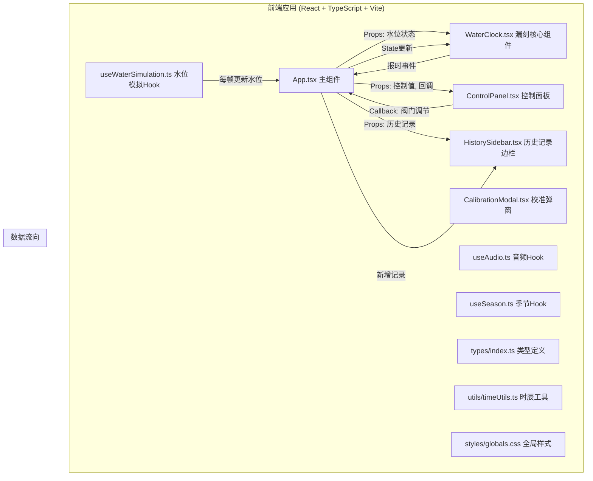

## 1. 架构设计



**模块调用关系**：
1. `App.tsx` 作为状态管理中心，持有水位、阀门值、季节、历史记录等全局状态
2. `useWaterSimulation.ts` 通过requestAnimationFrame每帧更新水位，通过回调更新App状态
3. `ControlPanel.tsx` 接收用户输入，通过回调更新App中的阀门值
4. `WaterClock.tsx` 根据传入的水位数据渲染SVG图形，检测报时条件
5. `useAudio.ts` 提供Web Audio API封装，供各组件播放音效
6. `HistorySidebar.tsx` 展示历史记录，点击详情时从App获取水量数据

## 2. 技术描述

- **前端框架**：React@18 + TypeScript@5 + Vite@5
- **初始化工具**：vite-init
- **样式方案**：CSS Modules + 全局CSS变量
- **动画库**：framer-motion@11（spring动效、组件动画）
- **工具库**：uuid@9（生成记录ID）
- **后端**：无，纯前端应用
- **数据库**：无，使用localStorage持久化历史记录
- **字体**：Google Fonts - 思源宋体 (Noto Serif SC)

## 3. 目录结构

```
auto316/
├── index.html                 # 入口HTML
├── package.json               # 依赖配置
├── tsconfig.json              # TypeScript配置
├── vite.config.js             # Vite配置
└── src/
    ├── App.tsx                # 主组件，状态管理
    ├── main.tsx               # React入口
    ├── vite-env.d.ts          # Vite类型声明
    ├── components/            # UI组件
    │   ├── WaterClock.tsx     # 漏刻核心组件（铜壶+刻度盘+城楼）
    │   ├── ControlPanel.tsx   # 控制面板（阀门+进度条+报时）
    │   ├── HistorySidebar.tsx # 历史记录边栏
    │   ├── CalibrationModal.tsx # 校准结果弹窗
    │   ├── RecordDetailModal.tsx # 记录详情弹窗
    │   └── TowerAnimation.tsx # 城楼报时动画组件
    ├── hooks/                 # 自定义Hooks
    │   ├── useWaterSimulation.ts # 水位物理模拟
    │   ├── useAudio.ts        # Web Audio API封装
    │   ├── useSeason.ts       # 季节状态管理
    │   └── useCalibration.ts  # 校准挑战逻辑
    ├── types/                 # TypeScript类型
    │   └── index.ts           # 全局类型定义
    ├── utils/                 # 工具函数
    │   ├── timeUtils.ts       # 时辰计算、格式化
    │   └── waterUtils.ts      # 水位计算工具
    └── styles/                # 样式文件
        ├── globals.css        # 全局样式与CSS变量
        ├── WaterClock.module.css
        ├── ControlPanel.module.css
        └── HistorySidebar.module.css
```

## 4. 数据模型

### 4.1 类型定义

```typescript
// 四季类型
export type Season = 'spring' | 'summer' | 'autumn' | 'winter';

// 时辰名称
export type ShiChenName = '子' | '丑' | '寅' | '卯' | '辰' | '巳' | '午' | '未' | '申' | '酉' | '戌' | '亥';

// 水位状态
export interface WaterState {
  sunPot: number;      // 日壶水位 0-100
  moonPot: number;     // 月壶水位 0-100
  starPot: number;     // 星壶水位 0-100
}

// 阀门状态
export interface ValveState {
  inlet: number;       // 进水阀 0-100
  outlet: number;      // 出水阀 0-100
}

// 报时记录
export interface TimeRecord {
  id: string;
  shiChen: ShiChenName;
  timestamp: Date;
  calibrationTime: number; // 校准耗时（秒）
  season: Season;
  waterHistory: { time: number; level: number }[]; // 水量变化数据点
}

// 校准状态
export interface CalibrationState {
  isActive: boolean;
  attemptsLeft: number;
  targetAngle: number;
  deviation: number;
  isSuccess: boolean | null;
  startTime: number | null;
  elapsedTime: number;
}
```

### 4.2 常量配置

```typescript
// 铜壶尺寸配置
export const POT_CONFIG = {
  sun: { height: 280, diameter: 200, maxVolume: 100 },
  moon: { height: 220, diameter: 160, maxVolume: 100 },
  star: { height: 180, diameter: 120, maxVolume: 100 },
};

// 流速配置
export const FLOW_RATES = {
  sunToMoon: 3,      // 日壶到月壶固定流速
  moonToStar: 3,     // 月壶到星壶固定流速
  maxInlet: 5,       // 最大进水速率
  maxOutlet: 8,      // 最大出水速率
};

// 季节影响配置
export const SEASON_EFFECTS: Record<Season, {
  evaporation: number;  // 蒸发速率 单位/分钟
  inletEfficiency: number;  // 进水效率系数
  outletEfficiency: number; // 出水效率系数
  bgColor: string;     // 背景色调
}> = {
  spring: { evaporation: 1, inletEfficiency: 1, outletEfficiency: 1, bgColor: '#a8d5ba' },
  summer: { evaporation: 2, inletEfficiency: 0.8, outletEfficiency: 0.85, bgColor: '#f5deb3' },
  autumn: { evaporation: 0.8, inletEfficiency: 1, outletEfficiency: 1, bgColor: '#d4a76a' },
  winter: { evaporation: 0.2, inletEfficiency: 1.1, outletEfficiency: 1.1, bgColor: '#b0c4de' },
};

// 时辰列表与角度映射
export const SHI_CHEN_LIST: { name: ShiChenName; angle: number }[] = [
  { name: '子', angle: 270 }, { name: '丑', angle: 300 }, { name: '寅', angle: 330 },
  { name: '卯', angle: 0 },   { name: '辰', angle: 30 },  { name: '巳', angle: 60 },
  { name: '午', angle: 90 },  { name: '未', angle: 120 }, { name: '申', angle: 150 },
  { name: '酉', angle: 180 }, { name: '戌', angle: 210 }, { name: '亥', angle: 240 },
];
```

## 5. 核心算法

### 5.1 水位模拟算法

```typescript
// 每帧更新水位 (dt为时间差，单位：秒)
function updateWaterLevels(
  current: WaterState,
  valves: ValveState,
  season: Season,
  dt: number
): WaterState {
  const { inlet, outlet } = valves;
  const effects = SEASON_EFFECTS[season];
  
  // 实际流速，考虑季节效率
  const inletRate = (inlet / 100) * FLOW_RATES.maxInlet * effects.inletEfficiency;
  const outletRate = (outlet / 100) * FLOW_RATES.maxOutlet * effects.outletEfficiency;
  
  // 壶间固定流速
  const sunToMoon = Math.min(FLOW_RATES.sunToMoon, current.sunPot / dt);
  const moonToStar = Math.min(FLOW_RATES.moonToStar, current.moonPot / dt);
  
  // 蒸发量（每10秒扣除）
  const evaporation = effects.evaporation / 60; // 转为每秒单位
  
  let newSun = current.sunPot + (inletRate - sunToMoon) * dt;
  let newMoon = current.moonPot + (sunToMoon - moonToStar) * dt;
  let newStar = current.starPot + (moonToStar - outletRate - evaporation) * dt;
  
  // 限制在0-100范围，超过则溢出
  newSun = Math.max(0, Math.min(100, newSun));
  newMoon = Math.max(0, Math.min(100, newMoon));
  newStar = Math.max(0, Math.min(100, newStar));
  
  return { sunPot: newSun, moonPot: newMoon, starPot: newStar };
}
```

### 5.2 指针角度计算

```typescript
// 星壶水位 0-100% 映射到 0-360度
function waterLevelToAngle(level: number): number {
  return (level / 100) * 360;
}

// 判断当前时辰
function getCurrentShiChen(angle: number): { name: ShiChenName; isExact: boolean } {
  const normalizedAngle = ((angle % 360) + 360) % 360;
  
  for (const shiChen of SHI_CHEN_LIST) {
    const diff = Math.abs(normalizedAngle - shiChen.angle);
    const minDiff = Math.min(diff, 360 - diff);
    if (minDiff <= 2.5) {
      return { name: shiChen.name, isExact: minDiff <= 0.5 };
    }
  }
  
  // 返回最近的时辰
  const nearest = SHI_CHEN_LIST.reduce((prev, curr) => {
    const prevDiff = Math.abs(normalizedAngle - prev.angle);
    const currDiff = Math.abs(normalizedAngle - curr.angle);
    return Math.min(prevDiff, 360 - prevDiff) < Math.min(currDiff, 360 - currDiff) ? prev : curr;
  });
  
  return { name: nearest.name, isExact: false };
}
```

### 5.3 时辰进度计算

```typescript
// 计算当前时辰进度百分比
function getShiChenProgress(angle: number): number {
  const normalizedAngle = ((angle % 360) + 360) % 360;
  const shiChenIndex = Math.floor(normalizedAngle / 30);
  const progressInShiChen = (normalizedAngle % 30) / 30;
  return progressInShiChen * 100;
}
```

## 6. 组件接口定义

### 6.1 WaterClock Props
```typescript
interface WaterClockProps {
  waterState: WaterState;
  season: Season;
  isReporting: boolean;
  currentShiChen: ShiChenName;
  onHourStrike: (shiChen: ShiChenName) => void;
}
```

### 6.2 ControlPanel Props
```typescript
interface ControlPanelProps {
  valveState: ValveState;
  season: Season;
  progress: number;
  currentShiChen: ShiChenName;
  calibrationState: CalibrationState;
  onValveChange: (valve: 'inlet' | 'outlet', value: number) => void;
  onSeasonChange: (season: Season) => void;
  onManualReport: () => void;
}
```

### 6.3 HistorySidebar Props
```typescript
interface HistorySidebarProps {
  records: TimeRecord[];
  onViewDetail: (record: TimeRecord) => void;
}
```

## 7. 性能优化策略

1. **requestAnimationFrame**：水位模拟使用RAF，确保60fps更新
2. **React.memo**：子组件使用memo包装，避免不必要重渲染
3. **useCallback/useMemo**：回调函数和计算值缓存
4. **CSS transforms**：动画优先使用transform和opacity，触发GPU加速
5. **事件节流**：滑块拖动事件节流，确保<50ms响应
6. **音频预生成**：Web Audio oscillator预创建，减少播放延迟
7. **本地存储**：历史记录使用localStorage异步读写，不阻塞主线程
8. **SVG优化**：复用SVG元素，避免频繁创建销毁
