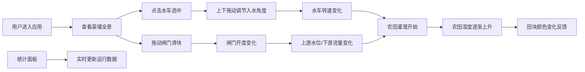

## 1. 产品概述

古代水车灌溉与水量调度模拟应用，让用户以汉代司水吏的身份，在虚拟渠堰区域内布置水车、控制闸门开度并分流河水到不同农田，通过实时湿度反馈体验古代水利工程的调度智慧。

- 主要用途：水利工程教学演示、历史文化科普、交互式模拟体验
- 目标用户：历史爱好者、学生、教育工作者、文化传播者
- 产品价值：通过沉浸式交互体验，传承中国古代水利工程智慧，寓教于乐

## 2. 核心功能

### 2.1 用户角色

| 角色 | 注册方式 | 核心权限 |
|------|---------|---------|
| 司水吏（用户） | 无需注册，直接使用 | 布置水车、调节闸门开度、观察农田湿度变化、查看性能统计 |

### 2.2 功能模块

1. **主画布场景**：渠堰全景展示，包含河道、水车、闸门、田块的可视化布局
2. **水车交互系统**：点击选中、拖动调节入水角度、转速实时显示
3. **闸门调度系统**：滑块控制开度、上游水位可视化、分流比例计算
4. **农田湿度反馈**：湿度传感器实时显示、田块颜色动态变化、湿度自动增减
5. **性能统计面板**：灌溉面积统计、平均转速、水位状态、操作时间戳

### 2.3 页面详情

| 页面名称 | 模块名称 | 功能描述 |
|---------|---------|----------|
| 主页面 | 标题栏 | 隶书字体"水利调度图"，古代图卷风格装饰 |
| 主页面 | 画布区域 | 1000x600px场景，左侧河道3架水车，右侧8块农田 |
| 主页面 | 水车组件 | 外径60px，8片叶片，支持点击选中和角度调节 |
| 主页面 | 闸门组件 | 2个手动闸门，滑块控制0-100%开度，水位可视化 |
| 主页面 | 田块组件 | 120x80px矩形，显示湿度值，颜色随湿度变化 |
| 主页面 | 控制面板 | 闸门调度滑块、开度显示、湿度条形图 |
| 主页面 | 统计面板 | 右下角毛玻璃效果面板，实时性能数据展示 |

## 3. 核心流程

用户打开应用后，首先看到完整的渠堰场景。用户可以点击水车选中后上下拖动调节入水角度，通过滑块控制闸门开度，观察河水通过水车带动灌溉到农田，农田湿度随时间变化并反馈在颜色和数值上。右下角统计面板实时更新系统运行状态。

## 4. 用户界面设计

### 4.1 设计风格

- **主色调**：土黄(#c8a555)、瓦灰(#8d8d8d)、深褐(#4e342e)、青绿(#4caf50)
- **背景色**：#c8d6b0（淡黄绿色，模拟古代纸张质感）
- **河道色**：蓝色渐变#4a90d9-#1c75bc
- **字体**：标题使用隶书，正文使用思源宋体
- **整体风格**：古代水利图卷风格，细黑线边框分隔，木质纹理元素，泛光河流动画

### 4.2 交互反馈

- **悬停效果**：交互元素放大1.1倍，光标变为指针
- **点击/拖动**：轻微弹性动画（使用framer-motion）
- **水车选中**：外圈显示金色边框
- **滑块控制**：开度数值在滑块上方动态显示

### 4.3 视觉元素

| 元素 | 样式描述 |
|------|---------|
| 水车 | 外径60px，8片木质渐变叶片，入水角度可调，旋转动画30fps+ |
| 闸门 | 矩形条块20x80px，开度影响上游水位高度 |
| 田块 | 120x80px矩形，间隙5px，颜色随湿度变化： 0-20% 深褐#6b4226 21-50% 土黄#c8a555 51-80% 浅绿#8bc34a 81-95% 翠绿#4caf50 |
| 水花 | 粒子效果模拟水车溅起的水花 |
| 河水流向 | 泛光动画表现 |

### 4.4 页面设计概览

| 页面名称 | 模块名称 | UI元素 |
|---------|---------|--------|
| 主页面 | 标题栏 | 隶书"水利调度图"，土黄色调，图卷装饰边框 |
| 主页面 | 画布区域 | 1000x600px，左侧河道蓝色渐变，右侧8块田块网格布局 |
| 主页面 | 水车组件 | 木质色渐变叶片，金色选中边框，转速悬浮数字 |
| 主页面 | 闸门组件 | 瓦灰色闸门，蓝色水位填充，开度百分比显示 |
| 主页面 | 田块组件 | 细黑边框，湿度数值显示，颜色动态变化 |
| 主页面 | 控制面板 | 土黄色背景，滑块控件，湿度条形图 |
| 主页面 | 统计面板 | 右下角固定，毛玻璃效果rgba(0,0,0,0.2)，白色文字 |

### 4.5 响应式设计

- 设计原则：Desktop-first，自适应平板和桌面端
- 最小宽度：768px
- 画布自适应：根据视口宽度等比例缩放，保持1000:600的宽高比
- 触控优化：滑块和交互元素最小触控区域48x48px

### 4.6 动画与性能

- 水车旋转：CSS动画，30fps以上
- 水花粒子：framer-motion实现，限制最大粒子数
- 湿度更新：每30秒计算一次，每帧耗时不超过5ms
- 页面加载：目标加载时间不超过2秒
