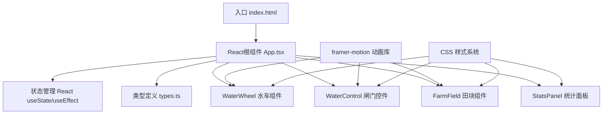

## 1. 架构设计

本项目为纯前端React应用，采用组件化架构，使用Vite作为构建工具，TypeScript保证类型安全，framer-motion实现动画效果。



## 2. 技术描述

- **前端框架**：React@18 + TypeScript@5 + Vite@5
- **构建工具**：Vite，使用@vitejs/plugin-react插件
- **动画库**：framer-motion@11，用于弹性动画、粒子效果
- **状态管理**：React内置useState/useEffect/useRef，无需额外状态管理库
- **样式方案**：CSS Modules + 内联样式，CSS变量定义主题色
- **字体**：思源宋体（Google Fonts），隶书（系统字体或Web字体）

## 3. 项目文件结构

```
auto317/
├── package.json              # 项目依赖和脚本
├── index.html                # 入口HTML
├── tsconfig.json             # TypeScript配置
├── vite.config.js            # Vite配置
└── src/
    ├── types.ts              # 类型定义
    ├── App.tsx               # 主应用组件
    ├── WaterWheel.tsx        # 水车组件
    ├── WaterControl.tsx      # 闸门控件组件
    ├── FarmField.tsx         # 田块组件
    ├── StatsPanel.tsx        # 统计面板组件
    └── index.css             # 全局样式
```

## 4. 类型定义（types.ts）

### 4.1 枚举类型

```typescript
// 水位状态枚举
enum WaterLevelStatus {
  STABLE = 'stable',
  RISING = 'rising',
  FALLING = 'falling'
}

// 田块湿度等级
enum HumidityLevel {
  DRY = 'dry',        // 0-20%
  NORMAL = 'normal',  // 21-50%
  MOIST = 'moist',    // 51-80%
  WET = 'wet'         // 81-95%
}
```

### 4.2 接口定义

```typescript
// 水车接口
interface WaterWheel {
  id: string;
  x: number;           // 画布X坐标
  y: number;           // 画布Y坐标
  angle: number;       // 入水角度 15-75度
  rotationSpeed: number; // 转速 RPM 4-12
  isSelected: boolean; // 是否选中
}

// 闸门接口
interface SluiceGate {
  id: string;
  x: number;           // 画布X坐标
  y: number;           // 画布Y坐标
  opening: number;     // 开度 0-100%
  upstreamWaterLevel: number; // 上游水位高度
}

// 田块接口
interface FarmField {
  id: string;
  x: number;           // 画布X坐标
  y: number;           // 画布Y坐标
  width: number;
  height: number;
  humidity: number;    // 湿度 0-100%
  linkedWheelId: string; // 关联水车ID
}

// 应用状态接口
interface AppState {
  waterWheels: WaterWheel[];
  sluiceGates: SluiceGate[];
  farmFields: FarmField[];
  waterLevelStatus: WaterLevelStatus;
  lastGateOperation: number | null; // 时间戳
}
```

## 5. 核心算法

### 5.1 水车转速计算

```typescript
// 入水角度 -> 转速映射
// 15度 -> 4 RPM
// 75度 -> 12 RPM
// 线性插值: speed = 4 + (angle - 15) * (8 / 60)
function calculateRotationSpeed(angle: number): number {
  const clampedAngle = Math.max(15, Math.min(75, angle));
  return 4 + (clampedAngle - 15) * (8 / 60);
}
```

### 5.2 湿度更新算法

```typescript
// 每30秒更新一次湿度
// 水车转速 > 0: 湿度 +1% (最大95%)
// 水车转速 = 0: 湿度 -0.5%
function updateHumidity(field: FarmField, wheel: WaterWheel, deltaTime: number): number {
  const cycles = deltaTime / 30000; // 30秒为一个周期
  let newHumidity = field.humidity;
  
  if (wheel.rotationSpeed > 0) {
    newHumidity += 1 * cycles;
    newHumidity = Math.min(95, newHumidity);
  } else {
    newHumidity -= 0.5 * cycles;
    newHumidity = Math.max(0, newHumidity);
  }
  
  return newHumidity;
}
```

### 5.3 水位状态判断

```typescript
// 根据闸门开度变化判断水位状态
function getWaterLevelStatus(
  currentOpening: number, 
  previousOpening: number
): WaterLevelStatus {
  if (currentOpening > previousOpening) {
    return WaterLevelStatus.FALLING;  // 开度增大，上游水位下降
  } else if (currentOpening < previousOpening) {
    return WaterLevelStatus.RISING;   // 开度减小，上游水位上涨
  }
  return WaterLevelStatus.STABLE;
}
```

### 5.4 田块颜色映射

```typescript
function getFieldColor(humidity: number): string {
  if (humidity <= 20) return '#6b4226';    // 深褐色
  if (humidity <= 50) return '#c8a555';    // 土黄色
  if (humidity <= 80) return '#8bc34a';    // 浅绿色
  return '#4caf50';                        // 翠绿色
}
```

## 6. 组件设计

### 6.1 App.tsx - 主组件

**职责**：
- 初始化3架水车、2个闸门、8块田块的位置和状态
- 管理全局应用状态
- 渲染Canvas画布布局（绝对定位）
- 处理鼠标交互事件（点击、拖动）
- 定时更新湿度值（每30秒）
- 计算并传递统计数据给StatsPanel

**状态**：
- `waterWheels`: WaterWheel[]
- `sluiceGates`: SluiceGate[]
- `farmFields`: FarmField[]
- `selectedWheelId`: string | null
- `waterLevelStatus`: WaterLevelStatus
- `lastGateOperation`: number | null

### 6.2 WaterWheel.tsx - 水车组件

**Props**：
- `x: number` - 位置X
- `y: number` - 位置Y
- `angle: number` - 入水角度
- `rotationSpeed: number` - 转速
- `isSelected: boolean` - 是否选中
- `onClick: () => void` - 点击事件
- `onAngleChange: (angle: number) => void` - 角度变化回调

**实现要点**：
- 外径60px，8片叶片，木质渐变
- CSS旋转动画，转速映射为animation-duration
- framer-motion实现选中缩放弹性动画
- 水花粒子效果（限制最大粒子数20）
- 悬浮显示转速数字

### 6.3 WaterControl.tsx - 闸门控件

**Props**：
- `gates: SluiceGate[]` - 闸门数组
- `fields: FarmField[]` - 田块数组
- `onGateChange: (gateId: string, opening: number) => void` - 开度变化回调

**实现要点**：
- 横向滑块控制闸门开度0-100%
- 开度数值在滑块上方动态显示
- 上游水位可视化（蓝色填充矩形）
- 各田块湿度条形图展示
- framer-motion弹性动画

### 6.4 FarmField.tsx - 田块组件

**Props**：
- `x: number`
- `y: number`
- `width: number`
- `height: number`
- `humidity: number`

**实现要点**：
- 120x80px矩形，细黑边框
- 上方显示湿度百分比
- 背景色随湿度动态变化
- CSS transition平滑过渡

### 6.5 StatsPanel.tsx - 统计面板

**Props**：
- `irrigatedAreaCount: number` - 湿度>80%的田块数
- `avgRotationSpeed: number` - 平均转速
- `waterLevelStatus: WaterLevelStatus` - 水位状态
- `lastGateOperation: number | null` - 最近操作时间戳

**实现要点**：
- 右下角固定定位
- 毛玻璃效果：backdrop-filter: blur(10px)
- 背景rgba(0,0,0,0.2)
- 实时更新数据

## 7. 性能优化

### 7.1 动画性能

- 水车旋转使用CSS `transform: rotate()` 和 `animation`，启用GPU加速
- 水花粒子使用CSS `opacity` 和 `transform` 动画，避免重排重绘
- 限制最大粒子数为20，防止内存泄漏

### 7.2 计算性能

- 湿度更新使用requestAnimationFrame节流，每帧耗时<5ms
- 使用useMemo缓存统计数据计算结果
- 避免在render中创建新对象/数组

### 7.3 渲染优化

- React.memo包装子组件，避免不必要重渲染
- 使用useCallback稳定事件处理函数引用
- 细粒度状态更新，避免全量state更新

## 8. 响应式适配

```typescript
// 画布缩放计算
function getCanvasScale(viewportWidth: number): number {
  const minWidth = 768;
  const baseWidth = 1000;
  const availableWidth = Math.max(minWidth, viewportWidth - 40); // 20px padding each side
  return availableWidth / baseWidth;
}
```

- 使用CSS transform: scale() 缩放整个画布
- 保持1000:600宽高比
- 媒体查询适配不同屏幕尺寸
