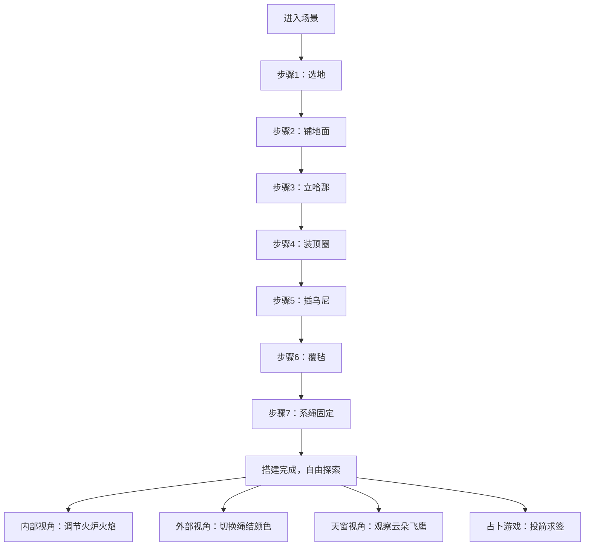

## 1. 产品概述

一个在浏览器中模拟古代蒙古包搭建全过程的3D交互教育体验项目。用户以游牧毡帐匠人的身份，在草原场景中按七步流程从零搭建完整蒙古包，体验传统工艺的同时可多角度欣赏其建筑结构与装饰艺术。

- 核心价值：沉浸式体验蒙古族传统建筑技艺，寓教于乐的文化传播载体
- 目标用户：文化爱好者、学生、游戏玩家
- 市场定位：轻量级WebGL文化教育交互应用

## 2. 核心功能

### 2.1 用户角色

| 角色 | 注册方式 | 核心权限 |
|------|----------|----------|
| 毡帐匠人 | 无需注册，直接进入 | 完整搭建流程操作、小游戏、视角控制 |

### 2.2 功能模块

1. **3D搭建主场景**：草原环境、七步搭建流程、材料拖拽吸附、进度显示、倒计时
2. **蒙古包内部交互**：火炉火焰调节、羊毛毡装饰、内部视角漫游
3. **套脑天窗系统**：缩放视角看天空、实时云朵动画、飞鹰盘旋
4. **外立面绳结交互**：绳结颜色切换、光晕特效
5. **宝力格占卜小游戏**：投箭物理模拟、吉凶签文系统、仿古卷轴UI

### 2.3 页面详情

| 页面名称 | 模块名称 | 功能描述 |
|----------|----------|----------|
| 主场景页 | 草原环境模块 | 天空盒渐变、草地地面、备料区与搭建区划分 |
| 主场景页 | 搭建流程模块 | 七步骤状态机、材料选择拖拽、位置吸附算法 |
| 主场景页 | UI信息模块 | 步骤名称与进度、10分钟倒计时、天色过渡动画 |
| 主场景页 | 蒙古包结构模块 | 哈那骨架、套脑顶圈、乌尼椽子、覆毡、系绳的程序化生成 |
| 主场景页 | 内部装饰模块 | 羊毛毡纹理、火炉粒子系统、火焰三档调节 |
| 主场景页 | 天窗系统模块 | 云朵动画、飞鹰盘旋、缩放视角控制 |
| 主场景页 | 绳结交互模块 | 颜色切换、水波光晕特效 |
| 主场景页 | 占卜游戏模块 | 抛物线物理、靶盘命中检测、签文卷轴 |

## 3. 核心流程

用户进入场景后，首先看到草原环境和左上角的第一步"选地"提示，右上角显示10分钟倒计时。用户从备料区点击选择材料，拖拽到搭建区，材料自动吸附到正确位置并触发音效和振动。每完成一步，天色从清晨→正午→黄昏渐变。完成全部七步后，用户可自由切换内外部视角，点击绳结切换颜色，点击火炉调节火焰，通过套脑观察天空。点击左侧图标可进入投箭占卜小游戏。

## 4. 用户界面设计

### 4.1 设计风格

- **主色调**：草原绿#2ecc71、天空蓝#87ceeb、毡白#f5f0e1、绳棕#6b4226
- **辅助色**：火焰橙#e67e22、吉祥红#c0392b、天空蓝#2980b9、尊贵黄#f1c40f、生命绿#27ae60
- **字体**：思源宋体（标题）、Noto Serif SC（正文），书法字体用于签文
- **UI元素**：仿古卷轴、羊皮纸质感、毛边边框、水墨晕染特效
- **整体氛围**：塞外草原、游牧文明、温暖质朴、庄重典雅

### 4.2 页面设计概述

| 页面名称 | 模块名称 | UI元素 |
|----------|----------|----------|
| 主场景页 | 左上进度区 | 半透明羊皮纸背景、宋体步骤名、进度百分比条、天色渐变 |
| 主场景页 | 右上倒计时区 | 仿古计时器样式、剩余时间数字、超时警告红闪 |
| 主场景页 | 左侧游戏入口 | 宝力格图标（弓箭造型）、悬浮放大动效 |
| 主场景页 | 底部备料区 | 材料卡片、选中高亮边框、拖拽 ghost 效果 |
| 主场景页 | 占卜面板 | 半透明毛玻璃、仿古卷轴签文、抛物线轨迹指示 |
| 主场景页 | 3D交互反馈 | 材料吸附高亮、"咔嗒"音效、轻微振动动画、绳结光晕 |

### 4.3 响应性

- 桌面端优先，鼠标键盘操作
- 自适应屏幕分辨率，保持16:9视口比例
- 触控设备支持触摸拖拽和双指缩放

### 4.4 3D场景指引

- **环境**：程序化生成的草原地面，天空盒从清晨暖黄#f4d03f过渡到正午亮白#fdfefe再到黄昏橙红#e67e22
- **光照**：主方向光模拟太阳光，随时间变化角度和色温；环境光模拟天空漫反射
- **相机**：PerspectiveCamera，初始位置(0, 3, 8)，支持OrbitControls环绕旋转，可切换内部视角(0, 1.5, 0)
- **构图**：蒙古包位于场景中心，搭建区在正前方，备料区在底部前景
- **交互**：Raycaster检测鼠标拾取，拖拽时物体半透明高亮，释放时吸附动画
- **后处理**：轻微Bloom增强光晕效果，FXAA抗锯齿，无过度后期以保证性能
- **性能**：顶点数<8000，纹理最大512x512，内存<150MB，加载<3秒，120fps运行
