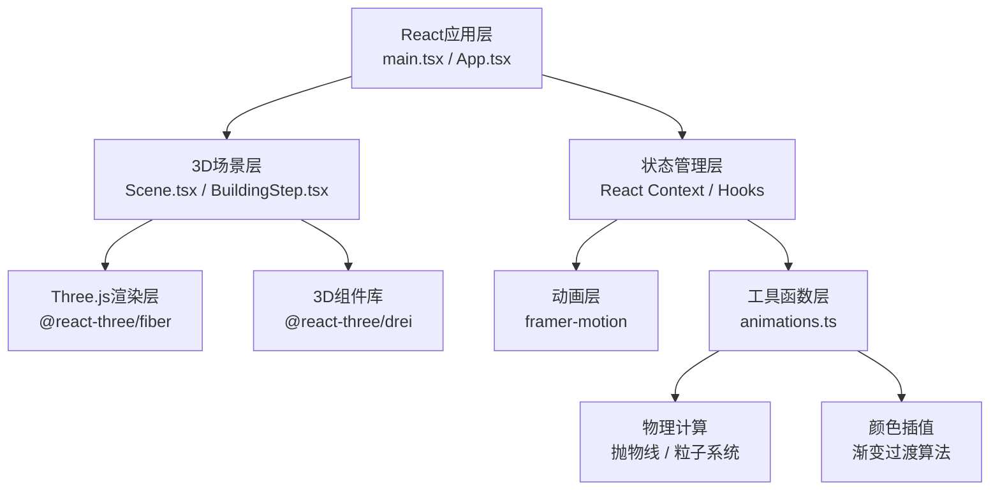

## 1. 架构设计



## 2. 技术描述

- **前端框架**：React@18 + TypeScript@5 + Vite@5
- **3D引擎**：Three@0.160 + @react-three/fiber@8 + @react-three/drei@9
- **动画库**：framer-motion@10
- **工具库**：uuid@9
- **初始化方式**：Vite 脚手架创建 React + TypeScript 项目
- **后端**：无后端，纯前端应用
- **数据库**：无需数据库，状态全内存管理

## 3. 核心文件清单

| 文件路径 | 作用 |
|----------|------|
| `package.json` | 项目依赖配置、启动脚本 |
| `index.html` | 入口页面、字体引用、背景色设置 |
| `vite.config.js` | Vite构建配置、TypeScript严格模式 |
| `tsconfig.json` | TypeScript编译配置、严格模式、ES2020 |
| `src/main.tsx` | React应用入口、挂载根组件 |
| `src/App.tsx` | 根组件、状态管理、UI布局 |
| `src/components/Scene.tsx` | 3D场景主组件、Three.js初始化、渲染循环、交互事件 |
| `src/components/BuildingStep.tsx` | 七步搭建流程、进度管理、材料吸附算法 |
| `src/utils/animations.ts` | 抛物线计算、粒子系统、颜色渐变插值 |
| `src/components/MaterialPanel.tsx` | 备料区UI、材料选择 |
| `src/components/ProgressUI.tsx` | 进度显示、倒计时、步骤名称 |
| `src/components/DivinationGame.tsx` | 宝力格占卜小游戏 |
| `src/components/Yurt.tsx` | 蒙古包3D模型组件 |
| `src/components/FireParticles.tsx` | 火焰粒子系统 |
| `src/components/SkySystem.tsx` | 云朵、飞鹰动画系统 |

## 4. 数据模型定义

### 4.1 搭建步骤类型

```typescript
type BuildingStepName = 
  | 'select_site'      // 选地
  | 'lay_floor'        // 铺地面
  | 'erect_khana'      // 立哈那
  | 'install_toono'    // 装顶圈
  | 'insert_uni'       // 插乌尼
  | 'cover_felt'       // 覆毡
  | 'tie_ropes';       // 系绳固定

interface BuildingStep {
  id: BuildingStepName;
  name: string;           // 中文名称
  progress: number;       // 0-100
  totalItems: number;     // 该步骤需要的材料总数
  completedItems: number; // 已完成数量
  isActive: boolean;
  isCompleted: boolean;
}

interface MaterialItem {
  id: string;
  type: 'khana' | 'toono' | 'uni' | 'felt' | 'rope';
  name: string;
  dimensions: { width?: number; height?: number; depth?: number; radius?: number };
  position: [number, number, number];
  targetPosition: [number, number, number];
  isPlaced: boolean;
  isDragging: boolean;
}

interface RopeKnot {
  id: string;
  position: [number, number, number];
  colorIndex: number;     // 0-3 对应红/蓝/黄/绿
  isGlowing: boolean;
}

interface FireState {
  level: 0 | 1 | 2;       // 小/中/大
  particleCount: number;  // 30/60/120
  currentColor: string;
  targetColor: string;
}

interface DivinationResult {
  ring: number;           // 0-3 从内到外
  fortune: string;        // 签文
  level: 'great' | 'good' | 'small_bad' | 'bad';
}
```

### 4.2 全局状态

```typescript
interface GameState {
  currentStep: BuildingStepName;
  steps: BuildingStep[];
  totalProgress: number;
  timeRemaining: number;  // 秒
  skyColor: string;       // 当前天色
  materials: MaterialItem[];
  ropeKnots: RopeKnot[];
  fire: FireState;
  isDivinationOpen: boolean;
  isCompleted: boolean;
  cameraMode: 'outside' | 'inside' | 'skylight';
}
```

## 5. 性能约束实现方案

| 约束 | 实现方案 |
|------|----------|
| 顶点数 < 8000 | 哈那骨架用LineSegments而非实体几何体；乌尼杆用CylinderGeometry低分段(8段)；覆毡用PlaneGeometry分段(8x8) |
| 纹理最大512x512 | 程序化生成Canvas纹理（羊毛毡菱形云纹、绳结图案），尺寸512x512 |
| 内存 < 150MB | 复用几何体和材质；及时清理未使用的BufferGeometry；粒子系统使用InstancedMesh |
| 加载 < 3秒 | 无外部资源加载，所有纹理程序化生成；代码分割懒加载小游戏模块 |
| 120fps流畅 | 使用requestAnimationFrame；状态更新批量处理；Raycaster检测优化（仅检测交互层） |

## 6. 关键算法

### 6.1 材料位置吸附算法
```
输入：拖拽终点P，目标区域中心点C，吸附半径R
输出：吸附后的位置P'
1. 计算距离d = |P - C|
2. 若d < R，P' = C（完全吸附）
3. 否则P' = P（不吸附）
4. 播放吸附动画：P从当前位置插值到P'，时长0.2s，缓动easeOutQuad
5. 播放"咔嗒"音效和轻微振动动画
```

### 6.2 抛物线计算
```
参数：初速度v0=1.5（水平）, v0y=2.0（垂直）, g=9.8
任意时刻t位置：
  x(t) = v0 * t
  y(t) = v0y * t - 0.5 * g * t²
落地时间t_land = 2 * v0y / g
落点x_land = v0 * t_land
命中环区 = floor( |x_land - targetX| / ringWidth )
```

### 6.3 天色渐变
```
总步骤7步，每步对应一个颜色节点：
步骤1-2：#f4d03f（清晨）→ #fdfefe（正午）
步骤3-5：保持#fdfefe
步骤6-7：#fdfefe → #e67e22（黄昏）
插值函数：lerp(a, b, t) = a + (b - a) * t
```

### 6.4 绳结光晕效果
```
使用postprocessing的Bloom效果，对选中绳结单独设置emissiveIntensity
波纹扩散通过缩放一个透明圆环实现，从scale=1到scale=3，opacity从1到0，时长0.8s
```
