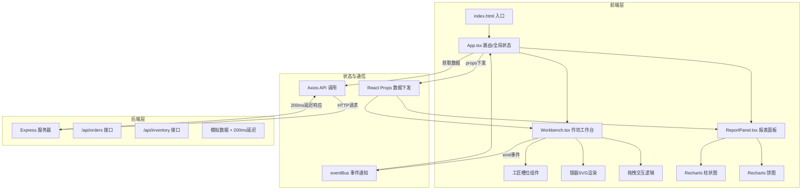
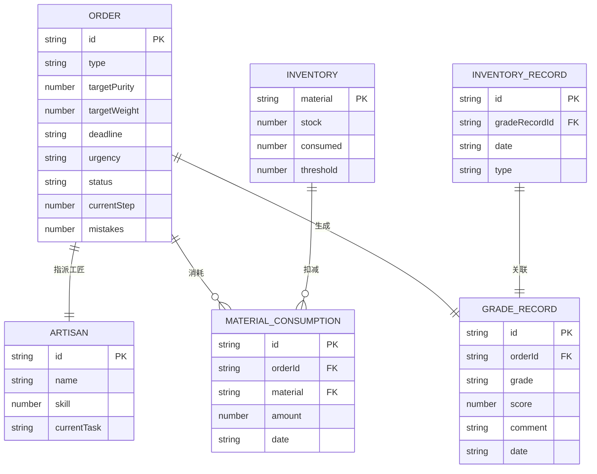

## 1. 架构设计



## 2. 技术描述

- **前端框架**：React 18 + TypeScript
- **构建工具**：Vite 5 + @vitejs/plugin-react
- **后端服务**：Express 4 + CORS
- **路由管理**：react-router-dom 6
- **状态管理**：React useState/useReducer + props传递 + eventBus事件总线
- **动画库**：framer-motion 11
- **图表库**：Recharts 2
- **样式方案**：@emotion/react + @emotion/styled (CSS-in-JS)
- **HTTP客户端**：Axios 1
- **字体**：思源宋体 (Google Fonts)
- **初始化工具**：手动配置文件结构

### 依赖包清单
- react、react-dom
- react-router-dom
- typescript
- vite、@vitejs/plugin-react
- framer-motion
- axios
- recharts
- @emotion/react、@emotion/styled
- express、cors

## 3. 文件结构与调用关系

```
auto32/
├── package.json              # 项目配置与依赖
├── vite.config.js            # Vite构建配置，代理/api到localhost:3001
├── tsconfig.json             # TypeScript配置，严格模式，ES2020
├── index.html                # 入口HTML，引入思源宋体
├── server/
│   └── index.ts              # Express服务器，处理/api/orders和/api/inventory
└── src/
    ├── App.tsx               # 根组件，路由/全局状态管理，API调用
    └── components/
        ├── Workbench.tsx     # 作坊工作台，拖拽交互，eventBus通知
        └── ReportPanel.tsx   # 报表面板，Recharts图表渲染
```

### 调用关系说明
1. **index.html** → 加载 **src/App.tsx** 作为React根组件
2. **App.tsx** → 通过Axios调用 **server/index.ts** 的 `/api/orders` 和 `/api/inventory` 接口
3. **App.tsx** → 通过props将订单数据、原料数据、工匠状态下发给 **Workbench.tsx** 和 **ReportPanel.tsx**
4. **Workbench.tsx** → 接收props中的eventBus对象，通过 `event.emit()` 通知 **App.tsx** 更新状态
5. **ReportPanel.tsx** → 接收props中的成品数据和消耗数据，渲染Recharts图表

### 数据流向
```
API数据 → App.tsx (state) → props → Workbench.tsx
                                 ↓ event.emit()
                          App.tsx (更新state)
                                 ↓ props
                          ReportPanel.tsx → 图表渲染
```

## 4. 路由定义

| 路由 | 用途 |
|------|------|
| / | 主工作台页面（包含订单列表、作坊工作台、报表面板） |
| * | 404重定向到首页 |

## 5. API 定义

### 5.1 类型定义

```typescript
// 订单类型
interface Order {
  id: string;
  type: '执壶' | '杯盏' | '香囊' | '盘碟';
  targetPurity: number; // 目标成色百分比
  targetWeight: number; // 目标重量（克）
  deadline: string; // 工期截止日
  urgency: 'high' | 'medium' | 'low'; // 紧急程度
  status: 'pending' | 'in_progress' | 'completed';
  currentWeight: number;
  currentPurity: number;
  currentStep: number; // 当前工序 0-4
  mistakes: number; // 操作失误次数
  startTime?: string;
  completeTime?: string;
  grade?: '上上' | '上中' | '中' | '下';
}

// 原料库存类型
interface Inventory {
  silver: { stock: number; consumed: number; threshold: number };
  tin: { stock: number; consumed: number; threshold: number };
  copper: { stock: number; consumed: number; threshold: number };
}

// 工匠类型
interface Artisan {
  id: string;
  name: string;
  skill: number; // 技能等级 1-5星
  avatar: string;
  currentTask: string | null;
  completedSteps: number[];
}

// 成品入库记录
interface InventoryRecord {
  date: string;
  grade: '上上' | '上中' | '中' | '下';
  count: number;
  type: string;
}

// 原料消耗记录
interface ConsumptionRecord {
  date: string;
  silver: number;
  tin: number;
  copper: number;
}
```

### 5.2 接口定义

#### GET /api/orders
- **描述**：获取所有订单列表
- **响应**：`{ success: boolean; data: Order[] }`
- **延迟**：200ms

#### POST /api/orders
- **描述**：创建新订单或更新现有订单
- **请求体**：`Order` 或 `Partial<Order> & { id: string }`
- **响应**：`{ success: boolean; data: Order }`
- **延迟**：200ms

#### GET /api/inventory
- **描述**：获取原料库存状态
- **响应**：`{ success: boolean; data: Inventory }`
- **延迟**：200ms

#### POST /api/inventory
- **描述**：更新原料库存（领用/补充）
- **请求体**：`{ type: 'consume' | 'replenish'; material: 'silver' | 'tin' | 'copper'; amount: number }`
- **响应**：`{ success: boolean; data: Inventory }`
- **延迟**：200ms

#### GET /api/reports
- **描述**：获取报表数据（入库记录和消耗记录）
- **请求参数**：`?range=today|three|seven`
- **响应**：`{ success: boolean; data: { inventoryRecords: InventoryRecord[]; consumptionRecords: ConsumptionRecord[] } }`
- **延迟**：200ms

## 6. 数据模型

### 6.1 ER图



### 6.2 模拟数据初始化

服务器启动时初始化以下模拟数据：

```typescript
// 初始订单
const initialOrders: Order[] = [
  {
    id: 'ord-001',
    type: '执壶',
    targetPurity: 95,
    targetWeight: 500,
    deadline: '2026-06-12',
    urgency: 'high',
    status: 'pending',
    currentWeight: 0,
    currentPurity: 0,
    currentStep: 0,
    mistakes: 0
  },
  // 更多订单...
];

// 初始库存
const initialInventory: Inventory = {
  silver: { stock: 5000, consumed: 0, threshold: 200 },
  tin: { stock: 1000, consumed: 0, threshold: 50 },
  copper: { stock: 800, consumed: 0, threshold: 40 }
};

// 工匠列表
const artisans: Artisan[] = [
  { id: 'art-001', name: '李錾工', skill: 5, avatar: '👨‍🔧', currentTask: null, completedSteps: [] },
  { id: 'art-002', name: '王锤揲', skill: 4, avatar: '👨‍🎨', currentTask: null, completedSteps: [] },
  { id: 'art-003', name: '张鎏金', skill: 4, avatar: '🧑‍🔬', currentTask: null, completedSteps: [] },
  { id: 'art-004', name: '陈抛光', skill: 3, avatar: '👨‍🏭', currentTask: null, completedSteps: [] }
];
```

## 7. 性能优化策略

1. **拖拽性能**：使用 framer-motion 的 `drag` 优化，开启 `useMotionValue` 实现60fps动画
2. **状态更新**：使用 `React.memo` 包裹子组件，避免不必要的重渲染
3. **数据缓存**：API响应使用本地缓存，避免重复请求
4. **动画优化**：使用 `transform` 和 `opacity` 属性实现GPU加速动画
5. **防抖节流**：拖拽事件使用节流，状态更新使用防抖合并
6. **懒加载**：报表面板按需加载图表组件
7. **虚拟列表**：订单列表使用虚拟滚动（如订单数量较多时）

## 8. 启动脚本

```bash
npm install    # 安装依赖
npm run dev    # 同时启动前端Vite开发服务器和后端Express服务器
```

前端运行在 `http://localhost:5173`，后端运行在 `http://localhost:3001`，Vite配置代理 `/api` 请求到后端。
