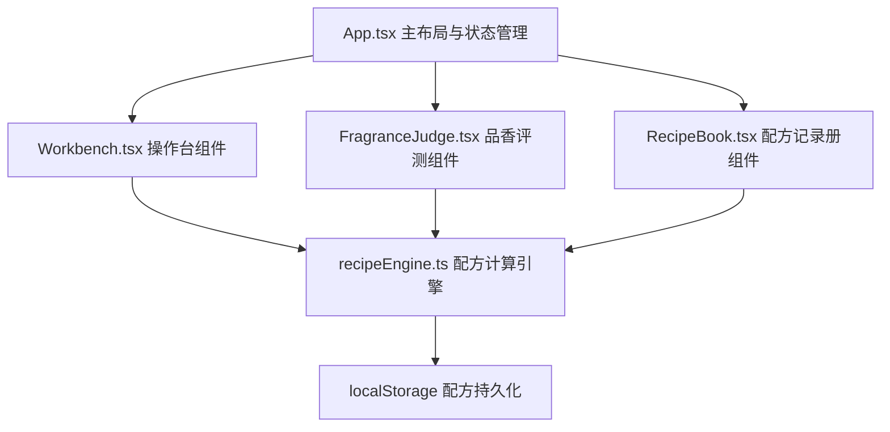

## 1. 架构设计



## 2. 技术描述

- **前端框架**：React 18 + TypeScript 5
- **构建工具**：Vite 5
- **动画库**：framer-motion 11
- **唯一ID**：uuid 9
- **状态管理**：React useState + useReducer
- **音频处理**：Web Audio API (AudioContext)
- **样式方案**：CSS Modules + CSS Variables
- **持久化存储**：localStorage

## 3. 目录结构

```
src/
├── App.tsx              # 主布局与状态管理
├── components/
│   ├── Workbench.tsx   # 操作台组件
│   ├── FragranceJudge.tsx # 品香评测组件
│   ├── RecipeBook.tsx   # 配方记录册组件
│   ├── SpiceJar.tsx     # 香料罐组件
│   ├── Mortar.tsx       # 研钵组件
│   ├── Mold.tsx         # 模具组件
│   ├── DryingArea.tsx   # 晾晒区组件
│   ├── Censer.tsx       # 香炉组件
│   └── RadarChart.tsx   # 雷达图组件
├── utils/
│   └── recipeEngine.ts # 配方计算引擎
├── types/
│   └── index.ts         # 类型定义
├── data/
│   └── spices.ts      # 香料数据
└── styles/
    └── variables.css   # CSS变量
```

## 4. 数据模型

### 4.1 类型定义

```typescript
// 香料类型
enum SpiceType {
  WOOD = 'wood',       // 木香
  FLOWER = 'flower',   // 花香
  RESIN = 'resin',     // 树脂
  SPICE = 'spice',   // 辛香
  FRUIT = 'fruit',     // 果香
  ANIMAL = 'animal',   // 动物香
}

// 香料数据
interface Spice {
  id: string;
  name: string;
  type: SpiceType;
  origin: string;
  description: string;
  quantity: number;
  color: string;
  properties: {
    sweet: number;
    bitter: number;
    spicy: number;
    cool: number;
    mellow: number;
    strong: number;
  };
}

// 香气属性
interface FragranceProfile {
  top: FragranceNotes;     // 前调
  middle: FragranceNotes; // 中调
  base: FragranceNotes;     // 后调
}

interface FragranceNotes {
  sweet: number;
  bitter: number;
  spicy: number;
  cool: number;
  mellow: number;
  strong: number;
}

// 香型
enum FragranceForm {
  STICK = 'stick',   // 线香
  CONE = 'cone',     // 塔香
  PILL = 'pill',       // 香丸
}

// 研磨状态
interface GrindingState {
  particles: Particle[];
  progress: number;
  grindCount: number;
  colorUniformity: number;
}

interface Particle {
  id: string;
  x: number;
  y: number;
  size: number;
  color: string;
  spiceId: string;
}

// 配方记录
interface RecipeRecord {
  id: string;
  spices: { spiceId: string; ratio: number }[];
  grindCount: number;
  form: FragranceForm;
  profile: FragranceProfile;
  rating: number; // 1-5星
  createdAt: number;
}

// 游戏状态
type GamePhase = 'selecting' | 'grinding' | 'molding' | 'drying' | 'judging' | 'complete';
```

## 5. 核心算法

### 5.1 研磨进度计算
- 前30%：每次拖拽增加0.8%
- 后70%：每次拖拽增加2.5%
- 颜色均匀度：基于各颗粒颜色RGB值的方差计算
- 完成条件：所有颗粒直径 < 3px 且 均匀度 >= 85%

### 5.2 配方计算引擎
- 根据香料比例加权计算香气属性
- 研磨次数影响香气层次分布
- 香型影响最终评分权重
- 星级评定：基于香气平衡性、层次感、独特性综合评分

### 5.3 配方排序
- 超过10条记录时按星级降序排列
- 前3条显示金边动画
