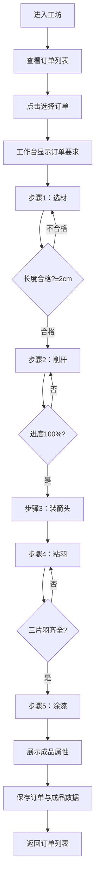

## 1. 产品概述
古代制箭工坊互动游戏是一款模拟春秋时期箭匠制箭过程的浏览器应用，用户通过选材、削杆、装箭头、粘羽、涂漆五个步骤，根据猎人订单要求制作精良羽箭，并测试其属性。
- 主要目的：让用户体验古代手工艺制作过程，学习制箭工艺知识
- 目标用户：对古代工艺、历史文化感兴趣的玩家，教育类应用使用者

## 2. 核心功能

### 2.1 用户角色
| 角色 | 注册方式 | 核心权限 |
|------|----------|----------|
| 箭匠（用户） | 无需注册，直接进入 | 浏览订单、制作箭矢、查看成品属性 |

### 2.2 功能模块
1. **订单面板**：展示猎人订单列表，显示箭杆长度、箭头材质、羽色、漆色要求
2. **工作台**：四格材料槽，根据制作步骤展示可交互材料
3. **制箭流程**：选材→削杆→装箭头→粘羽→涂漆五个步骤
4. **成品展示**：展示箭矢属性（重量、平衡度、精准度评分）
5. **数据存储**：模拟后端存储订单与成品数据

### 2.3 页面详情
| 页面名称 | 模块名称 | 功能描述 |
|----------|----------|----------|
| 工坊主页 | 订单面板 | 左侧订单卡片列表，点击高亮选中订单，显示四项制作要求 |
| 工坊主页 | 工作台区域 | 右侧工作台，四格材料槽，中央夹具展示当前制作进度 |
| 工坊主页 | 选材步骤 | 展示三根不同长度竹杆，点击选择，显示偏差检测结果 |
| 工坊主页 | 削杆步骤 | 鼠标拖拽刮刀削制竹杆，进度条显示百分比，自动上蜡发光 |
| 工坊主页 | 装箭头步骤 | 铁/青铜箭头选择，点击后滑入杆头，播放金属碰撞音效 |
| 工坊主页 | 粘羽步骤 | 拖拽三种颜色羽毛至箭尾槽位，显示粘合角度偏差 |
| 工坊主页 | 涂漆步骤 | 漆色盘选择颜色，刷子动画扫过箭杆，展示成品属性 |

## 3. 核心流程
用户进入工坊后，左侧显示猎人订单列表，右侧为工作台区域。用户点击一个订单卡片后，该卡片高亮，工作台上方显示订单要求。按照步骤依次完成：
1. 选择合适长度的竹杆置入夹具
2. 拖拽刮刀削直杆身，进度达到100%后自动上蜡
3. 选择匹配材质的箭头，安装至杆头
4. 拖拽对应颜色的羽毛至箭尾，三片间隔120度
5. 选择正确漆色，刷子动画完成涂漆
最后展示成品箭矢的重量、平衡度、精准度三项属性评分。

## 4. 用户界面设计
### 4.1 设计风格
- 主色调：暖木色系 #8b5e3c、#654321、#d4a373
- 文本色：米白色 #f5f0e1
- 进度条填充：橙色 #e67e22
- 边框：1px solid #5a3e2b，圆角4px
- 字体：楷体 'KaiTi', serif
- 风格：古朴手工感，木纹背景，细腻阴影层次

### 4.2 页面设计概述
| 页面名称 | 模块名称 | UI元素 |
|----------|----------|--------|
| 工坊主页 | 订单面板 | 卡片式设计，悬停上移3px+阴影扩大，选中高亮边框 |
| 工坊主页 | 工作台 | 木纹渐变背景，四格材料槽，中央夹具区域 |
| 工坊主页 | 材料卡片 | 选中时0.2s缩放+阴影加深过渡 |
| 工坊主页 | 进度条 | 0.3s线性过渡，填充色#e67e22 |
| 工坊主页 | 交互按钮 | 点击0.1s缩放至0.95反馈 |
| 工坊主页 | 成品展示 | 45度斜放箭矢，弹窗显示三项属性评分 |

### 4.3 响应式
- 桌面端（>768px）：左侧订单面板（固定宽度），右侧工作台（自适应）
- 移动端（≤768px）：订单面板折叠为顶部横向滚动条，工作台占满宽度
- 触摸优化：增大点击区域，支持触摸拖拽操作

### 4.4 动画与交互细节
- 竹杆选中：旋转放大置入夹具
- 削杆效果：CSS滤镜从粗糙→光滑，亮度变化模拟上蜡光泽
- 箭头安装：滑入动画+金属碰撞音效（AudioContext）
- 羽毛漂浮：轻微飘浮动效，拖拽吸附效果
- 涂漆动画：刷子沿箭杆扫过，颜色渐变覆盖
- 所有过渡动画保持60fps，避免重绘回流卡顿
