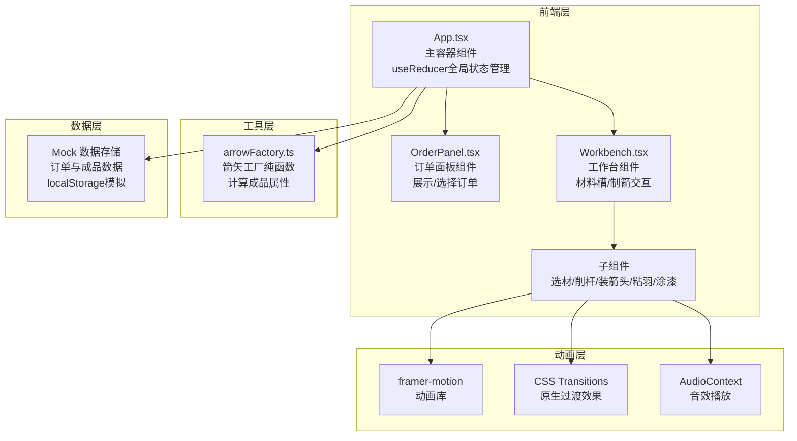

## 1. 架构设计



## 2. 技术描述
- 前端框架：React 18 + TypeScript 5
- 构建工具：Vite 5 + @vitejs/plugin-react
- 动画库：framer-motion 11
- 唯一ID生成：uuid 9
- 状态管理：React useReducer + Context
- 样式方案：CSS Modules + CSS Variables
- 音效：Web Audio API (AudioContext)
- 数据持久化：localStorage 模拟后端存储

## 3. 项目结构与调用关系

```
auto321/
├── index.html                    # 入口HTML
├── package.json                  # 项目依赖与脚本
├── tsconfig.json                 # TypeScript配置
├── vite.config.js                # Vite配置
└── src/
    ├── App.tsx                   # 主容器组件
    │   ├── 管理全局状态 (useReducer)
    │   ├── 步骤切换逻辑
    │   ├── 调用arrowFactory计算属性
    │   ├── 模拟后端数据存储
    │   └── 渲染OrderPanel与Workbench
    ├── components/
    │   ├── OrderPanel.tsx        # 订单面板组件
    │   │   ├── 接收App传入的订单列表
    │   │   ├── 渲染订单卡片
    │   │   └── 点击订单触发App状态更新
    │   └── Workbench.tsx         # 工作台组件
    │       ├── 接收App传入的当前步骤与操作动作
    │       ├── 渲染四格材料槽
    │       └── 根据步骤序号渲染对应交互面板
    ├── utils/
    │   └── arrowFactory.ts       # 箭矢工厂纯函数
    │       ├── 接收各步骤选择参数
    │       ├── 计算重量、平衡度、精准度
    │       └── 返回成品属性对象
    └── types/
        └── index.ts              # TypeScript类型定义
```

**数据流向：**
1. `App.tsx` → `OrderPanel.tsx`: 传入订单列表 `orders`、当前选中订单 `currentOrderId`
2. `OrderPanel.tsx` → `App.tsx`: 点击订单触发 `onSelectOrder(orderId)`
3. `App.tsx` → `Workbench.tsx`: 传入当前步骤 `currentStep`、选中订单 `currentOrder`、操作动作 `actions`
4. `Workbench.tsx` → `App.tsx`: 各步骤完成后触发 `onStepComplete(data)`
5. `App.tsx` → `arrowFactory.ts`: 传入各步骤选择参数 `params`
6. `arrowFactory.ts` → `App.tsx`: 返回计算后的成品属性 `arrowAttributes`
7. `App.tsx` → localStorage: 保存订单与成品数据

## 4. 核心类型定义

```typescript
// 订单类型
interface Order {
  id: string;
  hunterName: string;
  arrowLength: number;      // 70-90cm
  arrowheadMaterial: 'iron' | 'bronze';
  featherColor: 'white' | 'black' | 'red';
  paintColor: string;
  status: 'pending' | 'completed';
}

// 制作步骤
type Step = 0 | 1 | 2 | 3 | 4 | 5;  // 0:未开始, 1-5:五个步骤

// 竹杆选择
interface BambooSelection {
  length: number;       // 实际选择长度
  isQualified: boolean; // 是否在±2cm偏差内
}

// 削杆结果
interface ShavingResult {
  progress: number;     // 0-100
  smoothness: number;   // 0-100
}

// 箭头安装
interface ArrowheadInstallation {
  material: 'iron' | 'bronze';
  installed: boolean;
}

// 羽毛粘合
interface FeatherAttachment {
  color: 'white' | 'black' | 'red';
  angle: number;        // 安装角度
  deviation: number;    // 与理想120度的偏差
}

// 涂漆结果
interface PaintingResult {
  color: string;
  completed: boolean;
}

// 成品属性
interface ArrowAttributes {
  weight: number;       // 0-100分
  balance: number;      // 0-100分
  accuracy: number;     // 0-100分
  totalScore: number;
}

// 全局状态
interface AppState {
  orders: Order[];
  currentOrderId: string | null;
  currentStep: Step;
  bambooSelection: BambooSelection | null;
  shavingResult: ShavingResult | null;
  arrowhead: ArrowheadInstallation | null;
  feathers: FeatherAttachment[];
  painting: PaintingResult | null;
  finalAttributes: ArrowAttributes | null;
  showResultModal: boolean;
}

// Action类型
type AppAction =
  | { type: 'SELECT_ORDER'; payload: string }
  | { type: 'SELECT_BAMBOO'; payload: BambooSelection }
  | { type: 'UPDATE_SHAVING'; payload: ShavingResult }
  | { type: 'COMPLETE_SHAVING' }
  | { type: 'INSTALL_ARROWHEAD'; payload: ArrowheadInstallation }
  | { type: 'ATTACH_FEATHER'; payload: FeatherAttachment }
  | { type: 'COMPLETE_PAINTING'; payload: PaintingResult }
  | { type: 'CALCULATE_ATTRIBUTES' }
  | { type: 'CLOSE_RESULT_MODAL' }
  | { type: 'RESET_WORKFLOW' };
```

## 5. 性能优化策略

### 5.1 首屏性能
- Vite预构建依赖，冷启动时间<1.5s
- 代码分割，按需加载各步骤组件
- 资源预加载，字体与关键样式优先加载

### 5.2 动画性能
- 使用transform和opacity属性做动画，避免触发重排
- will-change提示浏览器优化
- framer-motion硬件加速
- 移除不必要的动画监听器

### 5.3 计算性能
- arrowFactory为纯函数，无副作用，计算时间<1ms
- 状态更新批量处理，避免频繁重渲染
- 使用React.memo优化子组件渲染
- useMemo/useCallback缓存计算结果与回调函数

### 5.4 渲染优化
- 列表使用key优化diff
- 虚拟滚动（如订单列表过长）
- 减少深层嵌套组件
- 合理使用Context避免全量重渲染
