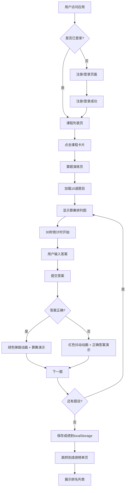

## 1. 产品概述
虚拟古代算学馆筹算教学与算题演练Web应用，让用户以汉代算学博士的身份管理筹算课程、布置算题并批改学生答卷，通过虚拟算筹在竹简格上摆出具体运算过程，传承中华传统数学文化。

## 2. 核心特性

### 2.1 用户角色
| 角色 | 注册方式 | 核心权限 |
|------|----------|----------|
| 学生用户 | 用户名密码注册（4-12字符） | 浏览课程、参与算题演练、查看成绩榜单 |

### 2.2 功能模块
1. **课程列表页**：展示6门筹算课程卡片网格，包含课程名、难度标签、课时数、完成率进度环
2. **算题演练页**：根据课程ID加载10道题目，左侧算筹排列图，右侧答题输入，倒计时30秒
3. **成绩榜单页**：竹简卷轴风格展示排名，前三名金银铜高亮，按答对率和用时排序
4. **用户认证模块**：用户名密码注册登录，React Context管理状态，localStorage持久化

### 2.3 页面详情
| 页面名称 | 模块名称 | 功能描述 |
|---------|---------|----------|
| 课程列表页 | 课程卡片网格 | 6门课程（九九表、盈不足、方程术、勾股术、粟米法、均输法），点击进入演练页 |
| 课程列表页 | SVG圆形进度环 | 展示学生完成率，支持数字递增动画 |
| 算题演练页 | 算筹可视化 | div+flex布局，红色#cc3333正筹、黑色#333负筹，十进制位从右向左排列 |
| 算题演练页 | 答题倒计时 | 环形进度条，30秒超时自动下一题，requestAnimationFrame驱动 |
| 算题演练页 | 答案反馈 | 正确绿色弹跳动画、错误红色抖动动画，算筹逐步移动合并演示 |
| 成绩榜单页 | 竹简卷轴列表 | 层叠竹简风格，framer-motion滚动动画逐条入场 |
| 成绩榜单页 | 排名高亮 | 金银铜色背景+勋章图标，按答对率降序、用时升序 |
| 导航栏 | 用户状态 | 登录后显示用户名和登出按钮，移动端折叠为汉堡菜单 |

## 3. 核心流程

## 4. 用户界面设计

### 4.1 设计风格
- **主色调**：竹简本色#f5deb3作为背景，墨色#2c2c2c作为文字和边框
- **导航栏**：深褐色#6b4c2a，白色文字
- **按钮**：朱红色#cc3333，悬停#aa2222并微微上浮
- **算筹区**：浅黄色#fff8e7背景，浅棕色边框模拟竹简边缘
- **难度标签**：入门#4caf50（绿）、进阶#ff9800（橙）、精通#f44336（红）
- **字体**：思源宋体（Source Han Serif）
- **卡片**：圆角12px，柔和阴影box-shadow: 0 2px 8px rgba(0,0,0,0.1)
- **动画**：页面切换0.3秒淡入淡出，算筹移动0.4秒transition

### 4.2 页面设计概述
| 页面名称 | 模块名称 | UI元素 |
|---------|---------|--------|
| 课程列表页 | 课程卡片网格 | 3列网格布局（移动端单列），卡片悬停放大1.05倍+阴影 |
| 课程列表页 | 圆形进度环 | SVG实现，数字递增动画（framer-motion useSpring） |
| 算题演练页 | 算筹排列区 | flex布局模拟横纵排列，红色正筹、黑色负筹，CSS transition动画 |
| 算题演练页 | 倒计时环形条 | 题目右上角，requestAnimationFrame驱动60fps |
| 算题演练页 | 答案反馈动画 | 正确：绿色#4caf50弹跳；错误：红色#f44336抖动 |
| 成绩榜单页 | 竹简卷轴 | 层叠效果，前三名金银铜色背景+勋章图标 |
| 成绩榜单页 | 滚动入场动画 | framer-motion逐条入场动画 |
| 导航栏 | 汉堡菜单 | 屏幕<768px时折叠 |

### 4.3 响应式
- **桌面端**：算题演练左右布局（算筹图左、输入框右），课程卡片3列网格
- **移动端（<768px）**：算题演练上下布局，课程卡片单列，导航栏汉堡菜单
- **触控优化**：按钮最小尺寸48x48px，增大触控区域

## 5. 性能要求
- 算筹渲染使用flex而非canvas，单题页渲染≤30ms
- localStorage操作使用300ms防抖
- 倒计时使用requestAnimationFrame驱动，确保60fps
- 组件按需拆分，单组件≤300行
