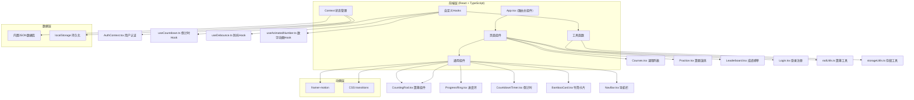
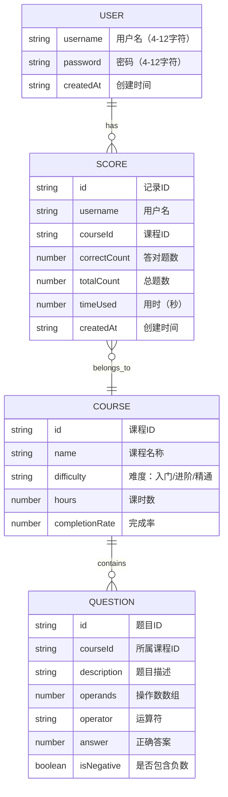

## 1. 架构设计



## 2. 技术描述
- **前端框架**：React 18 + TypeScript + Vite
- **初始化工具**：vite-init（react-ts模板）
- **路由**：react-router-dom v6
- **动画**：framer-motion 10 + CSS transitions
- **状态管理**：React Context API + useState
- **唯一ID**：uuid
- **HTTP客户端**：axios（预留）
- **数据库**：内置JSON对象 + localStorage
- **样式方案**：CSS Modules + CSS Variables

## 3. 路由定义
| 路由 | 页面组件 | 功能说明 |
|------|---------|---------|
| `/` | Courses.tsx | 课程列表首页 |
| `/courses` | Courses.tsx | 课程列表页 |
| `/practice/:courseId` | Practice.tsx | 算题演练页（带课程参数） |
| `/leaderboard` | Leaderboard.tsx | 成绩榜单页 |
| `/login` | Login.tsx | 登录注册页 |

## 4. 数据模型

### 4.1 数据模型定义



### 4.2 TypeScript 类型定义

```typescript
// src/types/index.ts
export type Difficulty = '入门' | '进阶' | '精通';

export interface Course {
  id: string;
  name: string;
  difficulty: Difficulty;
  hours: number;
  completionRate: number;
}

export interface Question {
  id: string;
  courseId: string;
  description: string;
  operands: number[];
  operator: '+' | '-' | '×' | '÷';
  answer: number;
  isNegative: boolean;
}

export interface User {
  username: string;
  password: string;
  createdAt: string;
}

export interface ScoreRecord {
  id: string;
  username: string;
  courseId: string;
  correctCount: number;
  totalCount: number;
  timeUsed: number;
  createdAt: string;
}

export interface AuthContextType {
  user: User | null;
  login: (username: string, password: string) => boolean;
  register: (username: string, password: string) => boolean;
  logout: () => void;
}
```

## 5. 文件结构

```
├── package.json
├── index.html
├── tsconfig.json
├── vite.config.js
├── src/
│   ├── App.tsx                 # 路由主组件
│   ├── main.tsx                # 应用入口
│   ├── types/
│   │   └── index.ts            # 类型定义
│   ├── context/
│   │   └── AuthContext.tsx     # 用户认证Context
│   ├── pages/
│   │   ├── Courses.tsx         # 课程列表页
│   │   ├── Practice.tsx        # 算题演练页
│   │   ├── Leaderboard.tsx     # 成绩榜单页
│   │   └── Login.tsx           # 登录注册页
│   ├── components/
│   │   ├── NavBar.tsx          # 导航栏组件
│   │   ├── CountingRod.tsx     # 算筹可视化组件
│   │   ├── ProgressRing.tsx    # SVG进度环组件
│   │   ├── CountdownTimer.tsx  # 倒计时组件
│   │   ├── BambooCard.tsx      # 竹简卡片组件
│   │   ├── CourseCard.tsx      # 课程卡片组件
│   │   └── AnimatedNumber.tsx  # 数字动画组件
│   ├── hooks/
│   │   ├── useCountdown.ts     # 倒计时Hook
│   │   ├── useDebounce.ts      # 防抖Hook
│   │   └── useAnimatedNumber.ts # 数字动画Hook
│   ├── utils/
│   │   ├── rodUtils.ts         # 算筹工具函数
│   │   ├── storageUtils.ts     # 存储工具函数
│   │   └── questionData.ts     # 内置题目数据库
│   └── styles/
│       ├── variables.css       # CSS变量
│       └── global.css          # 全局样式
```

## 6. 核心技术实现

### 6.1 算筹可视化算法
- 十进制数字按位分解（从右向左：个位、十位、百位...）
- 每位数字1-5用横向算筹表示，6-9用"一横+纵筹"表示
- 红色#cc3333表示正数，黑色#333表示负数
- 负数在最高位左侧加黑色方框标记
- 算筹间距2px，使用flex布局排列

### 6.2 性能优化
- 算筹渲染使用纯div+flex，避免canvas重绘开销
- localStorage操作使用300ms防抖
- 倒计时使用requestAnimationFrame驱动，确保60fps
- React.memo优化纯组件渲染
- 数字动画使用framer-motion useSpring实现平滑过渡

### 6.3 动画实现
- 页面切换：framer-motion AnimatePresence + opacity 0.3s
- 卡片悬停：transform: scale(1.05) + box-shadow
- 正确反馈：animate={{ y: [0, -10, 0], transition: { repeat: 2 } }}
- 错误反馈：animate={{ x: [0, -5, 5, -5, 0], transition: { duration: 0.3 } }}
- 算筹移动：CSS transition: all 0.4s ease-in-out
- 榜单入场：staggerChildren 0.1s + y从20到0

## 7. 依赖版本
| 包名 | 版本 |
|------|------|
| react | ^18.2.0 |
| react-dom | ^18.2.0 |
| react-router-dom | ^6.20.0 |
| typescript | ^5.3.0 |
| vite | ^5.0.0 |
| @vitejs/plugin-react | ^4.2.0 |
| framer-motion | ^10.16.0 |
| uuid | ^9.0.0 |
| axios | ^1.6.0 |
| @types/uuid | ^9.0.0 |
