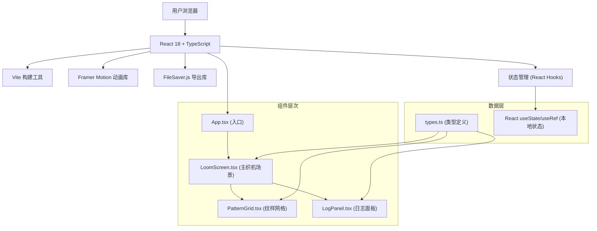

## 1. 架构设计



## 2. 技术描述

- **前端框架**：React 18 + TypeScript 5.x
- **构建工具**：Vite 5.x
- **动画库**：framer-motion 11.x
- **文件导出**：file-saver 2.x
- **语言版本**：ES2020
- **类型检查**：TypeScript 严格模式
- **状态管理**：React Hooks (useState, useRef, useEffect, useCallback)
- **样式方案**：CSS-in-JS (styled-components 或 CSS Modules) + 内联样式
- **动画方案**：Framer Motion + CSS @keyframes

## 3. 项目结构

```
项目根目录/
├── package.json              # 项目依赖和脚本
├── tsconfig.json             # TypeScript 配置
├── vite.config.js            # Vite 配置
├── index.html                # HTML 入口
└── src/
    ├── main.tsx              # React 入口
    ├── App.tsx               # 应用根组件
    ├── types.ts              # 共享类型定义
    ├── LoomScreen.tsx        # 主织机场景组件
    ├── PatternGrid.tsx       # 纹样设计网格组件
    ├── LogPanel.tsx          # SVG日志面板组件
    └── styles/
        └── globals.css       # 全局样式
```

## 4. 类型定义（types.ts）

```typescript
// 丝线颜色枚举
export enum ThreadColor {
  RED = '#c0392b',
  BLUE = '#2980b9',
  YELLOW = '#f1c40f',
  GREEN = '#27ae60',
}

// 网格状态枚举
export enum CellState {
  EMPTY = 'empty',      // 空织
  HALF = 'half',        // 半织（斜条纹）
  FULL = 'full',        // 满织（实心圆）
}

// 单个经线数据
export interface WarpThread {
  id: number;
  color: ThreadColor;
  selected: boolean;
}

// 织物行数据
export interface WeaveRow {
  id: number;
  cells: CellState[];
  timestamp: number;
}

// 纹样网格数据（4x4）
export type PatternGrid = CellState[][];

// 纹样日志数据
export interface PatternLog {
  name: string;
  colors: ThreadColor[];
  grid: PatternGrid;
  rows: WeaveRow[];
  createdAt: Date;
}

// 织机状态
export interface LoomState {
  warpThreads: WarpThread[];
  patternGrid: PatternGrid;
  weaveRows: WeaveRow[];
  currentRow: number;
  isShuttling: boolean;
  isStopped: boolean;
  showLogPanel: boolean;
}
```

## 5. 核心组件职责

### 5.1 LoomScreen.tsx（主织机场景）
- **Props**：无
- **State**：经线选择、织造行数据、投梭状态、当前行数
- **核心功能**：
  - 管理四色经线架的选择状态
  - 驱动投梭动画循环（0.8秒往复）
  - 根据纹样网格数据渲染每一行织物
  - 处理40行后自动卷绕逻辑
  - 向PatternGrid和LogPanel传递状态和回调
- **性能优化**：
  - useCallback 缓存回调函数
  - useMemo 缓存计算结果
  - requestAnimationFrame 控制动画帧
  - CSS transform 实现硬件加速

### 5.2 PatternGrid.tsx（纹样设计网格）
- **Props**：
  - `grid: PatternGrid` - 当前网格状态
  - `onCellClick: (row: number, col: number) => void` - 格子点击回调
- **State**：无（受控组件）
- **核心功能**：
  - 渲染4x4网格
  - 处理点击事件，循环切换三种状态
  - 状态变化时通过回调通知父组件
  - 按压反馈动画（缩放0.95倍）

### 5.3 LogPanel.tsx（纹样日志面板）
- **Props**：
  - `patternLog: PatternLog | null` - 纹样日志数据
  - `onClose: () => void` - 关闭面板回调
  - `onNameChange: (name: string) => void` - 名称修改回调
- **State**：纹样名称输入
- **核心功能**：
  - 生成SVG格式的纹样日志
  - 提供纹样名称输入
  - 展示颜色搭配和网格数据快照
  - 调用file-saver导出SVG文件

## 6. 性能优化策略

### 6.1 渲染性能
- 使用 React.memo 包裹子组件避免不必要重渲染
- 布面使用 CSS transform 平移而非修改 top/left
- 纹样行数据增量更新，避免全量重绘
- 使用 will-change 提示浏览器优化

### 6.2 动画性能
- 投梭动画使用 CSS @keyframes 实现
- 复杂动画使用 framer-motion 的 layout 动画
- 避免在动画回调中执行 heavy computation
- 使用 transform 和 opacity 属性做动画（触发GPU加速）

### 6.3 内存管理
- useEffect 清理定时器和事件监听
- useRef 存储频繁变化的值避免重渲染
- 织造行数据达到上限后及时清理旧数据

## 7. 响应式布局方案

```css
/* 基准尺寸（1024px设计稿） */
:root {
  --loom-width: min(80vw, 1200px);
  --grid-cell-size: calc(var(--loom-width) / 20);
}

/* 断点适配 */
@media (max-width: 1280px) {
  :root { --loom-width: 75vw; }
}

@media (max-width: 1024px) {
  :root { --loom-width: 90vw; }
}
```

## 8. 开发规范

### 8.1 编码规范
- 组件名使用 PascalCase，文件名使用相同名称
- 自定义 Hook 使用 use 前缀
- TypeScript 类型定义集中在 types.ts
- 避免使用 any 类型，使用 unknown 代替并做类型守卫
- 组件 props 使用 interface 定义

### 8.2 样式规范
- CSS 变量定义主题色和尺寸
- BEM 命名规范或 CSS Modules
- 动画时间统一 0.2-0.3 秒过渡
- 按压反馈统一 scale(0.95)

### 8.3 Git 规范
- 功能提交：feat: 描述
- 修复提交：fix: 描述
- 文档提交：docs: 描述
- 样式提交：style: 描述
- 重构提交：refactor: 描述
