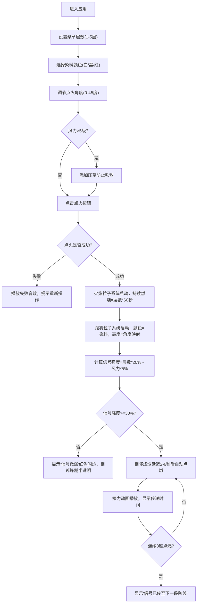

## 1. 产品概述
基于浏览器的古代烽燧信号传递与烟雾可视化应用，让用户扮演汉代边塞烽火吏，通过调节柴草层数、点火角度和染料配方来传递敌情信号，相邻烽燧自动接力形成预警链。

- 核心目标：以沉浸式3D体验还原古代烽燧预警系统的运作机制
- 目标用户：历史爱好者、教育工作者、游戏玩家
- 市场价值：寓教于乐的历史科普交互应用

## 2. 核心功能

### 2.1 用户角色
| 角色 | 注册方式 | 核心权限 |
|------|----------|----------|
| 烽火吏 | 无需注册，直接进入 | 操作烽燧、调整参数、观察接力传递 |

### 2.2 功能模块
1. **3D烽燧场景**：夯土台基、柴草堆、火焰粒子系统、烟雾粒子系统
2. **操作控制面板**：柴草层数滑块、点火按钮、染料选择、风力指示器
3. **烽燧接力地图**：6座烽燧标记、接力动画、传递时间显示
4. **环境模拟系统**：风力风向、天气变化、能见度影响
5. **信号反馈系统**：信号强度圆形进度条、信号微弱提示

### 2.3 页面详情
| 页面名称 | 模块名称 | 功能描述 |
|---------|---------|----------|
| 主页面 | 3D场景区 | 展示烽燧台、火焰、烟雾的实时3D渲染，支持视角交互 |
| 主页面 | 操作面板区 | 柴草层数调节（1-5层）、点火控制、染料选择（白/黑/红）、点火角度调节、压草操作 |
| 主页面 | 风力指示器 | 风速等级显示（0-7级）、风向旋转箭头、风速条动画 |
| 主页面 | 烽燧地图 | 6座烽燧位置标记、接力状态、传递时间、信号强度显示 |
| 主页面 | 信号反馈面板 | 圆形进度条显示信号强度、信号微弱红色闪烁提示 |

## 3. 核心流程

用户操作烽燧传递信号的完整流程：

## 4. 用户界面设计

### 4.1 设计风格
- **汉代边塞美学**：主背景夯土色#c4956a、戍卒灰#7b8a6f、台基深褐色#5d4037、柴草堆草黄色#d4b76a
- **天空色动态变化**：晴朗时#87ceeb渐变至灰黄色#c0a080，阴天时#9e9e9e
- **按钮样式**：大号圆形点火按钮，未点火灰色#757575，点火后火焰渐变#ff5722→#ff9800，带脉冲发光
- **滑块样式**：自定义range input，轨道木纹色
- **染料选择**：三个正方形色块，点击高亮边框
- **风力指示器**：半圆弧7个灯珠，当前风力从蓝色#42a5f5渐变至白色
- **动效风格**：所有交互0.2秒弹性反馈（framer-motion spring物理模型）

### 4.2 页面设计概述
| 页面名称 | 模块名称 | UI元素 |
|---------|---------|--------|
| 主页面 | 布局结构 | 左侧70% 3D场景，右侧30%操作面板，<768px时垂直堆叠 |
| 主页面 | 操作面板 | 毛边纸纹理卡片背景，柴草层数滑块、点火按钮、染料色块、点火角度旋钮、压草按钮、风力指示器 |
| 主页面 | 3D场景 | 夯土台基、柴草堆模型、火焰粒子系统、烟雾粒子系统、地面网格 |
| 主页面 | 烽燧地图 | 2D俯视小地图，6个烽燧标记点，发光边框表示已点燃，半透明表示信号弱 |
| 主页面 | 信号反馈 | 右下角圆形进度条，信号强度百分比，红色闪烁提示 |

### 4.3 响应式
- 桌面端（>768px）：左右分栏布局，3D场景70%，操作面板30%
- 移动端（<=768px）：垂直堆叠布局，3D场景占50%高度，操作面板占50%
- 触控优化：所有可交互元素最小触控面积44x44px

### 4.4 3D场景设计
- **环境**：天空色根据天气动态变化，地面使用网格纹理
- **光照**：方向光模拟太阳光，点光源模拟火焰光照，环境光提供基础照明
- **相机**：透视相机，初始位置(0, 5, 10)，看向原点，支持OrbitControls交互
- **构图**：烽燧台位于场景中心，柴草堆在台基上方，远处6座烽燧标记在地面网格上
- **粒子系统**：
  - 火焰粒子：最多300个，直径2-8px，从底部向上喷射，模拟火焰摇曳
  - 烟雾粒子：最多800个，使用BufferGeometry的Points，随风力飘散
- **后处理**：Bloom效果增强火焰发光感，雾化效果模拟远处能见度

## 5. 性能约束
- 烟雾粒子数量 ≤ 800个（BufferGeometry Points）
- 火焰粒子数量 ≤ 300个
- 帧率 ≥ 35fps
- 粒子更新使用useFrame每帧计算位置，不创建新几何体
