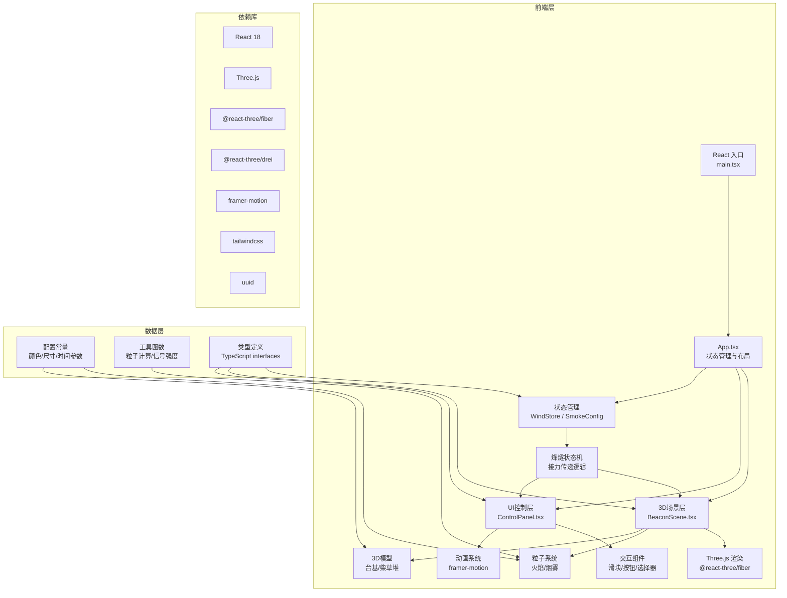

## 1. 架构设计



## 2. 技术描述
- **前端框架**：React 18 + TypeScript + Vite
- **3D渲染**：Three.js + @react-three/fiber + @react-three/drei
- **状态管理**：zustand（WindStore）+ React useState（局部状态）
- **动画系统**：framer-motion（UI动画）+ useFrame（3D粒子动画）
- **样式方案**：tailwindcss 3 + 自定义CSS变量
- **初始化工具**：vite-init react-ts 模板

## 3. 文件结构与调用关系

```
src/
├── main.tsx                 # React入口，渲染App
├── App.tsx                  # 主组件，管理烽燧状态机，分发smokeConfig
│   ├── 接收：WindStore风力数据
│   ├── 输出：smokeConfig → BeaconScene
│   └── 输出：回调函数 → ControlPanel
├── types/
│   └── index.ts             # TypeScript类型定义
├── store/
│   └── WindStore.ts         # zustand风力状态管理
├── scene/
│   ├── BeaconScene.tsx      # 3D场景核心组件
│   │   ├── 接收：smokeConfig from App
│   │   ├── 输出：粒子位置 → canvas
│   │   └── 调用：FireParticles, SmokeParticles, BeaconMap
│   ├── BeaconPlatform.tsx   # 夯土台基3D模型
│   ├── FirewoodStack.tsx    # 柴草堆3D模型
│   ├── FireParticles.tsx    # 火焰粒子系统
│   ├── SmokeParticles.tsx   # 烟雾粒子系统
│   └── BeaconMap.tsx        # 烽燧地图标记
├── ui/
│   ├── ControlPanel.tsx     # 操作面板主组件
│   │   ├── 接收：回调函数 from App
│   │   └── 调用：各子组件
│   ├── FirewoodSlider.tsx   # 柴草层数滑块
│   ├── IgniteButton.tsx     # 点火按钮
│   ├── DyeSelector.tsx      # 染料选择器
│   ├── AngleKnob.tsx        # 点火角度旋钮
│   ├── WindIndicator.tsx    # 风力指示器
│   ├── SignalMeter.tsx      # 信号强度圆形进度条
│   └── PressGrassButton.tsx # 压草按钮
├── utils/
│   ├── particleUtils.ts     # 粒子计算工具函数
│   ├── signalUtils.ts       # 信号强度计算
│   └── colorUtils.ts        # 颜色转换工具
├── constants/
│   └── config.ts            # 配置常量
└── assets/
    └── sounds/              # 音效资源
```

**数据流向**：
1. 用户操作 → ControlPanel → 回调函数 → App 更新 smokeConfig
2. WindStore → App → BeaconScene → 粒子系统
3. smokeConfig → BeaconScene → 火焰/烟雾粒子渲染
4. 信号强度计算 → App → ControlPanel → SignalMeter 显示
5. 烽燧接力逻辑 → App → BeaconMap → 标记状态更新

## 4. 核心类型定义

```typescript
// 烟雾颜色类型
export type SmokeColor = 'white' | 'black' | 'red';

// 烟雾高度等级
export type SmokeHeight = 'low' | 'medium' | 'high';

// 烽燧状态
export type BeaconState = 'idle' | 'burning' | 'relayed' | 'failed';

// 烟雾配置
export interface SmokeConfig {
  firewoodLayers: number;      // 1-5层
  smokeColor: SmokeColor;
  ignitionAngle: number;       // 0-45度
  isIgnited: boolean;
  hasPressGrass: boolean;
  burnStartTime: number | null;
}

// 风力数据
export interface WindData {
  speed: number;               // 0-7级
  direction: number;           // 0-360度
}

// 烽燧数据
export interface Beacon {
  id: string;
  position: [number, number, number];
  state: BeaconState;
  signalStrength: number;
  relayDelay: number;
  igniteTime: number | null;
}

// 粒子数据
export interface ParticleData {
  position: [number, number, number];
  velocity: [number, number, number];
  life: number;
  maxLife: number;
  size: number;
  color: [number, number, number];
}
```

## 5. 核心算法

### 5.1 信号强度计算
```typescript
// 信号强度 = 柴草层数 * 20% - 风力级数 * 5%
// 范围：0% - 100%，低于30%视为信号微弱
export const calculateSignalStrength = (
  firewoodLayers: number,
  windSpeed: number
): number => {
  const strength = firewoodLayers * 20 - windSpeed * 5;
  return Math.max(0, Math.min(100, strength));
};
```

### 5.2 点火角度映射烟雾高度
```typescript
// 点火角度0-45度 线性映射到 烟雾高度区间
// 0-15度 → 低烟 3-5单位
// 15-30度 → 中烟 6-9单位
// 30-45度 → 高烟 10-15单位
export const angleToHeight = (angle: number): [number, number] => {
  if (angle <= 15) {
    const t = angle / 15;
    return [3 + t * 2, 5 + t * 1];
  } else if (angle <= 30) {
    const t = (angle - 15) / 15;
    return [6 + t * 3, 9 + t * 0];
  } else {
    const t = (angle - 30) / 15;
    return [10 + t * 5, 15 + t * 0];
  }
};
```

### 5.3 烟雾颜色HSL值
```typescript
export const SMOKE_COLORS: Record<SmokeColor, [number, number, number]> = {
  white: [0, 0, 90],    // hsl(0, 0%, 90%)
  black: [0, 0, 30],    // hsl(0, 0%, 30%)
  red: [10, 80, 50],    // hsl(10, 80%, 50%)
};
```

### 5.4 烽燧接力延迟
```typescript
// 按距离随机 2-6秒
export const calculateRelayDelay = (
  distance: number
): number => {
  const baseDelay = 2 + (distance / 50) * 4;
  return baseDelay + (Math.random() - 0.5) * 2;
};
```

## 6. 性能优化策略

1. **粒子池化**：预分配粒子数组，useFrame中更新位置而非创建新几何体
2. **BufferGeometry**：使用BufferGeometry存储粒子数据，减少Draw Call
3. **实例化渲染**：相同几何体使用InstancedMesh
4. **帧率控制**：requestAnimationFrame自动适配，粒子更新逻辑轻量化
5. **状态合并**：使用zustand减少重渲染，memo优化组件
6. **资源懒加载**：音效按需加载，3D模型使用轻量化格式

## 7. 依赖清单

```json
{
  "dependencies": {
    "react": "^18.2.0",
    "react-dom": "^18.2.0",
    "three": "^0.160.0",
    "@react-three/fiber": "^8.15.0",
    "@react-three/drei": "^9.92.0",
    "framer-motion": "^10.16.0",
    "uuid": "^9.0.0",
    "zustand": "^4.4.0"
  },
  "devDependencies": {
    "typescript": "^5.3.0",
    "vite": "^5.0.0",
    "@vitejs/plugin-react": "^4.2.0",
    "tailwindcss": "^3.4.0",
    "@types/three": "^0.160.0",
    "@types/uuid": "^9.0.0"
  }
}
```
