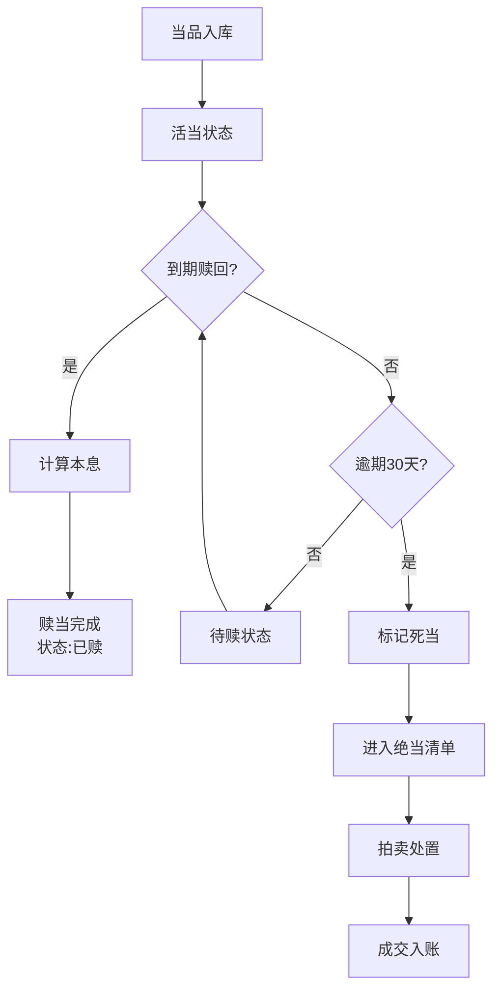

## 1. 产品概述

虚拟古代当铺管理系统，解决传统当铺中掌柜、朝奉、账房三者之间物品流、钱款流与票据流协同复杂难以追溯的问题，实现当品鉴定、估价、入库、赎当与绝当处理的全流程数字化管理。

- 核心目标：构建沉浸式古代当铺经营体验，实现当品全生命周期管理
- 目标用户：朝奉（鉴定估价）、账房（资金流水）、掌柜（综合管理）
- 市场价值：传统文化与现代管理技术结合，为文博类游戏/教育应用提供参考

## 2. 核心功能

### 2.1 用户角色

| 角色 | 登录方式 | 核心权限 |
|------|----------|----------|
| 朝奉 | 身份选择登录 | 收当鉴定、估价、查看当品详情 |
| 账房 | 身份选择登录 | 赎当处理、资金流水管理、绝当处置 |
| 掌柜 | 身份选择登录 | 全部权限、数据看板查看 |

### 2.2 功能模块

1. **首页主界面**：三栏布局（当品列表、当品详情、交易流水）、数据看板、搜索功能
2. **收当管理**：收当弹窗、当品信息录入、图片上传裁剪、自动估价、当票生成
3. **赎当管理**：当票编号搜索、高亮定位、本息计算、倒计时确认
4. **绝当处置**：绝当清单、网格视图、拍卖模拟、竞拍动画
5. **数据看板**：5项核心指标、古风扇形卡片、数字递增动画

### 2.3 页面详情

| 页面名称 | 模块名称 | 功能描述 |
|---------|---------|----------|
| 首页 | 数据看板 | 展示今日收当/赎当数、库存总数、月流水、绝当率，带递增动画 |
| 首页 | 当品列表 | 左栏虚拟滚动列表，按日期倒序，显示缩略图、当金、截止日、状态标签 |
| 首页 | 当品详情 | 中栏鉴定卡，品相评级、材质标签、手写估价单卡片 |
| 首页 | 交易流水 | 右栏最近10笔业务，时间、类型、金额、经办人，可滚动加载 |
| 收当弹窗 | 表单录入 | 分类选择、品名描述、图片上传（最多3张，拖拽/点击，1:1裁剪） |
| 收当弹窗 | 估价系统 | 基于分类和品相自动计算建议估价范围，支持手动调整 |
| 收当弹窗 | 当票生成 | 仿古宣纸背景，唯一编号、当金、月利2分、逾期条款 |
| 赎当流程 | 搜索匹配 | 当票编号模糊搜索，匹配后高亮+金色脉动光晕 |
| 赎当流程 | 确认弹窗 | 本息计算、3秒倒计时确认按钮、状态变更、流水记录 |
| 绝当处置页 | 死当列表 | 网格视图展示死当，起拍价默认当金80%，加价幅度10元 |
| 绝当处置页 | 拍卖模拟 | 3位虚拟竞拍人轮流出价，木槌下落动画，最高价成交 |

## 3. 核心流程

### 3.1 收当流程
朝奉登录 → 点击"收当"按钮 → 选择当品分类 → 输入品名描述 → 上传图片 → 系统给出估价建议 → 调整当金和当期 → 确认生成当票 → 当品入库 → 资金流水记录

### 3.2 赎当流程
当户持票 → 搜索当票编号 → 系统匹配高亮 → 点击赎当 → 计算本息 → 3秒倒计时确认 → 状态变更为已赎 → 资金流水记录

### 3.3 绝当流程
当品到期30天未赎 → 系统自动标记死当 → 每月初生成绝当清单 → 进入绝当处置页 → 设定起拍价 → 启动拍卖 → 虚拟竞拍人出价 → 木槌落定 → 成交入账

## 4. 用户界面设计

### 4.1 设计风格
- **主色调**：深棕色木质 #3c2415，辅色金色 #8b6914，强调色亮金 #c9a96e
- **背景**：仿古纸纹理（CSS径向渐变模拟）
- **字体**：思源宋体（古典风格）
- **卡片**：木质边框质感，圆角8px，悬停缩放+投影加深过渡0.2秒
- **按钮**：仿古印章/木牌风格，hover时轻微上浮
- **弹窗**：毛玻璃效果 backdrop-filter: blur(6px)
- **输入框**：焦点时下划线从中间向两端展开动画0.3秒，颜色变为#c9a96e
- **分割条**：8px宽，悬停变#8b4513，拖动时吸附预设比例动画

### 4.2 页面设计概述

| 页面名称 | 模块名称 | UI元素 |
|---------|---------|--------|
| 首页 | 数据看板 | 古风扇形卡片，深色背景#2c1810，金色文字#c9a96e，数字递增动画0.3秒 |
| 首页 | 三栏布局 | 可拖拽分割条，左25%/中50%/右25%预设比例，吸附动画 |
| 首页 | 当品列表卡片 | 缩略图1:1，状态标签（活当绿/死当红/已赎灰），日期倒序 |
| 首页 | 鉴定卡 | 品相评级优良中差徽章，材质标签金银玉瓷，手写风格估价单 |
| 首页 | 交易流水 | 时间轴样式，金额用红色/绿色区分收支 |
| 收当弹窗 | 图片上传 | 拖拽区域虚线边框，上传进度条，1:1裁剪框 |
| 收当弹窗 | 当票预览 | 仿古宣纸纹理背景，毛笔字风格编号，红色印章 |
| 赎当弹窗 | 高亮效果 | 卡片边缘金色脉动光晕，0.5秒周期 |
| 赎当弹窗 | 倒计时按钮 | 3秒倒计时圆环，进度填充动画 |
| 绝当处置页 | 拍卖动画 | 木槌从顶部下落关键帧动画，弹起一次 |
| 绝当处置页 | 竞拍面板 | 3位竞拍人头像，出价气泡上浮动画 |

### 4.3 响应式设计
- **桌面端（1280px以上）**：三栏布局正常显示，左300px/中600px/右300px
- **笔记本（1024px-1280px）**：三栏等比缩放，保持布局完整
- **1024px以下**：左栏和中栏合并为上下布局，右栏悬浮抽屉
- **触控优化**：按钮最小44x44px，滑动手势支持

### 4.4 动画系统
- **framer-motion** 实现所有过渡动画
- **页面切换**：淡入+轻微位移，staggerChildren错落效果
- **列表滚动**：虚拟滚动保持60fps，1000条数据流畅
- **弹窗打开**：scale(0.9)→scale(1) + opacity 0→1，时长200ms
- **数字变化**：逐帧递增动画，0.3秒内完成新旧值过渡
- **状态标签**：状态变更时脉冲动画
