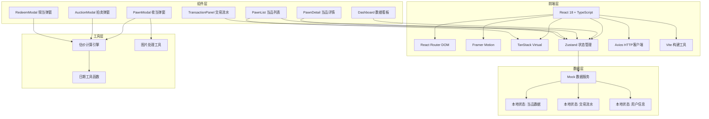

## 1. 架构设计



## 2. 技术栈说明

### 2.1 前端技术栈
- **框架**: React 18.2.0 + TypeScript 5.0
- **构建工具**: Vite 5.0
- **路由**: React Router DOM 6.20
- **状态管理**: Zustand 4.4
- **动画**: Framer Motion 10.16
- **虚拟滚动**: @tanstack/react-virtual 3.0
- **HTTP客户端**: Axios 1.6
- **唯一ID**: uuid 9.0
- **图标**: lucide-react 0.294
- **样式**: Tailwind CSS 3.3

### 2.2 性能优化
- **虚拟滚动**: @tanstack/react-virtual 实现1000条数据60fps滚动
- **代码分割**: 按路由分割代码，按需加载
- **图片优化**: WebP格式，1:1缩略图
- **动画优化**: 使用transform和opacity属性，避免重排重绘
- **弹窗响应**: 200ms内打开，使用CSS硬件加速

## 3. 路由定义

| 路由路径 | 页面组件 | 功能说明 |
|----------|----------|----------|
| `/` | HomePage | 首页主界面，包含三栏布局+数据看板 |
| `/auction` | AuctionPage | 绝当处置页面，死当列表+拍卖功能 |
| `*` | NotFound | 404页面 |

## 4. 数据模型

### 4.1 当品数据模型

```typescript
interface PawnItem {
  id: string;
  ticketNo: string; // 当票编号
  name: string; // 当品名称
  description: string; // 当品描述
  category: 'gold' | 'jade' | 'porcelain' | 'painting' | 'misc'; // 分类
  material: string; // 材质标签
  condition: 'excellent' | 'good' | 'fair' | 'poor'; // 品相评级
  images: string[]; // 图片URL数组（最多3张）
  pawnAmount: number; // 当金
  interestRate: number; // 月利率（默认0.02）
  pawnMonths: number; // 当期（月）
  startDate: string; // 收当日期
  dueDate: string; // 到期日期
  status: 'active' | 'dead' | 'redeemed'; // 状态：活当/死当/已赎
  appraisedBy: string; // 朝奉姓名
  weight?: number; // 重量（克），金银器用
  appraisalScore?: number; // 玉器评分1-5分
  craftBonus?: number; // 工艺加分
  estimatedMin: number; // 建议估价下限
  estimatedMax: number; // 建议估价上限
}
```

### 4.2 交易流水模型

```typescript
interface Transaction {
  id: string;
  type: 'pawn' | 'redeem' | 'auction';
  pawnItemId: string;
  amount: number;
  timestamp: string;
  operator: string;
  description: string;
}
```

### 4.3 拍卖记录模型

```typescript
interface AuctionRecord {
  id: string;
  pawnItemId: string;
  startPrice: number;
  bidIncrement: number;
  bids: Bid[];
  status: 'pending' | 'active' | 'completed';
  finalPrice: number;
  winner: string;
}

interface Bid {
  bidder: string;
  amount: number;
  timestamp: string;
}
```

### 4.4 仪表盘数据模型

```typescript
interface DashboardStats {
  todayPawnCount: number;
  todayRedeemCount: number;
  currentInventory: number;
  monthlyRevenue: number;
  deadPawnRate: number;
}
```

## 5. 估价算法

### 5.1 金银器估价
```
基础价 = 重量 × 0.8元/克
工艺加分 = 0-200元（根据品相调整
最终估价 = 基础价 + 工艺加分
建议范围 = [最终估价 × 0.9, 最终估价 × 1.1]
```

### 5.2 玉器估价
```
基础价 = 品相评分(1-5) × 200元
工艺加分 = 0-300元
最终估价 = 基础价 + 工艺加分
建议范围 = [最终估价 × 0.85, 最终估价 × 1.15]
```

### 5.3 其他类别估价
- **瓷器**: 品相等级 × 150元 + 年代加分
- **字画**: 作者名气 × 300元 + 尺寸加分
- **杂项**: 基础估价 + 稀缺度加分

### 5.4 赎当本息计算
```
实际月数 = 向上取整(实际天数 / 30)
利息 = 当金 × 月利率 × 实际月数
本息合计 = 当金 + 利息
```

## 6. 核心组件结构

```
src/
├── App.tsx                    # 主应用组件
├── main.tsx                   # 入口文件
├── index.css                # 全局样式
├── pages/
│   ├── HomePage.tsx         # 首页
│   └── AuctionPage.tsx    # 绝当处置页
├── components/
│   ├── Dashboard.tsx        # 数据看板
│   ├── PawnList.tsx       # 当品列表
│   ├── PawnDetail.tsx     # 当品详情
│   ├── TransactionPanel.tsx # 交易流水
│   ├── PawnModal.tsx     # 收当弹窗
│   ├── RedeemModal.tsx   # 赎当弹窗
│   ├── AuctionModal.tsx # 拍卖弹窗
│   └── ui/
│       ├── FanCard.tsx     # 古风扇形卡片
│       ├── PawnTicket.tsx # 当票组件
│       └── ImageUpload.tsx # 图片上传组件
├── store/
│   └── usePawnStore.ts   # 当品状态管理
│   └── useTransactionStore.ts # 交易状态管理
├── hooks/
│   └── usePawnEstimate.ts # 估价计算hook
│   └── useAuction.ts   # 拍卖逻辑hook
├── utils/
│   ├── estimate.ts       # 估价算法
│   ├── date.ts         # 日期工具
│   └── mock.ts         # 模拟数据生成
└── types/
    └── index.ts        # 类型定义
```

## 7. 性能指标与优化策略

### 7.1 性能目标
- 当品列表1000条数据滚动保持60fps
- 弹窗打开响应时间 < 200ms
- 首次加载时间 < 2s
- 图片上传进度条动画流畅

### 7.2 优化策略
1. **虚拟滚动**: 使用@tanstack/react-virtual只渲染可视区域
2. **图片懒加载**: Intersection Observer实现
3. **组件懒加载**: React.lazy + Suspense
4. **动画优化**: 使用will-change和transform
5. **状态分离**: 细粒度的状态订阅，避免不必要重渲染
6. **防抖节流**: 搜索输入防抖，滚动节流
