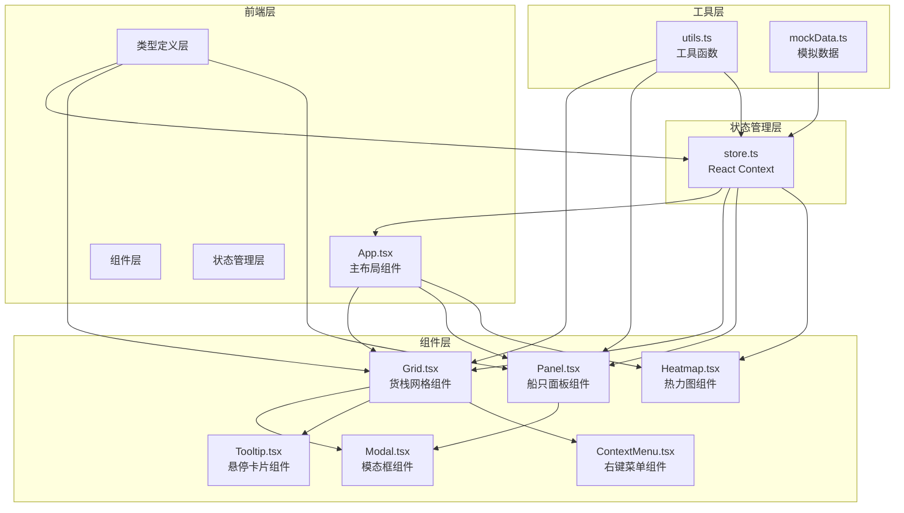
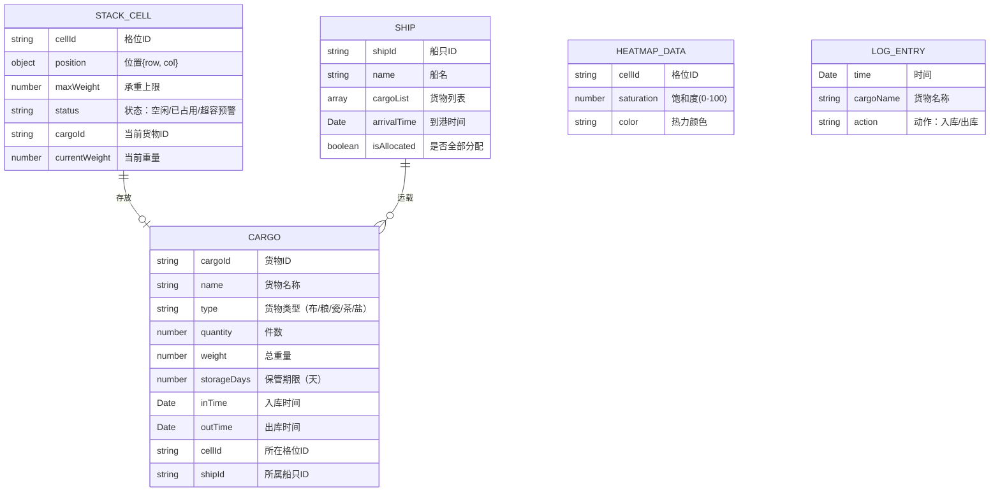

## 1. 架构设计



**数据流向**：
1. 模拟数据 → store.ts（初始化状态）
2. 用户交互 → 组件 → store.ts（更新状态）
3. store.ts → 所有组件（重新渲染）
4. 定时器 → store.ts（更新热力图）

## 2. 技术描述

- **前端框架**：React@18 + TypeScript@5 + Vite@5
- **状态管理**：React Context + useReducer
- **动画库**：framer-motion@11
- **可视化库**：d3@7（仅使用d3-scale）
- **工具库**：uuid@9
- **构建工具**：Vite@5 + @vitejs/plugin-react@4
- **无后端**：使用Mock数据模拟船只和货物信息

**技术选型理由**：
- React Context：轻量级全局状态管理，适合中小型应用，避免引入Redux等重型框架
- framer-motion：提供弹性动画、拖拽吸附等复杂动效支持
- d3-scale：专业的颜色渐变和数据比例尺，适合热力图实现
- TypeScript严格模式：保证类型安全，减少运行时错误

## 3. 目录结构

```
src/
├── types.ts          # 核心类型定义
├── store.ts          # 全局状态管理（Context）
├── App.tsx           # 主应用组件
├── main.tsx          # 应用入口
├── index.css         # 全局样式
├── components/
│   ├── Grid.tsx     # 货栈网格组件
│   ├── Panel.tsx    # 船只面板组件
│   ├── Heatmap.tsx # 热力图组件
│   ├── Modal.tsx   # 模态框组件
│   ├── Tooltip.tsx # 悬停信息卡片
│   └── ContextMenu.tsx # 右键菜单
└── utils/
    ├── index.ts    # 工具函数
    └── mockData.ts # 模拟数据
```

**文件调用关系**：
1. [types.ts] → 被所有组件和store引用
2. [store.ts] → 被App.tsx和所有组件引用
3. [utils/index.ts] → 被组件和store引用
4. [utils/mockData.ts] → 被store.ts引用（初始化数据）
5. [components/Grid.tsx] → 引用Tooltip、ContextMenu组件
6. [components/Panel.tsx] → 引用Modal组件
7. [App.tsx] → 引用Grid、Panel、Heatmap组件

## 4. 数据模型

### 4.1 核心类型定义



### 4.2 全局状态结构

```typescript
interface StoreState {
  cells: StackCell[];      // 100个格位
  cargoes: Cargo[];       // 所有货物
  ships: Ship[];           // 到港船只
  heatmapData: HeatmapData[]; // 热力图数据
  totalSaturation: number;   // 总堆存率
  selectedShipId: string | null; // 选中的船只
  selectedCargoId: string | null; // 选中的货物
  isSelectingCell: boolean; // 是否处于选格位模式
  logs: LogEntry[];      // 流水日志
}
```

## 5. 核心算法

### 5.1 堆存率计算

```
单个格位饱和度 = (当前重量 / 承重上限) * 100%
总堆存率 = (所有格位当前重量之和 / 所有格位承重上限之和) * 100%
```

### 5.2 热力图颜色映射（d3.scaleLinear）

```
0%   → #00ff00 (绿色)
50%  → #ffff00 (黄色)
80%  → #ff8c00 (橙色)
100% → #ff0000 (红色)
```

### 5.3 格位编号规则

```
行号：A-J（对应0-9行）
列号：1-10（对应0-9列）
格位ID = 行号 + 列号（如A1、B3、J10）
```

## 6. 性能优化策略

1. **虚拟滚动**：流水日志使用虚拟滚动，仅渲染可见区域
2. **记忆化组件**：使用React.memo包装Grid单元格组件
3. **批量更新**：使用React.useDeferredValue处理热力图更新
4. **节流防抖**：窗口resize事件使用节流（100ms）
5. **CSS硬件加速**：动画使用transform和opacity属性
6. **requestAnimationFrame**：确保动画流畅运行
7. **useMemo/useCallback**：避免不必要的重渲染

## 7. 浏览器兼容性

- Chrome/Edge：最新2个版本
- Firefox：最新2个版本
- Safari：最新2个版本
- 不支持IE
