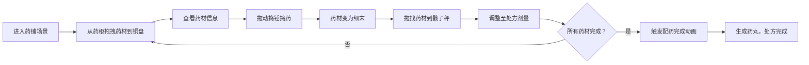

## 1. 产品概述

本产品是一个基于Web的3D古代药铺交互可视化应用，模拟中药炮制的捣药、称药与配药全流程，解决传统中药炮制过程中药料捣碎精度、剂量称量准确度与多味药材配比难以直观模拟和反复练习的问题。

- 主要用途：为中医药学习者提供沉浸式的3D交互练习环境
- 目标用户：中医药专业学生、中药炮制从业人员、中医药文化爱好者
- 产品价值：通过3D可视化和交互模拟，降低学习成本，提高操作熟练度

## 2. 核心功能

### 2.1 用户角色
| 角色 | 注册方式 | 核心权限 |
|------|----------|----------|
| 学习者 | 无需注册，直接使用 | 完整使用所有交互功能，进行药铺操作练习 |

### 2.2 功能模块
1. **3D药铺场景**：宋式药铺环境渲染，包含百子药柜、柜台、铜盘、捣药臼、戥子秤
2. **药材选择与拖拽**：从药柜拖拽药材抽屉到铜盘，触发粒子动画
3. **捣药交互**：鼠标垂直拖动控制捣锤上下运动，模拟药材捣碎过程
4. **戥子秤称量**：拖拽药材到秤盘，根据重量实时倾斜，剂量达标提示
5. **处方单管理**：竹简卷轴展示处方，记录每味药材状态
6. **配药完成动画**：所有药材称量完成后触发庆祝动画

### 2.3 页面详情
| 页面名称 | 模块名称 | 功能描述 |
|---------|---------|----------|
| 主页面 | 3D场景模块 | 药铺环境渲染、相机控制、光照效果 |
| 主页面 | 药柜交互模块 | 抽屉选择、拖拽、拉出动画、标签显示 |
| 主页面 | 铜盘与粒子模块 | 药材放置检测、撒落粒子动画 |
| 主页面 | 捣药交互模块 | 捣锤拖动控制、药材碎片演变、粉末粒子 |
| 主页面 | 戥子秤模块 | 重量感应、倾斜计算、达标检测与提示 |
| 主页面 | 处方单模块 | 竹简卷轴UI、药材状态更新、配药完成动画 |
| 主页面 | 信息面板模块 | 药材信息展示、操作指引、响应式布局 |

## 3. 核心流程

用户进入宋式药铺场景，从百子药柜中选择药材抽屉拖拽到铜盘，药材撒落显示信息；然后拖动捣锤进行捣药，观察药材从大块变为细末；接着将药材拖拽到戥子秤盘上，调整至处方剂量；重复上述步骤完成所有药材称量；最后触发配药完成动画，生成药丸。

## 4. 用户界面设计

### 4.1 设计风格
- **主色调**：浅橡木色#d2b48c（木质纹理背景）、米黄色#f5e6c8（墙面）、青瓷砖#a0b0a0（地面）
- **辅助色**：金色#b8860b（边框高亮）、浅金色#e0c090（铜盘）、深灰色#6b5b4a（捣药臼）
- **按钮风格**：圆角矩形（4px圆角），微凹陷阴影，悬停放大1.05倍+金色边框
- **字体**：思源宋体（Source Han Serif SC），仿古书法风格
- **布局风格**：桌面端左侧75% 3D场景，右侧25%信息面板；移动端底部浮动面板
- **图标风格**：仿古线条图标，配合木质纹理背景

### 4.2 页面设计概述
| 页面名称 | 模块名称 | UI元素 |
|---------|---------|--------|
| 主页面 | 3D场景 | 宋式药铺环境、药柜、铜盘、捣药臼、戥子秤、竹筒卷轴 |
| 主页面 | 信息面板 | 药材名称、性味、用量范围、操作指引文字 |
| 主页面 | 处方单 | 竖向竹简、每味药材一行、序号/名称/剂量/状态 |
| 主页面 | 交互提示 | 文字气泡"剂量达标"、呼吸高亮动画、闪烁提示 |

### 4.3 响应式设计
- **桌面端（≥1440x900）**：3D场景占75%宽度，右侧信息面板占25%
- **平板端（1024px-1440px）**：3D场景占70%，面板占30%
- **移动端（<1024px）**：信息面板折叠为底部浮动栏，高度自适应，最小220px
- **触摸优化**：拖拽区域增大，按钮最小44x44px，双击缩放控制

### 4.4 3D场景设计
- **环境**：宋式药铺内部，米黄色墙面，青瓷砖地面，柔和暖光
- **光照**：主光源为顶部暖黄色平行光，配合环境光和点光源照亮柜台区域，产生柔和阴影
- **相机**：透视相机，初始位置(0, 1.5, 3)，视角60度，可通过鼠标拖拽旋转视角
- **构图**：药柜在左侧背景，柜台在中景，铜盘、捣药臼、戥子秤为前景交互焦点
- **交互动画**：抽屉拉出0.4s滑动、捣锤上下运动、秤杆倾斜、药丸汇聚0.8s动画、粒子飘散
- **后处理**：轻微泛光效果，柔和阴影，色彩分级偏暖色调
- **性能预算**：1440x900下60fps，粒子峰值≤200个，交互响应延迟<50ms
