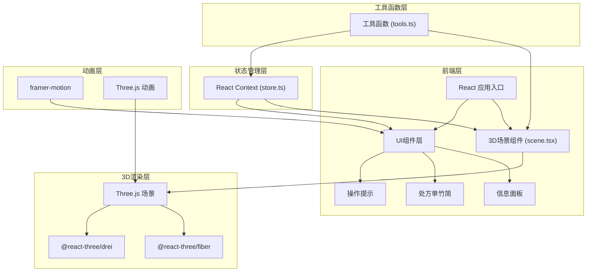
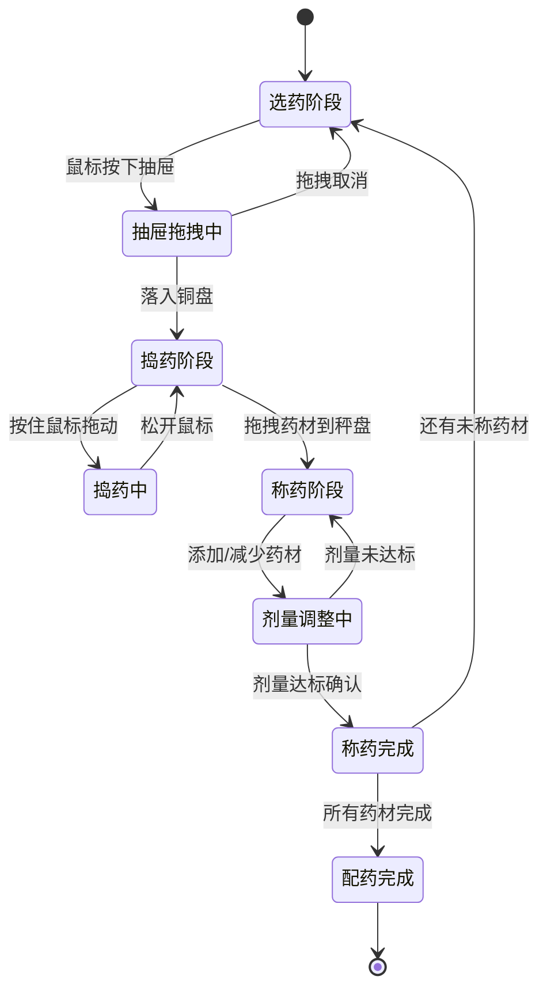

## 1. 架构设计



## 2. 技术选型

- **前端框架**：React@18 + TypeScript
- **构建工具**：Vite@5 + @vitejs/plugin-react
- **3D渲染**：Three.js@0.160 + @react-three/fiber@8 + @react-three/drei@9
- **UI动画**：framer-motion@11
- **状态管理**：React Context + useReducer
- **样式方案**：CSS Modules + CSS Variables
- **类型支持**：@types/three@0.160

## 3. 数据模型

### 3.1 药材数据定义
```typescript
interface Herb {
  id: string;
  name: string;
  nature: string; // 性味
  flavor: string; // 味
  dosageRange: [number, number]; // 用量范围（钱）
  color: string; // 药材颜色
  drawerPosition: [number, number]; // 抽屉在药柜中的位置
}

interface PrescriptionItem {
  id: string;
  herbId: string;
  herbName: string;
  requiredDosage: number; // 处方剂量（钱）
  currentWeight: number; // 当前称量重量
  status: 'unweighed' | 'pounding' | 'weighing' | 'completed';
}

interface AppState {
  currentPhase: 'selecting' | 'pounding' | 'weighing' | 'completed';
  selectedHerb: Herb | null;
  poundingCount: number;
  poundingSpeed: 'fast' | 'normal' | 'slow';
  scaleWeight: number;
  prescription: PrescriptionItem[];
  isDragging: boolean;
  draggedObject: 'drawer' | 'herb' | null;
}
```

### 3.2 处方示例数据
```typescript
const samplePrescription: PrescriptionItem[] = [
  { id: '1', herbId: 'huanglian', herbName: '黄连', requiredDosage: 1.5, currentWeight: 0, status: 'unweighed' },
  { id: '2', herbId: 'danggui', herbName: '当归', requiredDosage: 2.0, currentWeight: 0, status: 'unweighed' },
  { id: '3', herbId: 'gancao', herbName: '甘草', requiredDosage: 1.0, currentWeight: 0, status: 'unweighed' },
  { id: '4', herbId: 'renshen', herbName: '人参', requiredDosage: 0.5, currentWeight: 0, status: 'unweighed' },
];
```

## 4. 文件结构

```
├── package.json
├── index.html
├── tsconfig.json
├── vite.config.js
└── src/
    ├── main.tsx              # 应用入口
    ├── App.tsx               # 根组件
    ├── scene.tsx             # 3D场景主组件
    ├── store.ts              # 全局状态管理
    ├── tools.ts              # 工具函数
    ├── types.ts              # 类型定义
    ├── data/
    │   └── herbs.ts          # 药材数据
    ├── components/
    │   ├── InfoPanel.tsx     # 右侧信息面板
    │   ├── Prescription.tsx  # 处方单竹简
    │   └── Toast.tsx         # 提示气泡
    └── styles/
        ├── global.css        # 全局样式
        └── variables.css     # CSS变量
```

## 5. 核心函数定义

### 5.1 捣药物理计算 (tools.ts)
```typescript
// 根据捣击次数计算碎片网格数量
export function calculateFragmentCount(poundingCount: number): number;

// 根据捣击速度和次数计算粒子数量
export function calculatePowderParticles(poundingCount: number, speed: number): number;

// 根据捣击次数更新碎片颜色
export function updateFragmentColor(poundingCount: number, baseColor: string): string;

// 检测捣击速度类型
export function detectPoundingSpeed(duration: number): 'fast' | 'normal' | 'slow';
```

### 5.2 戥子秤称量计算 (tools.ts)
```typescript
// 根据重量计算秤杆倾斜角度
export function calculateScaleAngle(weight: number, maxWeight: number): number;

// 检测剂量是否达标
export function checkDosageComplete(currentWeight: number, requiredDosage: number, tolerance: number): boolean;

// 重量转换（克 ↔ 钱）
export function gramToQian(grams: number): number;
export function qianToGram(qian: number): number;
```

### 5.3 拖拽碰撞检测 (tools.ts)
```typescript
// 检测拖拽对象是否落入目标区域
export function checkDropCollision(draggedPos: Vector3, targetPos: Vector3, threshold: number): boolean;

// 计算吸附位置
export function calculateSnapPosition(draggedPos: Vector3, targetPos: Vector3): Vector3;
```

## 6. 性能优化策略

### 6.1 3D性能
- 使用 `InstancedMesh` 渲染药柜抽屉和药材碎片
- 粒子系统使用 `BufferGeometry` 动态更新
- 启用 `frustumCulled` 对不可见对象进行视锥体剔除
- 纹理压缩和 mipmap 生成
- 阴影贴图分辨率限制为 1024x1024

### 6.2 渲染优化
- 使用 React.memo 避免不必要的重渲染
- 使用 useMemo 和 useCallback 缓存计算结果和回调
- 粒子数量限制：峰值不超过200个
- 动画帧使用 requestAnimationFrame 批量更新

### 6.3 内存管理
- 场景卸载时正确 dispose Three.js 对象
- 粒子对象池复用，避免频繁创建销毁
- 纹理和几何体资源复用

## 7. 交互状态机


