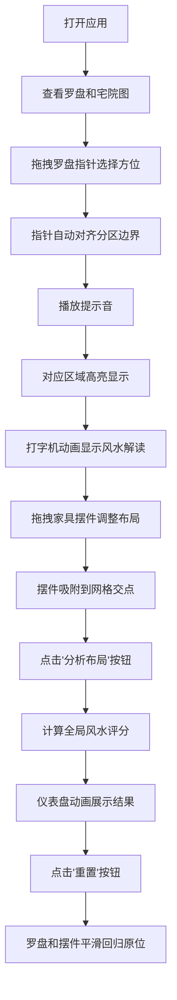

## 1. 产品概述

本产品是一款基于浏览器的古代罗盘堪舆与风水布局互动应用，让用户体验明代风水先生的工作流程，通过虚拟罗盘测定方位、判断吉凶并调整家具摆件以改善宅院风水布局。

- 主要目的：提供沉浸式的中国传统风水文化体验，让用户了解八卦方位、五行生克等传统堪舆知识
- 核心价值：寓教于乐，将传统文化与现代交互技术结合，打造独特的文化体验产品

## 2. 核心功能

### 2.1 用户角色
| 角色 | 注册方式 | 核心权限 |
|------|----------|----------|
| 普通用户 | 无需注册，直接使用 | 使用罗盘测定方位、摆放家具摆件、获取风水分析结果 |

### 2.2 功能模块
1. **罗盘交互模块**：圆形八卦罗盘，可拖拽指针旋转，自动对齐方位，音效反馈
2. **宅院布局模块**：宅院平面图，包含前院、正厅、厢房、后院四区域，可拖拽家具摆件
3. **风水分析模块**：根据方位和摆件位置计算吉凶评分，提供文字解读
4. **仪表盘展示模块**：圆形仪表盘动画展示风水总分
5. **重置功能模块**：一键重置罗盘和家具位置，平滑过渡动画

### 2.3 页面详情
| 页面名称 | 模块名称 | 功能描述 |
|----------|----------|----------|
| 主界面 | 罗盘组件 | 300px直径圆形罗盘，八卦方位分区，中心指针可拖拽旋转，松开自动对齐分区边界 |
| 主界面 | 宅院地图组件 | 宅院平面图，四个区域用背景色和边框区分，家具摆件可拖拽移动并吸附网格 |
| 主界面 | 方位高亮模块 | 旋转罗盘后对应区域高亮，颜色随吉凶变化（大吉/小吉/平/凶） |
| 主界面 | 文字解读模块 | 顶部打字机动画显示方位风水解读文字（每秒5字） |
| 主界面 | 分析按钮 | 点击触发全局风水评估，计算总分并以仪表盘动画展示 |
| 主界面 | 重置按钮 | 一键重置罗盘和家具位置，1秒平滑过渡动画 |

## 3. 核心流程

用户打开应用后，首先看到左侧罗盘和右侧宅院图。用户可以拖拽罗盘指针选择方位，系统自动高亮对应区域并显示风水解读。用户可以拖拽家具摆件到不同位置，调整布局。点击"分析布局"按钮获取全局风水评分。点击"重置"按钮恢复初始状态。

## 4. 用户界面设计

### 4.1 设计风格
- **主色调**：米黄色 #f5ecd7 作为背景色，木纹棕 #8b6914 作为边框和标题色
- **五行配色**：乾金白 #f0f0f0、坤土黄 #d4b76a、震木绿 #8bc34a、巽木青 #4db6ac、坎水黑 #455a64、离火红 #e53935、艮土棕 #8d6e63、兑金银 #b0bec5
- **吉凶配色**：大吉 #4caf50、小吉 #8bc34a、平 #ffeb3b、凶 #ff5722
- **按钮风格**：圆角矩形（border-radius: 8px），悬停时背景色加深10%，上浮阴影（box-shadow 0.3s变换）
- **字体**：思源宋体，统一使用
- **布局风格**：左右分栏布局，罗盘和宅院图之间用2px细线 #c0a080 分隔
- **视觉元素**：古朴典雅的中国传统风格，木纹质感，八卦纹饰

### 4.2 页面设计概述
| 页面名称 | 模块名称 | UI元素 |
|----------|----------|--------|
| 主界面 | 顶部区域 | 风水解读文字（打字机动画），按钮组（分析布局、重置） |
| 主界面 | 左侧区域 | 圆形罗盘（300px直径），八卦方位分区，中心指针 |
| 主界面 | 分隔线 | 2px垂直线 #c0a080 |
| 主界面 | 右侧区域 | 宅院平面图（前院、正厅、厢房、后院），家具摆件（床、桌、屏风、水缸、盆栽） |
| 主界面 | 弹出层 | 圆形仪表盘（0-100分，红到绿渐变，1秒动画） |

### 4.3 响应式设计
- **桌面端**：左右分栏布局，罗盘直径300px
- **移动端**（<768px）：上下垂直排列，罗盘缩小到200px直径
- **触摸优化**：拖拽操作支持触摸事件，增大可点击区域

### 4.4 动画与交互
- **指针拖拽**：60FPS流畅动画，响应延迟