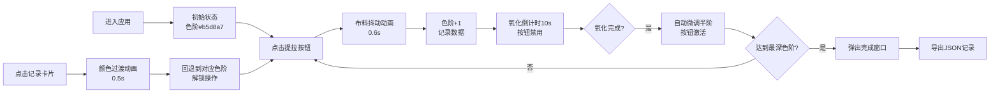

## 1. 产品概述
古代蓝染浸染氧化过程模拟互动应用，让用户体验明代染匠学徒的蓝染工艺操作流程，通过反复提拉布料观察颜色从淡绿到深蓝的渐变过程，并记录每次操作数据。

- 核心目标：通过互动式模拟体验传统蓝染工艺的魅力，教育用户了解氧化染色原理
- 目标用户：手工艺爱好者、文化学习者、游戏玩家
- 产品价值：将传统工艺数字化，提供沉浸式、可记录的互动体验

## 2. 核心功能

### 2.1 用户角色
| 角色 | 注册方式 | 核心权限 |
|------|----------|----------|
| 访客用户 | 无需注册 | 完整操作体验、记录查看、数据导出 |

### 2.2 功能模块
1. **染缸操作区**：布料提拉按钮、氧化倒计时、染缸与布料可视化
2. **色阶记录表**：时间线卡片展示浸染轮次数据
3. **完成弹窗**：最终成果展示、记录导出功能
4. **历史回退**：点击记录卡片回退到对应色阶重新操作

### 2.3 页面详情
| 页面名称 | 模块名称 | 功能描述 |
|---------|---------|----------|
| 主页面 | 染缸操作区 | 点击提拉按钮触发布料抖动动画和色阶变化，氧化倒计时显示，染缸气泡动画 |
| 主页面 | 色阶记录表 | 以时间线卡片形式展示每次浸染记录，支持点击回退 |
| 弹窗 | 完成提示 | 展示完整记录时间线，提供JSON格式导出功能 |

## 3. 核心流程

用户进入应用后，看到初始状态的染缸和淡绿色布料。点击"提拉一次"按钮，布料向上滑出并抖动，颜色向深蓝过渡一个色阶，同时记录本次操作数据。之后按钮进入10秒氧化倒计时，期间禁用。氧化完成后按钮重新激活，颜色自动微调加深。重复此过程直到达到最深色阶，弹出完成窗口，可导出全部记录。



## 4. 用户界面设计

### 4.1 设计风格
- 主色调：陶土色#8b5e3c、深棕色#5a3d2b、暖色木纹#f0ead6、浅米色#f5f0e1
- 强调色：靛蓝色#0a2c5d、淡绿色#b5d8a7
- 字体：思源宋体（Source Han Serif），呼应传统工艺主题
- 布局：左右两栏（60%/40%），左侧操作区、右侧记录区
- 视觉元素：半圆形染缸、渐变布料、漂浮气泡、时间线卡片
- 动效：布料抖动滑出、气泡破裂再生、颜色平滑过渡、卡片悬停上浮

### 4.2 页面设计概述
| 页面名称 | 模块名称 | UI元素 |
|---------|---------|--------|
| 主页面 | 染缸操作区 | 半圆形陶土染缸（直径300px）、径向渐变染液、渐变布料（60x180px）、圆形底座、三个漂浮气泡、提拉按钮带倒计时 |
| 主页面 | 色阶记录表 | 圆角卡片（8px）、10x10px色块预览、轮次编号、时间信息、悬停上浮效果（translateY(-2px)）、自定义滚动条（4px宽） |
| 弹窗 | 完成提示 | 半透明遮罩、居中弹窗、完整时间线、导出按钮 |

### 4.3 响应性
- 桌面端优先设计，固定左右两栏布局
- 色阶记录表最多渲染50条，超出自动移除最早记录
- 所有动画使用CSS transform和opacity实现，确保60fps帧率

## 5. 数据结构

### 5.1 浸染记录
```typescript
interface DyeRecord {
  id: string;
  round: number;
  timestamp: number;
  oxidationSeconds: number;
  colorHex: string;
}
```

### 5.2 预设色阶
共10个预设色阶：
#b5d8a7 → #8fc27e → #6ba85e → #4f8b4d → #35703a → #1f562b → #154024 → #0e2e1c → #061e12 → #0a2c5d
