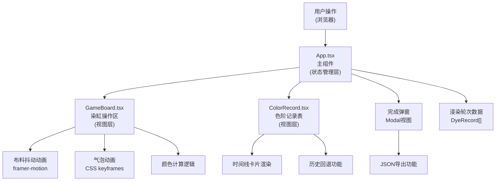

## 1. 架构设计



**模块调用关系**：
- `index.html` → 加载 `main.tsx` → 渲染 `App.tsx`
- `App.tsx` 持有全局状态（当前色值、记录数组、氧化状态），作为数据枢纽
- `App.tsx` → 传递 `currentColor`、回调函数给 `GameBoard.tsx`
- `GameBoard.tsx` → 用户操作触发回调，更新 `App.tsx` 状态
- `App.tsx` → 传递 `records` 数组给 `ColorRecord.tsx`
- `ColorRecord.tsx` → 用户点击卡片触发回退回调，更新 `App.tsx` 状态

**数据流向**：
1. 用户点击提拉 → `GameBoard` 触发 `onLift` 回调 → `App` 更新 `currentColor` 和 `records`
2. 氧化计时器 → `GameBoard` 触发 `onOxidationComplete` 回调 → `App` 微调颜色
3. 用户点击记录卡片 → `ColorRecord` 触发 `onRevert` 回调 → `App` 回退到指定色阶

## 2. 技术描述

- 前端框架：React 18 + TypeScript
- 构建工具：Vite 5
- 动画库：framer-motion 11
- 唯一ID生成：uuid 9
- 样式方案：CSS Modules / 内联样式结合
- 无后端，纯前端应用

## 3. 目录结构

```
src/
├── App.tsx              # 主组件，状态管理
├── main.tsx             # 应用入口
├── index.css            # 全局样式
├── components/
│   ├── GameBoard.tsx    # 染缸操作区组件
│   └── ColorRecord.tsx  # 色阶记录表组件
├── types/
│   └── index.ts         # TypeScript类型定义
└── utils/
    └── colorUtils.ts    # 颜色计算工具函数
```

## 4. 类型定义

```typescript
// src/types/index.ts
export interface DyeRecord {
  id: string;
  round: number;
  timestamp: number;
  oxidationSeconds: number;
  colorHex: string;
}

export interface GameState {
  currentColor: string;
  currentStep: number;
  records: DyeRecord[];
  isOxidizing: boolean;
  oxidationCountdown: number;
  isCompleted: boolean;
}

// 预设10个色阶
export const COLOR_STEPS: string[] = [
  '#b5d8a7',
  '#8fc27e',
  '#6ba85e',
  '#4f8b4d',
  '#35703a',
  '#1f562b',
  '#154024',
  '#0e2e1c',
  '#061e12',
  '#0a2c5d',
];

export const OXIDATION_DURATION = 10; // 秒
export const MAX_RECORDS = 50;
```

## 5. 核心函数定义

### 5.1 颜色计算工具
```typescript
// src/utils/colorUtils.ts

// hex转RGB
export function hexToRgb(hex: string): { r: number; g: number; b: number }

// RGB转hex
export function rgbToHex(r: number, g: number, b: number): string

// 计算两个颜色的中间值（5%偏移用于氧化微调）
export function interpolateColor(
  color1: string,
  color2: string,
  percentage: number
): string

// 获取下一个色阶
export function getNextColorStep(currentStep: number): string

// 检查是否达到最终色阶
export function isFinalColor(step: number): boolean
```

### 5.2 App组件核心方法
```typescript
// 处理提拉操作
const handleLift = (): void

// 处理氧化完成
const handleOxidationComplete = (): void

// 处理回退到历史记录
const handleRevert = (record: DyeRecord): void

// 导出记录为JSON
const exportRecords = (): void
```

## 6. 性能优化要点

1. **动画性能**：所有布料动画、气泡动画、颜色过渡均使用CSS `transform` 和 `opacity`，避免触发布局重排
2. **列表渲染**：记录列表最多保留50条，自动裁剪，防止DOM节点过多
3. **状态最小化**：色阶使用索引存储而非计算值，减少状态更新开销
4. **组件拆分**：GameBoard和ColorRecord独立，状态提升到App统一管理
5. **计时器管理**：使用useRef存储计时器ID，组件卸载时清理，防止内存泄漏
