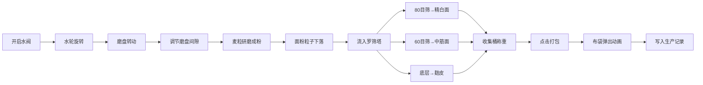

## 1. 产品概述

古代水磨坊仿真系统是一款沉浸式的宋代磨坊经营Web应用，让用户化身古代磨坊主，体验传统水力磨面的完整工艺流程。

- 核心用途：通过交互模拟水力石磨研磨麦粒、罗筛分级面粉的全过程，兼具教育性和趣味性
- 目标用户：历史文化爱好者、游戏化教育场景用户、对传统工艺感兴趣的大众用户
- 产品价值：以精美动画还原古代科技智慧，让用户在操作中理解传统粮食加工的原理

## 2. 核心功能

### 2.1 用户角色

| 角色 | 注册方式 | 核心权限 |
|------|----------|----------|
| 磨坊主 | 无需注册，直接进入 | 控制水阀、调节磨盘、操作罗筛、打包面粉、查看生产记录 |

### 2.2 功能模块

1. **水磨主场景**：水轮旋转动画、磨盘转动模拟、面粉粒子特效、过载保护系统
2. **研磨控制区**：水阀门旋钮(0-100%)、磨盘间隙滑块(0.5mm-3mm)、负载警示条
3. **罗筛分级塔**：三层振动筛网(80目/60目/麸皮)、实时重量显示
4. **打包仓储**：面粉桶清空打包、布袋弹出动画、生产批次记录
5. **数据管理**：批次记录存储、历史产量查询

### 2.3 页面详情

| 页面名称 | 模块名称 | 功能描述 |
|----------|----------|----------|
| 主操作界面 | 水磨场景区 | 水轮旋转、磨盘转动、面粉粒子下落动画、晨光阴影效果 |
| 主操作界面 | 控制面板区 | 水阀旋钮控制转速、间隙滑块控制粗细、负载显示与过载保护 |
| 主操作界面 | 罗筛塔区 | 三层筛网横向振动动画、分级别面粉收集、实时重量更新 |
| 主操作界面 | 打包区 | 三个收集木桶、清空打包按钮、布袋弹出动画 |
| 主操作界面 | 记录区 | 生产批次列表、产量统计、质量等级显示 |

## 3. 核心流程

用户打开应用后，首先调节水阀门控制水轮转速，然后设置磨盘间隙，开启研磨。麦粒落入磨盘研磨成粉，面粉通过粒子动画落入木槽，再流入罗筛塔分级。分级后的面粉分别收集在三个木桶中，用户可随时打包，生成带编号的布袋并记录批次数据。

## 4. 用户界面设计

### 4.1 设计风格

- **主色调**：暖木色 #d2b48c
- **辅色调**：深棕色 #8b5a2b
- **背景色**：米黄色 #f5deb3
- **强调色**：警示红（过载）、麻布色 #d4b886（布袋）、浅米色 #f5e6c8（面粉粒子）
- **按钮风格**：圆角矩形，圆角8px，悬停时背景从 #8b5a2b 渐变为 #a0522d，0.3s 缓动过渡
- **字体**：Roboto Slab 衬线字体，呼应古朴风格
- **整体风格**：宋代风韵，木质纹理质感，晨光斜射阴影，古朴雅致

### 4.2 页面设计概述

| 页面名称 | 模块名称 | UI 元素 |
|----------|----------|----------|
| 主操作界面 | 水磨场景区 | 左侧水轮（叶片旋转）、中央磨盘（上下盘间隙指示）、下方木槽、面粉粒子（#f5e6c8，3-6px）、晨光阴影 |
| 主操作界面 | 控制面板区 | 圆形水阀旋钮（0-100%刻度）、水平间隙滑块（0.5mm-3mm刻度）、垂直负载条（绿→黄→红渐变） |
| 主操作界面 | 罗筛塔区 | 三层叠放筛网（0.6s周期横向振动）、网孔目数标识、三个木桶（带重量显示，精度0.1斤） |
| 主操作界面 | 打包区 | 清空打包按钮（圆角8px）、麻布色布袋（#d4b886）、产品信息标签 |
| 主操作界面 | 记录区 | 批次卡片列表、编号/日期/类型/重量/等级信息 |

### 4.3 响应式设计

- **桌面端（>768px）**：三栏布局——左水轮、中磨盘、右罗筛塔，控制面板居中上方
- **移动端（≤768px）**：垂直堆叠布局——上控制面板、中水轮+磨盘、下罗筛塔+打包区
- **触控优化**：滑块和按钮增加触控热区，最小44x44px可点击区域

### 4.4 动效设计

- **水轮旋转**：根据水阀开度计算转速，CSS transform 旋转
- **磨盘转动**：上盘缓慢旋转，摩擦声效（可选）
- **面粉粒子**：半透明粒子从磨缝飘落，随机位置，3-6px直径，使用 requestAnimationFrame 保证45fps+
- **筛网振动**：CSS animation 横向位移，0.6s 周期，ease-in-out 缓动
- **布袋弹出**：framer-motion 动画，0.5s 弹出，轻微摇晃后静止
- **状态过渡**：所有数值变化使用 0.4s ease-out 渐变过渡
- **性能要求**：动画帧率≥45fps，打包响应<200ms
