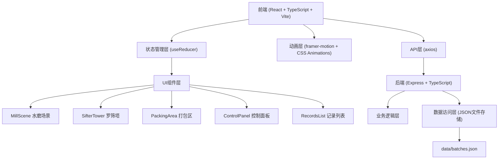
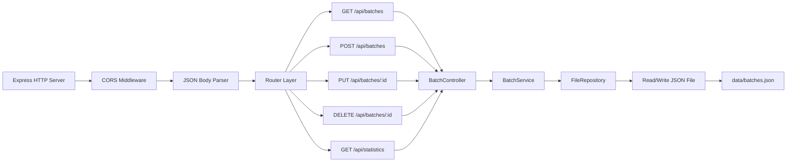
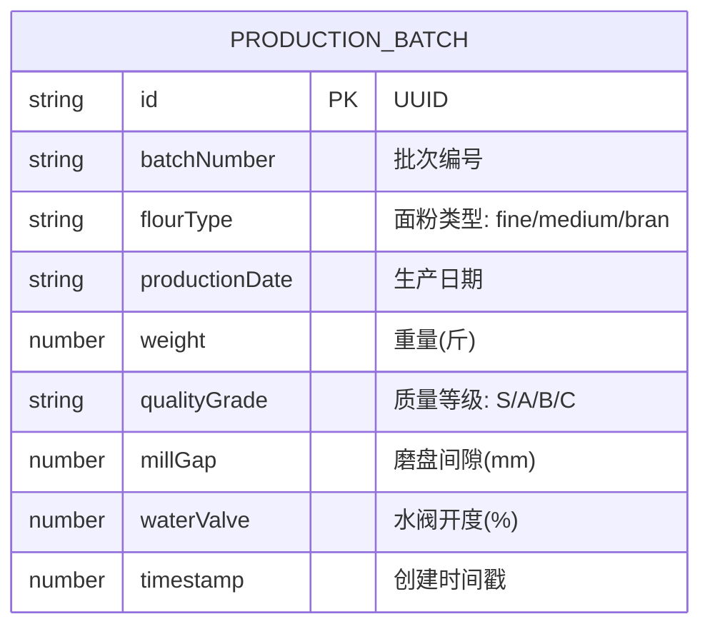

## 1. 架构设计



## 2. 技术描述

- **前端框架**: React 18 + TypeScript
- **构建工具**: Vite 5
- **动画库**: framer-motion
- **HTTP客户端**: axios
- **状态管理**: React useReducer (原生)
- **后端框架**: Express 4
- **数据存储**: JSON 文件 (模拟持久化)
- **包管理器**: npm
- **字体**: Roboto Slab (Google Fonts)

### 依赖包清单

| 包名 | 版本 | 用途 |
|------|------|------|
| react | ^18.2.0 | 前端框架 |
| react-dom | ^18.2.0 | React DOM 渲染 |
| typescript | ^5.4.0 | 类型检查 |
| vite | ^5.2.0 | 构建工具 |
| @vitejs/plugin-react | ^4.2.0 | Vite React 插件 |
| framer-motion | ^11.0.0 | 动画库 |
| express | ^4.18.0 | 后端框架 |
| cors | ^2.8.5 | 跨域支持 |
| uuid | ^9.0.0 | 生成唯一ID |
| axios | ^1.6.0 | HTTP 客户端 |
| @types/express | ^4.17.0 | Express 类型定义 |
| @types/cors | ^2.8.0 | CORS 类型定义 |
| @types/uuid | ^9.0.0 | UUID 类型定义 |
| @types/node | ^20.10.0 | Node.js 类型定义 |
| ts-node | ^10.9.0 | TypeScript 运行时 |

## 3. 前端页面路由

| 路由 | 页面 | 描述 |
|------|------|------|
| / | 主操作界面 | 水磨坊完整交互场景 |

## 4. API 定义 (Express 后端)

### 4.1 类型定义

```typescript
// 面粉类型枚举
type FlourType = 'fine' | 'medium' | 'bran';

// 质量等级
type QualityGrade = 'S' | 'A' | 'B' | 'C';

// 面粉分级结果
interface SiftingResult {
  fine: number;      // 精白面重量 (斤)
  medium: number;    // 中筋面重量 (斤)
  bran: number;      // 麸皮重量 (斤)
}

// 生产批次记录
interface ProductionBatch {
  id: string;                    // UUID
  batchNumber: string;           // 批次编号，如 M20260609-001
  flourType: FlourType;          // 面粉类型
  productionDate: string;        // 生产日期 ISO 格式
  weight: number;                // 重量 (斤，精度0.1)
  qualityGrade: QualityGrade;    // 质量等级
  millGap: number;               // 磨盘间隙 (mm)
  waterValve: number;            // 水阀开度 (%)
  timestamp: number;             // 时间戳
}

// 研磨状态
interface MillingState {
  waterValve: number;            // 水阀开度 0-100
  millGap: number;               // 磨盘间隙 0.5-3mm
  rotationSpeed: number;         // 转速 rpm
  loadPercentage: number;        // 负载百分比 0-100
  isOverloaded: boolean;         // 是否过载
  isRunning: boolean;            // 是否运行中
  totalWheatProcessed: number;   // 已处理麦粒总量
  currentFlour: SiftingResult;   // 当前已磨出面粉量
  packedBatches: ProductionBatch[]; // 已打包批次
}

// API 响应格式
interface ApiResponse<T> {
  success: boolean;
  data?: T;
  error?: string;
  message?: string;
}
```

### 4.2 REST API 端点

| 方法 | 路径 | 描述 | 请求体 | 响应 |
|------|------|------|--------|------|
| GET | /api/batches | 获取所有生产批次 | - | `ProductionBatch[]` |
| GET | /api/batches/:id | 获取单个批次详情 | - | `ProductionBatch` |
| POST | /api/batches | 创建新批次 | `Omit<ProductionBatch, 'id' | 'timestamp'>` | `ProductionBatch` |
| PUT | /api/batches/:id | 更新批次 | `Partial<ProductionBatch>` | `ProductionBatch` |
| DELETE | /api/batches/:id | 删除批次 | - | `{ success: boolean }` |
| GET | /api/statistics | 获取统计数据 | - | `{ totalWeight: number; countByType: Record<FlourType, number>; countByGrade: Record<QualityGrade, number> }` |

## 5. 服务器架构图



## 6. 数据模型

### 6.1 实体关系图



### 6.2 项目文件结构

```
auto332/
├── package.json
├── index.html
├── tsconfig.json
├── vite.config.js
├── src/
│   ├── App.tsx                 # 主入口组件，状态管理
│   ├── MillCore.ts             # 核心业务逻辑
│   ├── types.ts                # 类型定义
│   ├── components/
│   │   ├── MillScene.tsx       # 水磨场景组件
│   │   ├── SifterTower.tsx     # 罗筛塔组件
│   │   ├── PackingArea.tsx     # 打包区组件
│   │   ├── ControlPanel.tsx    # 控制面板组件
│   │   ├── FlourParticles.tsx  # 面粉粒子组件
│   │   ├── WaterWheel.tsx      # 水轮组件
│   │   ├── MillStone.tsx       # 磨盘组件
│   │   └── RecordsList.tsx     # 记录列表组件
│   ├── hooks/
│   │   └── useMillingLoop.ts   # 研磨循环Hook
│   └── api/
│       └── client.ts           # API 客户端
├── src/backend/
│   ├── server.ts               # Express 服务器入口
│   ├── controllers/
│   │   └── batchController.ts  # 批次控制器
│   ├── services/
│   │   └── batchService.ts     # 业务逻辑层
│   ├── repositories/
│   │   └── fileRepository.ts   # 文件存储层
│   └── types/
│       └── index.ts            # 后端类型定义
└── data/
    └── batches.json            # 数据存储文件
```

### 6.3 核心业务算法 (MillCore.ts)

1. **磨盘负载计算**：`load = (100 - millGap * 25) * (waterValve / 100)`
   - 间隙越小、水阀越大，负载越高
   - 超过 85% 触发过载保护停机

2. **面粉粗细映射**：
   - 间隙 0.5-1.0mm: 细粉为主，精白面占比 60-70%
   - 间隙 1.0-2.0mm: 中等粗细，中筋面占比 50-60%
   - 间隙 2.0-3.0mm: 粗粉为主，麸皮占比 40-50%

3. **筛分分级算法**：
   - 第一层 80目：通过率 = 70 - (millGap - 0.5) * 15
   - 第二层 60目：通过率 = 剩余的 60%
   - 底层麸皮：剩余全部

4. **质量等级评定**：
   - S级: 间隙 < 1.2mm 且 水阀 < 70%
   - A级: 间隙 < 1.8mm 且 水阀 < 85%
   - B级: 间隙 < 2.5mm
   - C级: 其他情况

5. **产量计算**：每帧产出量 = (waterValve / 100) * 0.002 * (3 - millGap + 0.5)

## 7. 性能优化策略

1. **面粉粒子池**：对象池模式复用粒子对象，避免频繁 GC
2. **requestAnimationFrame**：使用原生 RAF 控制动画循环，保证 45fps+
3. **CSS 硬件加速**：transform 和 opacity 动画启用 GPU 加速
4. **防抖节流**：滑块输入使用节流，减少状态更新频率
5. **虚拟列表**：批次记录过多时使用虚拟滚动
6. **批量更新**：状态更新使用 useReducer 批量处理
