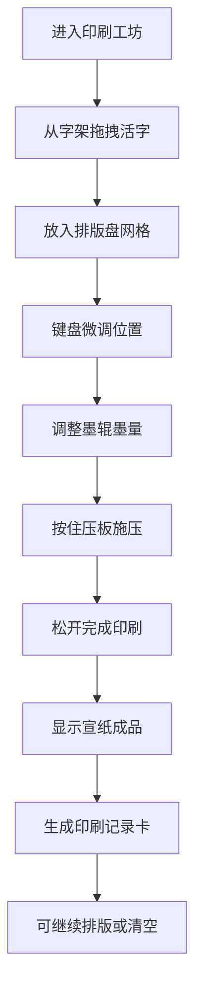

## 1. 产品概述
古代活字排版与印刷模拟应用，让用户体验宋代毕昇活字印刷术的完整工艺流程，从拣选木活字、拼版、上墨、施压到揭纸，最终获得印刷成品与数据记录。
- 主要目的：通过交互式模拟传承中华印刷文明，让用户直观理解古代活字印刷的技术原理
- 目标用户：对传统文化、印刷史感兴趣的学习者和爱好者
- 产品价值：将复杂的传统工艺转化为可操作的数字体验，兼具教育意义与互动乐趣

## 2. 核心 Features

### 2.1 用户角色
| 角色 | 注册方式 | 核心权限 |
|------|----------|----------|
| 体验用户 | 无需注册 | 完整使用排版印刷功能，查看印刷记录 |

### 2.2 功能模块
1. **字架拣字模块**：按金木水火土五行部首分类展示120个常用汉字活字，支持拖拽拣选
2. **排版盘模块**：30×15网格拼版区域，支持位置微调、清空、撤销操作
3. **墨辊上墨模块**：滑块控制墨量0-100，实时显示墨色渐变效果
4. **压板施压模块**：环形进度条显示压力值，按住施压、松开完成印刷
5. **成品展示模块**：Canvas渲染印刷结果，自动生成印刷记录卡

### 2.3 页面详情
| 页面名称 | 模块名称 | 功能描述 |
|----------|----------|----------|
| 印刷工坊主页 | 字架组件 | 五行部首分类展示活字，拖拽拾取，木质碰撞音效 |
| 印刷工坊主页 | 排版盘组件 | 网格拼版、键盘微调、清空/撤销、选中高亮 |
| 印刷工坊主页 | 墨辊组件 | 墨量滑块、渐变背景、百分比显示 |
| 印刷工坊主页 | 压板组件 | 环形压力条、持续施压交互、压力值记录 |
| 印刷工坊主页 | 成品组件 | Canvas渲染、记录卡生成、版心偏移/墨色均匀度显示 |

## 3. 核心流程
用户从左侧字架拖拽木活字到右侧排版盘，可通过键盘方向键微调选中活字的位置。排版完成后，拖动墨辊滑块调整墨量，按住压板按钮持续施压，松开后自动完成印刷。最终在宣纸上显示印刷成品，并生成包含版心偏移量、墨色均匀度和时间戳的记录卡。

## 4. 用户界面设计

### 4.1 设计风格
- **主色调**：土黄色#c8a97e（背景）、浅木色#d4a76a（活字）、深木色#6b4226（排版盘）、深棕色#5a3e1b（选中边框）
- **字体**：思源宋体（Source Han Serif），体现宋代刊刻风格
- **活字块**：1.2cm见方浅木色方块，带0.5px凸起边框模拟立体感，表面阴刻反文
- **按钮风格**：圆角设计，清空按钮红色#c0392b，撤销按钮灰色#7f8c8d
- **部首徽章**：直径24px圆形，底纹#8b7355，金木水火土五行分类
- **动画过渡**：所有状态变化使用0.3s ease-in-out过渡

### 4.2 页面设计概述
| 页面名称 | 模块名称 | UI元素 |
|----------|----------|--------|
| 印刷工坊主页 | 字架区域 | 五行列布局、部首徽章、活字块、拖拽半透明效果 |
| 印刷工坊主页 | 排版盘区域 | 30×15网格凹槽、清空/撤销按钮、选中坐标显示 |
| 印刷工坊主页 | 墨辊区域 | 圆弧形渐变背景、横向滑块、百分比数字、墨色渐变 |
| 印刷工坊主页 | 压板区域 | 施压按钮、环形进度条（绿到红渐变）、压力值显示 |
| 印刷工坊主页 | 成品区域 | 宣纸纹理Canvas、毛边纸记录卡、印刷数据 |

### 4.3 响应式设计
- **桌面端（≥1024px）**：左右两栏布局，左侧字架、右侧排版盘+控制区+成品区
- **平板端（768-1023px）**：上下两行布局，字架折叠为横向滚动条
- **性能优化**：120个活字+450网格拖拽保持60fps，Canvas绘制≤50ms

### 4.4 交互细节
- **拖拽**：活字跟随鼠标，opacity 0.6半透明，落位播放木质碰撞音效
- **微调**：选中活字方向键每次偏移0.5px，实时显示坐标和间距
- **墨量**：低于20时30%概率出现断墨白点
- **压力**：0-3秒线性增长，>80清晰但可能偏移1-3px，<30文字模糊
- **清空/撤销**：活字块0.3s缩放动画消失，撤销最多20步
