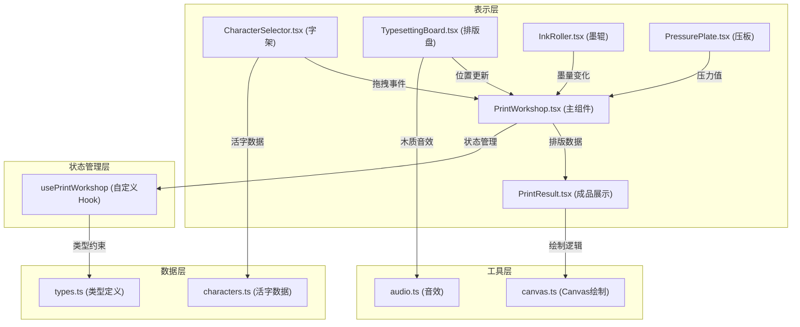

## 1. 架构设计



## 2. 技术描述

- **前端框架**: React@18 + TypeScript@5
- **构建工具**: Vite@5 + @vitejs/plugin-react@4
- **动画库**: framer-motion@11
- **唯一ID**: uuid@9
- **状态管理**: React useState + useReducer + 自定义Hook
- **字体**: 思源宋体 (Google Fonts 在线引用)
- **音频**: Web Audio API 生成木质碰撞音效

## 3. 目录结构

```
src/
├── types.ts              # 类型定义（被所有模块引用）
├── data/
│   └── characters.ts     # 120个常用汉字按五行分类
├── hooks/
│   └── usePrintWorkshop.ts  # 主状态管理Hook
├── utils/
│   ├── audio.ts          # Web Audio音效生成
│   └── canvas.ts         # Canvas绘制工具函数
├── components/
│   ├── CharacterSelector.tsx  # 字架组件
│   ├── TypesettingBoard.tsx   # 排版盘组件
│   ├── InkRoller.tsx          # 墨辊组件
│   ├── PressurePlate.tsx      # 压板组件
│   └── PrintResult.tsx        # 成品展示组件
├── PrintWorkshop.tsx     # 主组件
├── App.tsx               # 应用入口
├── main.tsx              # React入口
└── index.css             # 全局样式
```

## 4. 数据模型

### 4.1 类型定义

```typescript
// 活字接口
interface Character {
  id: string;
  char: string;
  radical: '金' | '木' | '水' | '火' | '土';
  strokeCount: number;
}

// 排版盘格子
interface GridCell {
  row: number;
  col: number;
  character: Character | null;
  offsetX: number;
  offsetY: number;
}

// 排版盘状态
interface TypesettingState {
  grid: GridCell[][];
  selectedCell: { row: number; col: number } | null;
  history: GridCell[][][];
  historyIndex: number;
}

// 印刷记录
interface PrintRecord {
  id: string;
  timestamp: number;
  inkLevel: number;
  pressure: number;
  gridData: GridCell[][];
  centerOffset: { x: number; y: number };
  inkUniformity: number;
}

// 工序状态
type WorkshopStage = 'typesetting' | 'inking' | 'pressing' | 'revealing';
```

### 4.2 数据流

1. **CharacterSelector** → 拖拽事件 → **PrintWorkshop** 更新 `typesettingState.grid`
2. **InkRoller** → onInkChange → **PrintWorkshop** 更新 `inkLevel`
3. **PressurePlate** → onPressureComplete → **PrintWorkshop** 更新 `pressure` 和 `stage`
4. **PrintWorkshop** → props传递 → **PrintResult** 渲染Canvas和记录卡
5. **usePrintWorkshop** Hook 统一管理状态和业务逻辑

## 5. 模块调用关系

| 模块 | 依赖模块 | 调用方向 | 数据传递 |
|------|----------|----------|----------|
| PrintWorkshop.tsx | types.ts, usePrintWorkshop, 所有子组件 | 主组件调用子组件 | 状态props向下，事件回调向上 |
| CharacterSelector.tsx | types.ts, characters.ts, audio.ts | 被主组件调用 | 拖拽Character对象 |
| TypesettingBoard.tsx | types.ts, audio.ts | 被主组件调用 | GridCell数组、选中状态 |
| InkRoller.tsx | types.ts | 被主组件调用 | 墨量值(0-100) |
| PressurePlate.tsx | types.ts | 被主组件调用 | 压力值(0-100) |
| PrintResult.tsx | types.ts, canvas.ts | 被主组件调用 | 排版数据、墨量、压力值 |
| usePrintWorkshop.ts | types.ts | 被主组件引用 | 返回状态和操作方法 |

## 6. 核心算法

### 6.1 墨色均匀度计算
```typescript
function calculateInkUniformity(inkLevel: number): number {
  const baseUniformity = Math.min(100, inkLevel * 1.2);
  const randomFactor = 0.9 + Math.random() * 0.2;
  return Math.round(Math.min(100, baseUniformity * randomFactor));
}
```

### 6.2 版心偏移计算
```typescript
function calculateCenterOffset(pressure: number): { x: number; y: number } {
  if (pressure > 80) {
    return {
      x: (Math.random() - 0.5) * 6,
      y: (Math.random() - 0.5) * 6
    };
  }
  return { x: 0, y: 0 };
}
```

### 6.3 断墨白点生成
```typescript
function shouldShowWhiteSpot(inkLevel: number): boolean {
  return inkLevel < 20 && Math.random() < 0.3;
}
```

### 6.4 文字清晰度计算
```typescript
function calculateClarity(pressure: number, inkLevel: number): number {
  const pressureScore = pressure < 30 ? pressure * 0.5 : Math.min(100, pressure * 1.1);
  const inkScore = Math.min(100, inkLevel * 1.2);
  return Math.round((pressureScore + inkScore) / 2);
}
```

## 7. 性能优化策略

1. **React.memo** 包装所有子组件，避免不必要的重渲染
2. **useCallback** 包装事件处理函数，稳定引用
3. **useMemo** 缓存Grid计算结果和Canvas绘制数据
4. **transform: translate3d** 启用GPU加速拖拽动画
5. **will-change** 提示浏览器优化动画元素
6. **requestAnimationFrame** 处理Canvas绘制，确保60fps
7. **虚拟滚动** 平板端字架横向滚动优化
8. **批量更新** 使用unstable_batchedUpdates合并状态更新

## 8. 构建配置

### vite.config.js
```javascript
import { defineConfig } from 'vite';
import react from '@vitejs/plugin-react';

export default defineConfig({
  plugins: [react()],
  server: {
    port: 5173,
    open: true
  },
  build: {
    target: 'es2020',
    minify: 'esbuild'
  }
});
```

### tsconfig.json
```json
{
  "compilerOptions": {
    "target": "ES2020",
    "useDefineForClassFields": true,
    "lib": ["ES2020", "DOM", "DOM.Iterable"],
    "module": "ESNext",
    "skipLibCheck": true,
    "moduleResolution": "bundler",
    "allowImportingTsExtensions": true,
    "resolveJsonModule": true,
    "isolatedModules": true,
    "noEmit": true,
    "jsx": "react-jsx",
    "strict": true,
    "noUnusedLocals": true,
    "noUnusedParameters": true,
    "noFallthroughCasesInSwitch": true
  },
  "include": ["src"]
}
```
