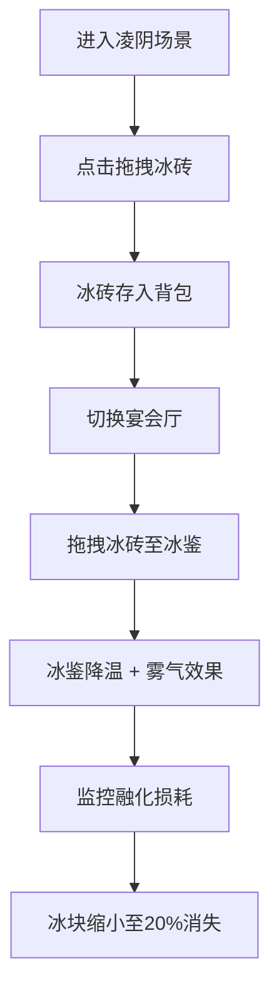

## 1. 产品概述

这是一个古代冰鉴储冰与食品冰镇管理的互动游戏项目，用户扮演周代的凌人（掌冰官员），在凌阴（冰窖）中管理冬季采储的冰块，调配冰块到不同规格的青铜冰鉴中，为王室宴会提供冰镇酒水和瓜果，并监测冰块的融化和损耗。

## 2. 核心功能

### 2.1 用户角色
| 角色 | 注册方式 | 核心权限 |
|------|----------|----------|
| 凌人 | 无需注册 | 管理冰窖、调配冰块、监控融化损耗 |

### 2.2 功能模块
1. **凌阴场景**：冰砖堆管理，拖拽取冰存入背包
2. **宴会厅场景**：青铜冰鉴放置冰块，温度显示，雾气粒子效果
3. **竹简信息面板**：冰块批次记录、融化监控、损耗统计
4. **背包系统**：存储取出的冰块（最多10块）
5. **场景切换**：凌阴与宴会厅之间切换

### 2.3 页面详情
| 页面名称 | 模块名称 | 功能描述 |
|----------|----------|----------|
| 凌阴场景 | 冰砖堆 | 6x5冰砖阵列，点击拖拽取冰 |
| 凌阴场景 | 背包栏 | 右下角背包，存储最多10块冰砖 |
| 宴会厅场景 | 冰鉴系统 | 大/中/小三种青铜冰鉴，槽位放置冰块 |
| 宴会厅场景 | 温度系统 | 每块冰降1度，从25度向下变化，雾气粒子效果 |
| 信息面板 | 竹简记录 | 批次、入库时间、当前大小、使用数量、损耗率 |
| 全局 | 融化系统 | 每5分钟缩小5%，小于20%消失并触发音效 |

## 3. 核心流程

用户进入凌阴场景 → 点击冰砖拖拽至背包 → 切换至宴会厅 → 从背包拖拽冰砖至冰鉴槽位 → 冰鉴降温产生雾气 → 监控冰块融化情况 → 记录损耗数据

## 4. 用户界面设计

### 4.1 设计风格
- **主色调**：青铜锈色#5d7a5a、竹简色#d4c5a9、朱砂红#c0392b、冰蓝色#c8e6c9
- **背景**：麻布纹理（CSS repeating-linear-gradient模拟经纬线），底色#2c2c2c
- **字体**：思源宋体（Noto Serif SC）
- **布局**：左侧70%主操作区，右侧30%信息面板，竹节竖线分隔
- **交互动效**：悬停放大1.1倍+微光box-shadow，点击0.2s按压缩放
- **响应式**：宽度<900px时右侧面板收为底部抽屉，汉堡菜单弹出

### 4.2 页面设计概述
| 页面名称 | 模块名称 | UI元素 |
|----------|----------|--------|
| 凌阴场景 | 冰窖背景 | 石砌墙壁#4a4a4a，地面青砖#6b7b6b |
| 凌阴场景 | 冰砖堆 | 6x5半透明浅蓝色#c8e6c9正方体，水珠闪烁动画（每2秒） |
| 凌阴场景 | 背包栏 | 右下角10格，拖拽跟随鼠标80%大小，入包水滴音效 |
| 宴会厅场景 | 朱漆食案 | 桌面#8b4513 |
| 宴会厅场景 | 青铜冰鉴 | 大鉴0.6单位/中鉴0.4单位/小鉴0.2单位，口沿下方槽位 |
| 宴会厅场景 | 温度显示 | 冰鉴上方显示温度数值，雾气粒子升腾（2-4px白色半透明，0.5单位/秒） |
| 信息面板 | 竹简面板 | 记录批次、入库时间、大小、使用数量、损耗率 |
| 全局 | 场景切换 | 顶部按钮切换凌阴/宴会厅 |

### 4.3 响应性
- 桌面端：左侧70%主操作区 + 右侧30%信息面板
- 移动端（<900px）：右侧面板收为底部抽屉，汉堡菜单弹出
- 拖拽操作支持触摸事件
- 所有元素相对单位，自适应缩放

### 4.4 性能要求
- 拖拽响应时间 < 50ms
- 粒子效果帧率 ≥ 45fps
- 使用requestAnimationFrame处理动画和融化计算
