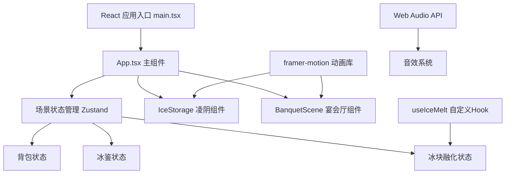

## 1. 架构设计



## 2. 技术描述
- **前端**：React@18 + TypeScript@5 + Vite@5
- **状态管理**：Zustand@4
- **动画库**：framer-motion@11
- **构建工具**：Vite@5 + @vitejs/plugin-react@4
- **样式**：原生CSS（global.css）+ CSS变量
- **音频**：Web Audio API 生成音效

## 3. 项目文件结构
```
├── package.json          # 依赖与脚本
├── index.html            # 入口HTML
├── tsconfig.json         # TypeScript配置
├── vite.config.js        # Vite配置
└── src/
    ├── main.tsx          # React入口
    ├── App.tsx           # 主组件（场景切换、全局状态）
    ├── components/
    │   ├── IceStorage.tsx    # 凌阴冰砖堆管理
    │   └── BanquetScene.tsx  # 宴会厅冰鉴界面
    ├── hooks/
    │   └── useIceMelt.ts     # 冰块融化逻辑Hook
    ├── store/
    │   └── useGameStore.ts   # Zustand全局状态
    └── styles/
        └── global.css    # 全局样式
```

## 4. 数据模型

### 4.1 冰块数据结构
```typescript
interface IceBlock {
  id: string;
  batchId: string;           // 来源批次
  storageTime: number;       // 入库时间戳
  originalSize: number;      // 原始大小（1.0）
  currentSize: number;       // 当前大小（0-1）
  location: 'storage' | 'backpack' | 'vessel';
  vesselId?: string;         // 所在冰鉴ID
}
```

### 4.2 冰鉴数据结构
```typescript
interface IceVessel {
  id: string;
  type: 'large' | 'medium' | 'small';
  diameter: number;          // 0.6 / 0.4 / 0.2
  temperature: number;       // 当前温度
  maxSlots: number;          // 最大槽位数
  iceBlocks: string[];       // 槽内冰块ID数组
}
```

### 4.3 游戏状态
```typescript
interface GameState {
  currentScene: 'iceStorage' | 'banquet';
  iceBlocks: IceBlock[];
  vessels: IceVessel[];
  backpack: string[];        // 背包中冰块ID，最多10个
  usedIceCount: number;      // 已使用冰砖数量
  totalLossRate: number;     // 总损耗率
  // Actions
  takeIceFromStorage: (id: string) => boolean;
  placeIceToVessel: (iceId: string, vesselId: string) => boolean;
  removeMeltedIce: (id: string) => void;
  switchScene: (scene: 'iceStorage' | 'banquet') => void;
}
```

## 5. 核心算法

### 5.1 冰块融化算法
```
每帧调用 useIceMelt:
  对于每个冰块:
    经过时间 = 当前时间 - 上次更新时间
    融化比例 = (经过时间 / 300000) * 0.05  // 每5分钟缩小5%
    currentSize = max(0, currentSize - 融化比例)
    如果 currentSize < 0.2:
      从槽位/背包中移除
      触发水花音效
      更新损耗率
```

### 5.2 温度计算
```
对于每个冰鉴:
  有效冰块数 = 槽内冰块数 * 冰块平均currentSize
  温度 = 25 - 有效冰块数
  温度 = max(0, 温度)
```

### 5.3 损耗率计算
```
总损耗率 = (已消失冰块数 + 当前冰块融化总量) / 原始总冰块数 * 100%
```
