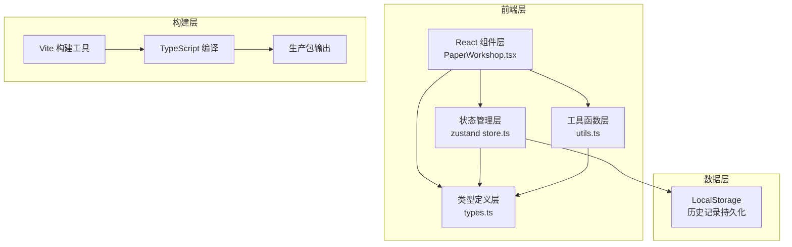

## 1. 架构设计



## 2. 技术描述

- **前端框架**：React 18 + TypeScript 5
- **构建工具**：Vite 5
- **状态管理**：zustand 4
- **动画库**：framer-motion 11
- **后端**：无（纯前端应用）
- **数据库**：LocalStorage（历史记录持久化）
- **初始化方式**：npm create vite@latest

## 3. 核心文件结构

| 文件路径 | 作用 |
|---------|------|
| `/package.json` | 项目依赖与脚本配置 |
| `/vite.config.js` | Vite构建配置，base: './' |
| `/tsconfig.json` | TypeScript配置，严格模式，target ES2020 |
| `/index.html` | 入口页面，背景色#e8dcc8，思源宋体 |
| `/src/types.ts` | 类型定义：纸浆浓度、纸张状态、质检结果等接口 |
| `/src/store.ts` | zustand全局状态：纸浆浓度、操作进度、质检得分、历史记录 |
| `/src/utils.ts` | 工具函数：计算纸张均匀度、干燥时间、断裂概率、质检评分 |
| `/src/PaperWorkshop.tsx` | 主场景组件：纸槽、抄纸帘、压榨台、晒纸墙、质检台的布局与交互 |
| `/src/main.tsx` | 应用入口 |
| `/src/index.css` | 全局样式 |

## 4. 类型定义

### 4.1 核心接口

```typescript
// 原料类型
type MaterialType = 'chuPi' | 'sangPi' | 'maXianWei';

// 纸浆状态
interface PulpState {
  concentration: number; // 0-100
  materials: Record<MaterialType, number>;
}

// 纸张状态
type PaperStage = 'pulp' | 'wet' | 'pressed' | 'drying' | 'dried' | 'inspecting' | 'done';

interface PaperState {
  id: string;
  stage: PaperStage;
  uniformity: number; // 0-100
  dryness: number; // 0-100
  pressLevel: number; // 0-100
  inspectionPoints: number; // 0-10
}

// 质检结果
type QualityGrade = 'excellent' | 'good' | 'medium' | 'poor';

interface QualityResult {
  id: string;
  timestamp: number;
  materials: Record<MaterialType, number>;
  concentration: number;
  uniformity: number;
  dryness: number;
  pressLevel: number;
  score: number;
  grade: QualityGrade;
}

// 全局状态
interface WorkshopState {
  pulp: PulpState;
  currentPaper: PaperState | null;
  history: QualityResult[];
  isAnimating: boolean;
  currentStep: number;
}
```

## 5. 数据模型

### 5.1 质检记录存储结构

```typescript
interface HistoryRecord {
  id: string;
  timestamp: number;
  materials: {
    chuPi: number;
    sangPi: number;
    maXianWei: number;
  };
  concentration: number;
  uniformity: number;
  dryness: number;
  pressLevel: number;
  score: number;
  grade: 'excellent' | 'good' | 'medium' | 'poor';
}

// LocalStorage key: 'paper-workshop-history'
// 最多存储10条记录，按时间倒序排列
```

## 6. 性能优化策略

1. **动画优化**：所有动画使用`transform`和`opacity`属性，避免触发layout重排
2. **状态批量更新**：使用zustand的批量更新机制，减少render次数
3. **组件拆分**：各工作区独立组件，使用memo避免不必要重渲染
4. **事件节流**：拖拽操作使用requestAnimationFrame节流
5. **帧率监控**：关键动画期间保持55fps以上
6. **懒加载**：非关键动画资源延迟加载
