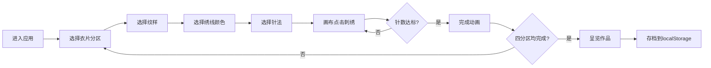

## 1. 产品概述
汉代未央宫织室令织绣纹样设计互动应用，用户扮演汉代织室尚衣令，在织案上为玄衣纁裳的冕服进行纹样布局与刺绣模拟。

- **主要用途**：模拟古代宫廷织绣工艺，提供纹样设计、针法模拟、作品保存的沉浸式体验
- **目标用户**：对中国古代服饰文化、传统刺绣工艺感兴趣的用户
- **产品价值**：通过互动方式传承汉代织绣文化，让用户体验传统刺绣的精细工艺

## 2. 核心功能

### 2.1 用户角色
| 角色 | 注册方式 | 核心权限 |
|------|----------|----------|
| 尚衣令（用户） | 无需注册，直接进入 | 选择纹样、绣线、针法，在衣片各分区刺绣，保存作品 |

### 2.2 功能模块
1. **工具面板**：纹样选择库、绣线色盘、针法选择、重置按钮
2. **刺绣画布**：基于react-konva的交互式刺绣区域，支持逐针渲染
3. **衣片预览区**：玄衣纁裳冕服正视图，四个分区状态展示
4. **作品呈览**：完成后竹简样式展示，支持localStorage存档

### 2.3 页面详情
| 页面名称 | 模块名称 | 功能描述 |
|----------|----------|----------|
| 主页面 | 工具面板 | 展示4种纹样（龙、凤、火、藻）、16色绣线盘、4种针法（齐针、戗针、铺针、滚针） |
| 主页面 | 刺绣画布 | 响应鼠标点击生成绣针轨迹，支持不同针法的线段生成规则，实时针数统计 |
| 主页面 | 衣片预览区 | 显示冕服四分区（领、袖、前襟、下裳），点击切换分区，展示已完成纹样缩略图 |
| 主页面 | 呈览弹窗 | 仿竹简样式展示作品数据，支持存档到localStorage |

## 3. 核心流程
用户进入应用 → 选择衣片分区 → 选择纹样 → 选择绣线颜色 → 选择针法 → 在画布上点击刺绣（逐针累加）→ 针数达标触发完成动画 → 切换分区重复操作 → 四分区均完成后点击"呈览" → 查看作品并存档

## 4. 用户界面设计

### 4.1 设计风格
- **主色调**：深棕#5a3a2a与暗红#8b0000，辅以金色#ffd700作为高亮
- **字体**：思源宋体（Noto Serif SC）
- **按钮样式**：圆角，悬停放大1.05倍+金色外发光，点击缩小0.95倍
- **布局风格**：三栏布局（左工具面板、中刺绣画布、右衣片预览）
- **纹理效果**：缣帛经纬线纹理、竹简径向渐变纹理

### 4.2 页面设计概述
| 页面名称 | 模块名称 | UI元素 |
|----------|----------|--------|
| 主页面 | 工具面板 | 220px宽半透明黑底，纹样32x32彩色图标+180x180悬停预览，16色圆形色盘，针法图标，圆形重置按钮 |
| 主页面 | 刺绣画布 | 青铜色描边，深色半透明圆角矩形计数器（金色数字），右下角"织室令印"铜印 |
| 主页面 | 衣片预览区 | 3:4比例，缣帛米黄色背景+经纬线纹理，四分区颜色区分，完成分区金线对勾 |
| 主页面 | 呈览弹窗 | 竹简底色#d4c9a8+径向渐变纹理，文字竖排深褐色，"存档"按钮 |

### 4.3 响应式
- 桌面端（≥1024px）：三栏水平布局
- 移动端（<768px）：上下结构，工具面板收缩为可展开侧边栏，触摸操作优化

### 4.4 交互动效
- 纹样/颜色/针法选中时高亮放大1.1倍
- 分区选中时外发光#ffd700并放大1.05倍
- 针数达标时纹样闪烁三次金色光芒（0.2秒渐隐/渐显）
- 按钮悬停放大1.05倍+外发光，点击缩小0.95倍+click音效
- 完成时播放440Hz正弦波升调音效（0.15秒）
